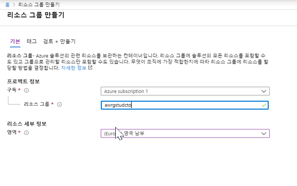
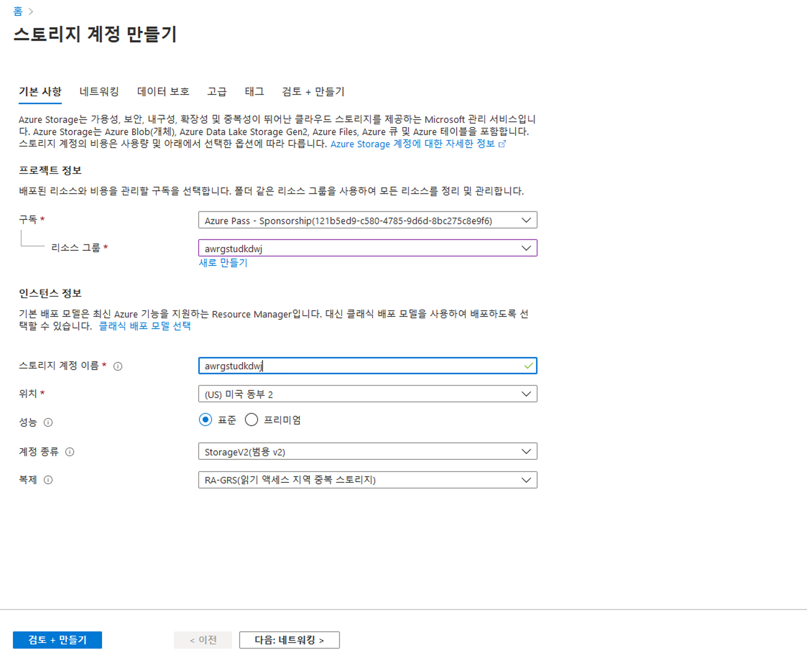
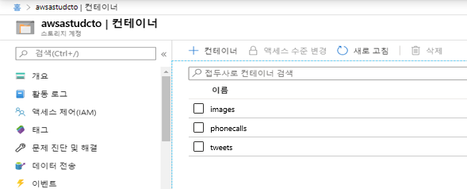
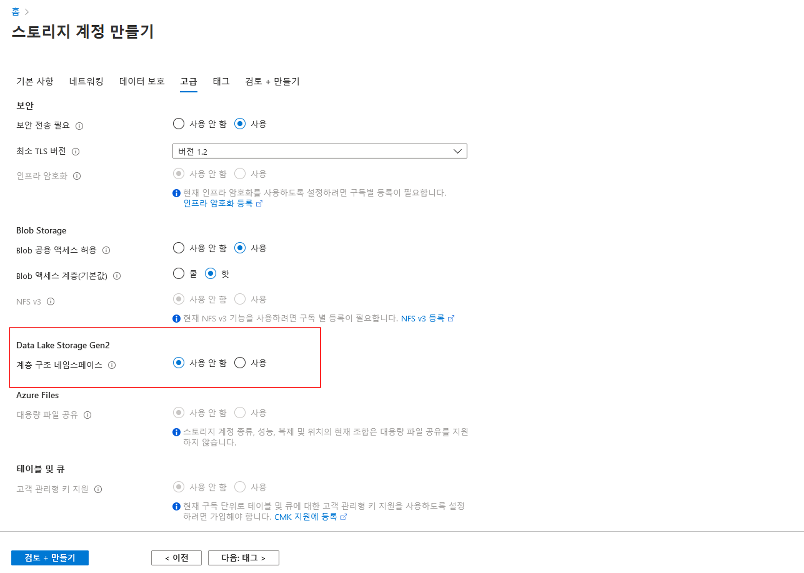

# DP 200 - 데이터 플랫폼 솔루션 구현
# 랩 2 - 데이터 스토리지 작업

**예상 소요 시간**: 60분

**전제 조건**: 이 랩의 사례 연구를 읽었다고 가정합니다. 모듈 1의 콘텐츠 및 랩이 다음과 같다고 가정합니다. 데이터 엔지니어를 위한 Azure도 완료되었습니다.

**랩 파일**: 이 랩용 파일은 _Allfiles\Labfiles\Starter\DP-200.2_ 폴더에 있습니다.

## 랩 개요

이 랩에서는 수강생들이 주어진 비즈니스 및 기술 요구 사항에 대해 구현할 적절한 스토리지 형식을 결정할 수 있습니다. Azure Storage 계정 및 Data Lake Storage 계정을 만들고 Data Lake Storage 버전 1과 버전 2의 차이점을 설명할 수 있습니다. 또한 선택한 데이터 스토리지에 데이터 로드를 수행하는 방법을 시연할 수 있습니다.

## 랩 목표
  
이 랩을 완료하면 다음을 할 수 있습니다.

1. Azure에서 데이터 스토리지 접근 방식 선택
2. Azure 스토리지 계정 만들기
3. Azure Data Lake Storage 설명
4. Azure Data Lake에 데이터 업로드

## 시나리오
  
디지털 변환 프로젝트의 일부인 기술 솔루션을 구현하기 위해 수석 데이터 엔지니어로 고용되었습니다. 조직은 회사 웹사이트를 호스팅하는 IIS(인터넷 정보 서비스)를 Azure로 마이그레이션하고 있습니다. 개발자들이 웹 애플리케이션과 논리를 Azure Web Apps으로 전송하는 중이며, 웹 사이트에서 사용되는 정적 이미지를 호스트하는 데 사용할 수 있는 데이터 저장소를 준비하도록 요청했습니다.

또한 정보 서비스 부서는 팀이 확대되고 있으며 곧 예측 분석 솔루션을 구축하는 프로세스를 시작할 데이터 과학자들과 참여할 것이라고 알려주었습니다. 작업의 프로덕션 환경을 호스팅하는 데 사용할 솔루션을 설치하라고 요청 받았습니다. 먼저, 솔루션을 위해 어떤 스토리지 계층을 만드는 것이 적절한지 평가합니다.

이 작업의 끝 부분에서 다음을 수행할 수 있습니다.

1. Azure의 데이터 스토리지 접근 방식 선택
2. Azure Storage 계정 만들기
3. Azure Data Lake Storage 설명
4. Azure Data Lake에 데이터 업로드

> **중요**: 이 랩을 진행하면서 프로비전 또는 구성 작업에서 발생한 문제를 기록하고 _\Labfiles\DP-200-Issues-Doc.docx_에 있는 문서의 테이블에 로그인합니다. 랩 번호를 문서화하고, 기술을 기록하며, 문제를 설명하고, 해결 방법이 무엇인지 설명합니다. 이 문서를 나중에 모듈에서 다시 참조할 수 있도록 저장합니다.

## 연습 1: Azure에서 데이터 스토리지 접근 방식 선택

예상 소요 시간: 15분

개인 연습
  
이 연습의 주요 작업은 다음과 같습니다.

1. 사례 연구에서 웹 사이트용 정적 이미지와 예측 분석 솔루션에 대한 데이터 스토리지 요구 사항을 식별합니다.

2. 강사는 그룹과 결과에 대해 논의합니다.

### 작업 1: AdventureWorks의 데이터 스토리지 요구 사항 및 구조를 식별합니다.

1. 랩 가상 머신에서 **Microsoft Word**를 시작하고 **Allfiles\Labfiles\Starter\DP-200.2** 폴더의 **DP-200-Lab02-Ex01.docx** 파일을 엽니다.

2. **10분**을 할애하여 이 랩의 시나리오에 설명된 대로 데이터 스토리지 요구 사항을 문서화합니다. 사례 연구 문서도 추가로 참조할 수 있습니다.

### 작업 2: 강사와 조사 결과에 대해 토론합니다.

1. 강사는 결과를 논의하기 위해 그룹 토론을 중지합니다.

> **결과**: 이 연습을 통해 데이터 스토리지 요구 사항 표 2개가 포함된 Microsoft Word 문서를 만들었습니다.

## 연습 2: Azure 스토리지 계정 만들기
  
예상 소요 시간: 20분

개인 연습
  
이 연습의 주요 작업은 다음과 같습니다.

1. 랩 위치에 가장 가까운 지역에서 **awrgstudxx**라는 Azure 리소스 그룹을 만듭니다. 여기서 **xx**는 귀하의 이니셜입니다.

2. 랩 위치에 가장 가까운 지역에서 리소스 그룹 awrgstudxx 내에 스토리지 계정 **awsastudxx**를 만들고 구성합니다. 여기서 **xx**는 귀하의 이니셜입니다.

3. awsastudxx 스토리지 계정에서 **images**, **phonecalls**, **tweets**라는 컨테이너를 만듭니다.

4. 스토리지 계정의 이미지 컨테이너에 일부 그래픽을 업로드합니다.

### 작업 1: 리소스 그룹을 만들고 구성합니다.

1. 랩 가상 머신에서 Microsoft Edge를 시작하고 Azure Portal([**http://portal.azure.com**](http://portal.azure.com))로 이동하여 과정에 할당된 계정을 사용하여 로그인합니다.

2. Azure Portal에서 **리소스 그룹** 아이콘을 클릭합니다.

3. **리소스 그룹** 화면에서 **+ 추가**를 클릭하여 다음 설정으로 첫 번째 리소스 그룹을 만듭니다.

    - **구독**: 이 랩에서 사용 중인 구독의 이름
    
    - **리소스 그룹 이름**: **awrgstudxx**, 여기서 **xx**는 귀하의 이니셜입니다.

    - **리소스 그룹 위치**: 랩 위치에 가장 가까운 Azure 지역의 이름이며 Azure VM을 프로비전할 수 있는 위치입니다.

      > **참고**: 구독에서 사용 가능한 Azure 지역을 확인하려면 [**https://azure.microsoft.com/ko-kr/regions/offers/**](https://azure.microsoft.com/ko-kr/regions/offers/)를 참조하세요.

        

4. 리소스 그룹 만들기 화면에서 **검토 + 만들기**를 클릭합니다.

5. 리소스 그룹 만들기 화면에서 **만들기**를 클릭합니다.

> **참고**: 리소스 그룹을 만드는 데 약 30초가 소요됩니다. 알림 영역을 확인하여 생성이 완료된 시점을 확인할 수 있습니다.

### 작업 2: 스토리지 계정을 만들고 구성합니다.

1. Azure Portal에서 화면 왼쪽 상단의 **홈** 하이퍼링크를 클릭합니다.

2. Azure Portal에서 **+ 리소스 만들기** 아이콘을 클릭합니다.

3. 새 화면에서 **마켓플레이스 검색** 텍스트 상자를 클릭하고 **storage account**라는 단어를 입력합니다. 표시되는 목록에서 **스토리지 계정**을 클릭합니다.

4. **스토리지 계정** 화면에서 **만들기**를 클릭합니다.

5. **스토리지 계정 만들기** 화면에서 다음 설정을 사용하여 첫 번째 스토리지 계정을 만듭니다.

    - 프로젝트 세부 정보에 다음을 설정합니다.

        - **구독**: 이 랩에서 사용 중인 구독의 이름
    
        - **리소스 그룹**: **awrgstudxx**, 여기서 **xx**는 귀하의 이니셜입니다.

    - 인스턴스 상세 사항에 다음 세부 정보를 지정합니다.
    
        - **스토리지 계정 이름**: **awsastudxx**, 여기서 **xx**는 귀하의 이니셜입니다.

        - **위치**: 랩 위치와 가장 가까운 Azure 지역의 이름이며 Azure VM을 프로비전할 수 있는 위치입니다.

        - **성능**: **표준**.

        - **계정 종류**: **StorageV2(범용 v2)**.

        - **복제**: **RA_GRS(읽기 액세스 지역 중복 스토리지)**

            

6. **스토리지 계정 만들기** 화면에서 **검토 + 만들기**를 클릭합니다.

7. **스토리지 계정 만들기** 화면의 유효성 검사가 끝나면 **만들기**를 클릭합니다.

   > **참고**: 스토리지 계정을 만드는 데 약 90초가 소요되며, 디스크와 디스크 구성은 사용자가 정의한 설정에 따라 제공됩니다.

### 작업 3: 스토리지 계정에서 컨테이너를 만들고 구성합니다.

1. Azure Portal에서 _배포가 완료되었습니다._ 메시지가 표시됩니다. 그러면 **리소스로 이동** 단추를 클릭합니다.

2. **awsastudxx** 화면의(**xx**는 귀하의 이니셜) **Blob Service**에서 **컨테이너**를 클릭합니다.

3. **awsastudxx - 컨테이너** 화면의 왼쪽 위에서 **+ 컨테이너** 단추를 클릭합니다.

4. **새 컨테이너** 화면에서 다음 설정으로 컨테이너를 만듭니다.

    - 이름: **images**.

    - 공용 액세스 수준: **프라이빗(익명 액세스 없음)**

        

5. **새 컨테이너** 화면에서 **만들기**를 클릭합니다.

   > **참고**: 컨테이너가 즉시 만들어지고 **awrgstudxx - 컨테이너** 화면 목록에 나타납니다.

6. 4~5단계를 반복하여 **프라이빗(익명 액세스 없음)** 공용 액세스 수준으로 **phonecalls**라는 컨테이너를 만듭니다.

7. 4~5단계를 반복하여 **프라이빗(익명 액세스 없음)** 공용 액세스 수준으로 **tweets**라는 컨테이너를 만듭니다. 화면이 아래 그래픽과 같이 나타나야 합니다.

    

### 작업 4: 스토리지 계정의 이미지 컨테이너에 일부 그래픽을 업로드합니다.

1. Azure Portal의 **awsastudxx - 컨테이너** 화면에 나타난 목록에서 **이미지** 항목을 클릭합니다.

2. **이미지** 화면에서 **업로드** 단추를 클릭합니다.

3. 파일 텍스트 상자의 **Blob 업로드** 화면에서 텍스트 상자 오른쪽에 있는 **폴더**아이콘을 클릭합니다.

4. **열기** 대화 상자에서 **Labfiles\Starter\DP-200.2\website graphics** 폴더를 찾습니다. 다음 파일을 강조 표시합니다.

    - one.png

    - two.png

    - three.png

    - No.png

5. **열기** 대화 상자에서 **열기**를 클릭합니다. 

6. **Blob 업로드** 화면에서 **업로드** 단추를 클릭합니다.

7. **Blob 업로드** 화면을 닫고 **이미지**화면을 닫습니다.

8. **awsastudxx - 컨테이너** 화면을 닫고 Azure Portal에서 **홈** 화면으로 이동합니다. 

   > **참고**: 파일을 업로드하는 데 약 5초가 소요됩니다. 완료되면 Blob 업로드 화면의 목록에 표시됩니다.

> **결과**: 이 연습을 통해 AdventureWorks 웹 사이트에서 사용할 준비가 된 4개의 그래픽 파일이 포함된 'images' 컨테이너가 있는 'awsastudxx' 스토리 계정을 만들었습니다.

## 연습 3: Azure Data Lake Storage 설명
  
예상 소요 시간: 15분

개인 연습
  
이 연습의 주요 작업은 다음과 같습니다.

1. 랩 위치에 가장 가까운 지역에서 리소스 그룹 awrgstudxx 내에 **awdlsstudxx**라는 스토리지 계정을 Data Lake Store Gen2 스토리지 형식으로 만들고 구성합니다. 여기서 **xx**는 귀하의 이니셜입니다.

2. awdlsstudxx 스토리지 계정에서 **logs** 및 **data**라는 컨테이너를 만듭니다.

### 작업 1: 스토리지 계정을 Data Lake Store Gen II 저장소로 만들고 구성합니다.

1. Azure Portal에서 **+ 리소스 만들기**를 클릭합니다.

2. 새 화면에서 **마켓플레이스 검색** 텍스트 상자를 클릭하고 **storage**라는 단어를 입력합니다. 표시되는 목록에서 **스토리지 계정**을 클릭합니다.

3. **스토리지 계정** 블레이드에서 **만들기**를 클릭합니다.

4. **스토리지 계정 만들기** 블레이드에서 다음 설정으로 스토리지 계정을 만듭니다.

    - 프로젝트 세부 정보에 다음을 설정합니다.

        - **구독**: 이 랩에서 사용 중인 구독의 이름
    
        - **리소스 그룹 이름**: **awrgstudxx**, 여기서 **xx**는 귀하의 이니셜입니다.

    - 인스턴스 상세 사항에 다음 세부 정보를 지정합니다.

        - **스토리지 계정 이름**: **awdlsstudxx**, 여기서 **xx**는 귀하의 이니셜입니다.

        - **위치**: 랩 위치와 가장 가까운 Azure 지역의 이름이며 Azure VM을 프로비전할 수 있는 위치입니다.

        - **성능**: **표준**.

        - **계정 종류**: **StorageV2(범용 v2)**.

        - **복제**: **RA_GRS(읽기 액세스 지역 중복 스토리지)**

5. **고급** 탭을 클릭합니다.

6. Data Lake Storage Gen2에서 **계층 구조 네임스페이스**의 **사용**을 클릭합니다.

    

7. **스토리지 계정 만들기** 블레이드에서 **검토 + 만들기**를 클릭합니다.

8. **스토리지 계정 만들기** 블레이드의 유효성을 검사한 후, **만들기**를 클릭합니다.

   > **참고**: 스토리지 계정을 만드는 데 약 90초가 소요되며, 디스크와 디스크 구성은 사용자가 정의한 설정에 따라 제공됩니다.

### 작업 2: 스토리지 계정에서 컨테이너를 만들고 구성합니다.

1. Azure Portal에서 _배포가 완료되었습니다._ 메시지가 표시됩니다. 그러면 **리소스로 이동** 단추를 클릭합니다.

2. **awdlsstudxx** 화면에서(**xx**는 귀하의 이니셜) **컨테이너**를 클릭합니다.

3. **awsastudxx - 컨테이너** 화면 왼쪽 위에서 **+ 컨테이너** 단추를 클릭합니다.

4. **새로 만들기** 화면에서 다음 설정을 사용하여 컨테이너를 만듭니다.

    - 이름: **data**(**비공개(익명 액세스 없음)** 공용 액세스 수준 지정)

    - 이름: **logs**(**비공개(익명 액세스 없음)** 공용 액세스 수준 지정)

5. **새 컨테이너** 화면에서 **만들기**를 클릭합니다.

   > **참고**: 파일 시스템이 즉시 만들어지고 다음과 같이 **awdlsstudxx - 컨테이너** 화면의 목록에 나타납니다.

    

> **결과**: 이 연습에서는 data 및 logs 파일 시스템이 포함된 Data Lake Gen2 스토리지 계정 awdlsstudxx를 만들었습니다.

## 연습 4: Azure Data Lake에 데이터 업로드
  
예상 소요 시간: 10분

개인 연습
  
이 연습의 주요 작업은 다음과 같습니다.

1. Microsoft Azure Storage Explorer 설치 및 시작

2. Data Lake Gen II 스토리지 계정의 컨테이너에 일부 데이터 파일을 업로드합니다.

### 작업 1: Storage Explorer를 설치합니다.

3. Azure Portal의 **awdlsstudxx** 개요 페이지에서 **탐색기에서 열기**로 이동한 다음 **Azure Storage Explorer 다운로드** 하이퍼링크를 클릭합니다.

4. [Azure Storage Explorer](https://azure.microsoft.com/ko-kr/features/storage-explorer/)의 다음 웹 페이지가 열립니다. **지금 다운로드** 단추를 클릭합니다.

5. Microsoft Edge 대화 상자에서 **저장**을 클릭합니다. 다운로드가 완료되면 Microsoft Edge의 다운로드 화면에서 **다운로드 보기**를 클릭하고 **폴더 열기**를 클릭합니다. 그러면 다운로드 폴더가 열립니다.

6. **StorageExplorer.exe** 파일을 두 번 클릭합니다. 사용자 계정 컨트롤 대화 상자에서 **예**를 클릭 합니다.

7. 사용권 계약 화면에서 **사용권 계약에 동의합니다** 옆에 있는 라디오 단추를 선택한 다음 **설치**를 클릭합니다.

   > **참고**: Storage Explorer를 설치하는 데 약 4분이 걸릴 수 있습니다. Azure Storage Explorer를 사용하면 스토리지 계정의 콘텐츠를 쉽게 관리할 수 있습니다. Blob, 파일, 큐, 테이블 및 Cosmos DB 엔터티를 업로드, 다운로드 및 관리합니다. 또한 가상 머신 디스크를 관리하기 위해 쉽게 액세스할 수 있습니다.

8. 설치가 완료되면 **Microsoft Azure Storage Explorer 시작** 옆의 확인란이 선택되어 있는지 확인한 다음 **마침**을 클릭합니다. Microsoft Azure Storage Explorer가 열리고 구독이 나열합니다.

9. Storage Explorer에서 **계정 관리**를 선택하여 **계정 관리 패널**로 이동합니다.

10. 이제 왼쪽 창에 로그인한 모든 Azure 계정이 표시됩니다. 다른 계정에 연결하려면 **계정 추가**를 선택합니다.

11. 국가별 클라우드 또는 Azure Stack에 로그인하려면 Azure 환경 드롭다운을 클릭하여 사용할 Azure 클라우드를 선택합니다. 환경을 선택한 후 **로그인...** 단추를 클릭합니다.

12. Azure 계정에 정상적으로 로그인되면 계정 및 해당 계정과 연결된 Azure 구독이 왼쪽 창에 추가됩니다. 사용할 Azure 구독을 선택한 다음 **적용**을 선택합니다. 왼쪽 창에 선택한 Azure 구독과 연결된 스토리지 계정이 표시됩니다.

    

### 작업 2: Data Lake Gen II 스토리지 계정의 데이터 및 로그 컨테이너에 데이터 파일을 업로드합니다.

1. Azure Storage Explorer에서 화살표를 클릭하여 구독을 확장합니다.

2. **스토리지 계정**에서 스토리지 계정 **awdlsstudxx(ADLS Gen2)** 를 검색하고 화살표를 클릭하여 확장합니다.

3. **Blob 컨테이너**에서 화살표를 클릭하여 확장하고 **logs** 파일 시스템을 표시합니다. **logs** 파일 시스템을 클릭합니다.

4. Azure Storage Explorer에서 **업로드** 아이콘 옆의 화살표를 클릭하고 **파일 업로드**를 클릭합니다.

5. 파일 업로드 대화 상자에서 **선택한 파일** 텍스트 상자 옆의 타원을 클릭합니다.

6. **업로드할 파일 선택** 대화 상자에서 **Labfiles\Starter\DP-200.2\logs** 폴더를 찾습니다. 다음 파일을 강조 표시합니다.

    - weblogsQ1.log

    - weblogsQ2.log

    - preferences.json

7. **업로드할 파일 선택** 대화 상자에서 **열기**를 선택합니다.

8. **파일 업로드** 화면에서 **업로드** 단추를 클릭합니다.

   

9. **Blob 컨테이너**에서 화살표를 클릭하여 확장하고 **data** 파일 시스템을 표시합니다. **data** 파일 시스템을 클릭합니다.

10. Azure Storage Explorer에서 **업로드** 아이콘 옆의 화살표를 클릭하고 **파일 업로드**를 클릭합니다.

11. 파일 업로드 대화 상자에서 **선택한 파일** 텍스트 상자 옆의 타원을 클릭합니다.

12. **업로드할 파일 선택** 대화 상자에서 **Labfiles\Starter\DP-200.2\Static Files** 폴더를 찾습니다. 다음 파일을 강조 표시합니다.

    - DimDate2.txt

13. **업로드할 파일 선택** 대화 상자에서 **열기**를 선택합니다.

14. **파일 업로드** 화면에서 **업로드** 단추를 클릭합니다.

15. **Labfiles\Starter\DP-200.2\logs** 폴더의 preferences.JSON 파일을 Data Lake Store gen2의 **데이터** 파일 시스템에 업로드하는 단계를 반복합니다.

   > **참고**: 파일을 업로드하는 데 약 5초가 소요됩니다. Azure Storage Explorer에서 다음 메시지가 표시됩니다. **보기가 오래되었을 수 있습니다. 새로 고치시겠습니까? 예**를 클릭합니다. 완료되면 Blob 업로드 화면의 목록에 두 파일이 모두 표시됩니다.

    

16. Azure Storage Explorer의 데이터 파일 시스템에서 **+ 새 폴더** 단추를 클릭합니다.

17. 새 폴더 화면에서 새 폴더 이름 텍스트 상자에 **output**을 입력합니다.

18. Azure Storage Explorer를 닫습니다.

19. Azure Portal로 돌아가서 **홈** 블레이드로 이동합니다.

> **결과**: 이 연습을 통해 AdventureWorks의 데이터 과학자가 사용할 수 있는 두 개의 웹로그 파일이 들어 있는 파일 시스템을 가진 awdlsstudxx라는 Data Lake Gen II 스토리지 계정을 생성했습니다.
