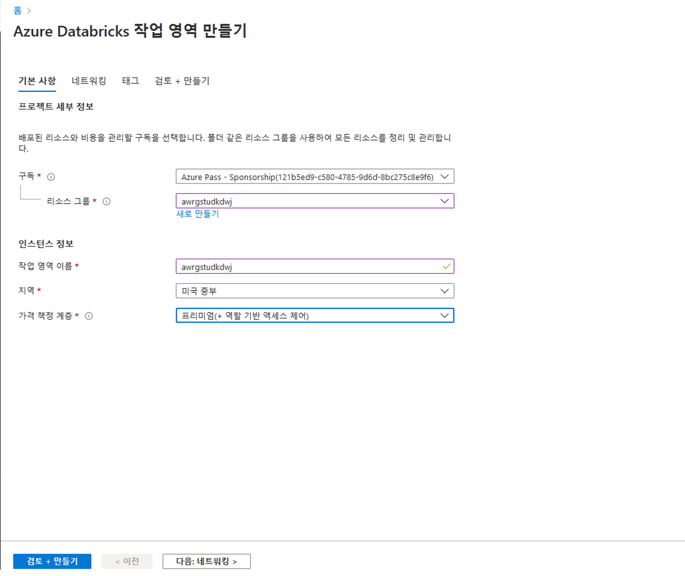
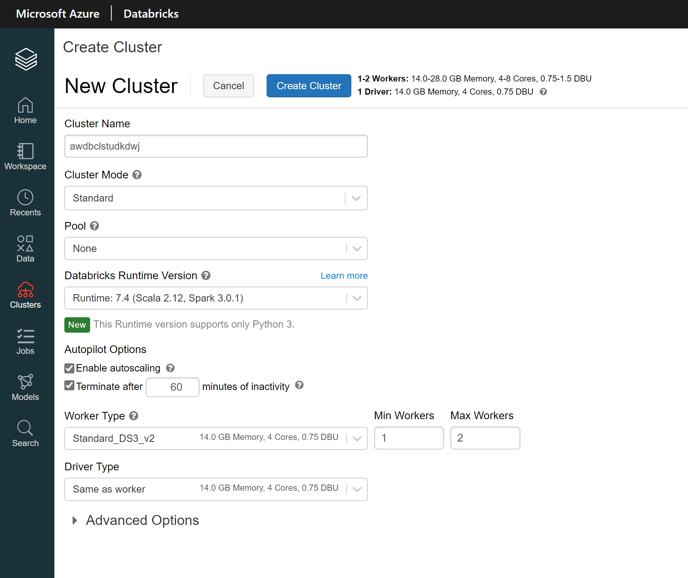
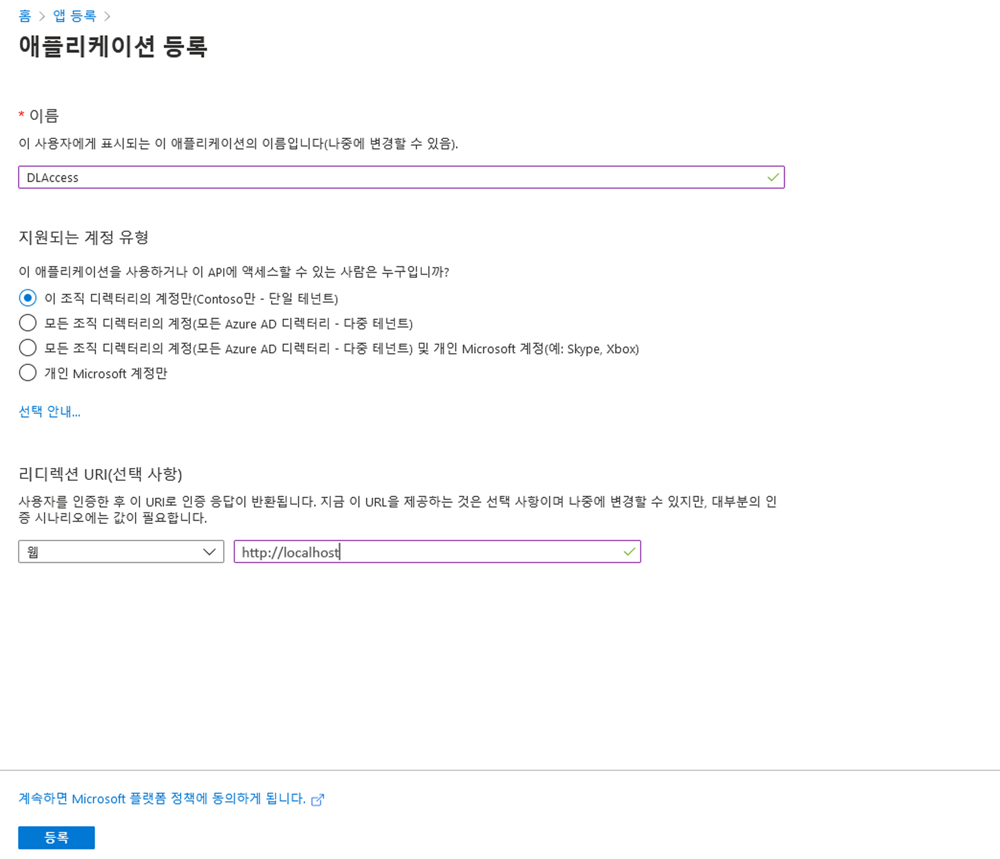
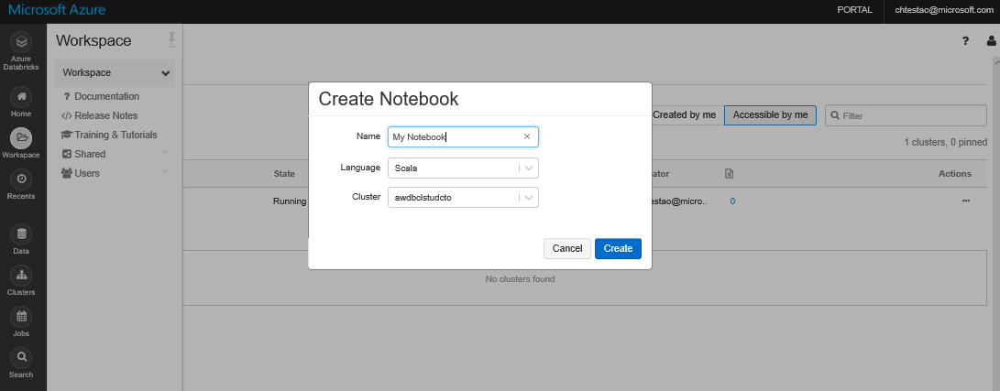
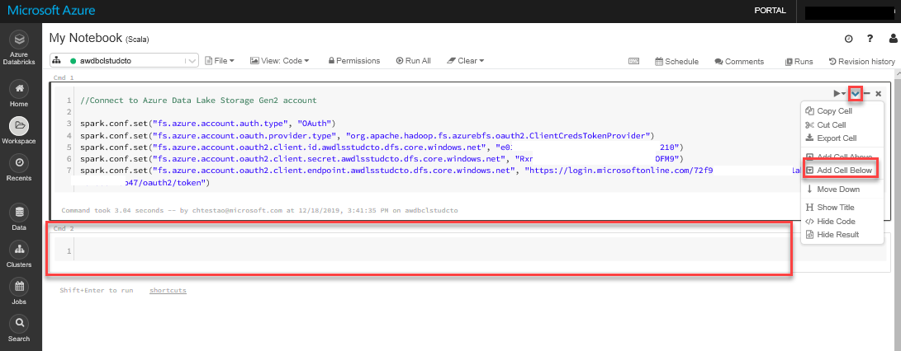
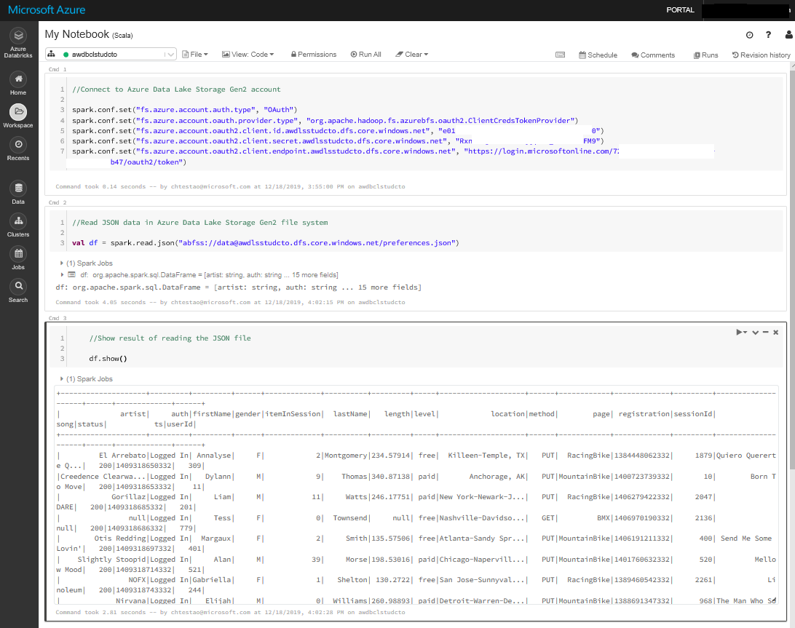

---
lab:
    title: 'Azure Databricks를 사용하여 팀 기반 데이터 과학 사용'
    module: '모듈 3: Azure Databricks를 사용하여 팀 기반 데이터 과학 사용'
---

# DP 200 - 데이터 플랫폼 솔루션 구현
# 랩 3 - Azure Databricks를 사용하여 팀 기반 데이터 과학 지원

**예상 시간**: 75분

**필수 구성 요소**: 이 랩에 대한 사례 연구는 이미 읽은 것으로 가정합니다. 모듈 1: 데이터 엔지니어용 Azure도 완료했습니다.

**랩 파일**: 이 랩의 파일은 _Allfiles\Labfiles\Starter\DP-200.3_ 폴더에 있습니다.

## 랩 개요

이 랩이 끝나면 학생은 Azure Databricks 사용이 데이터 과학 프로젝트에 도움이 되는 이유를 설명할 수 있습니다. 학생들은 Azure Databricks 인스턴스를 프로비전한 다음 Data Lake Store Gen2 저장소에서 간단한 데이터 준비 작업을 수행하는데 사용할 작업 영역을 만듭니다. 마지막으로 학생은 Azure Databricks를 사용하여 변환을 수행하는 연습을 수행합니다.

## 랩 목표
  
이 랩을 완료하면 다음과 같은 것들을 수행할 수 있습니다.

1. Azure Databricks 설명
1. Azure Databricks로 작업
1. Azure Databricks로 데이터 읽기
1. Azure Databricks로 변환 수행

## 시나리오
  
IS(정보 서비스) 부서 응답에 따라 기술 사용의 이점을 나열하여 예측 분석 플랫폼을 구축하는 프로세스를 시작합니다. 데이터 과학자들은 이 부서에 합류할 예정이며 새로운 팀 구성원이 사용할 수 있는 예측 분석 환경이 있는지 확인하려고 합니다.

Azure Databricks 환경을 프로비전한 다음 기존 Data Lake Storage Gen2 계정의 데이터를 수집하여 서비스에 대한 간단한 데이터 준비 루틴을 수행하여 이 환경이 작동하는지 테스트합니다. 데이터 엔지니어는 데이터 과학자가 데이터 준비 연습을 수행하는 데 도움을 줘야할 수 있습니다. 이를 위해 기본 변환을 수행하는 데 도움이 되는 노트를 확인하는 것이 좋습니다.

이 랩을 마치면 다음 작업을 수행할 수 있습니다.

1. Azure Databricks 설명
1. Azure Databricks로 작업
1. Azure Databricks로 데이터 읽기
1. Azure Databricks로 변환 수행

> **중요**: 이 랩을 진행하면서 프로비전하거나 구성 작업에서 발생한 이슈를 기록하고 _\Labfiles\DP-200-Issues-Doc.docx_에 있는 문서의 테이블에 로그합니다. 랩 번호를 문서화하고, 기술을 기록하며, 문제를 설명하고, 해결 방법이 무엇인지 설명합니다. 이 문서를 나중에 모듈에서 다시 참조할 수 있도록 저장합니다.

## 연습 1: Azure Databricks 설명

>**중요**: **연습 2를 먼저** 수행합니다. 연습 2에서 Databricks 클러스터 만들기를 시작한 후 연습 1로 돌아갑니다. 클러스터를 프로비전하는 데 10분이 소요됩니다.

예상 시간: 15분

개별 연습
  
이 연습의 주요 작업은 다음과 같습니다.

1. 지금까지 이 과정에서 배운 내용에서 Azure Databricks가 충족할 디지털 변환 요구 사항과 Azure Databricks용 후보 데이터 원본을 식별합니다.

1. 강사는 그룹과 결과에 대해 논의합니다.

### 작업 1: 디지털 변환 및 후보 데이터 원본을 정의합니다.

1. 랩 가상 머신에서, **Microsoft Word**를 시작하고 **Allfiles\Labfiles\Starter\DP-200.3** 폴더의 **DP-200-Lab03-Ex01.docx** 파일을 엽니다.

1. **10분** 동안 이 랩의 사례 연구 및 시나리오에 설명된 대로 디지털 변환 요구 사항 및 후보 데이터 원본을 문서화합니다.

### 작업 2: 강사와 조사 결과에 대해 토론합니다.

1. 강사는 결과를 논의하기 위해 그룹을 멈춥니다.

> **결과**: 이 연습을 완료한 후 Azure Databricks가 충족할 디지털 변환 요구 사항과 후보 데이터 원본을 식별하는 Microsoft Word 문서를 만들었습니다.

## 연습 2: Azure Databricks로 작업
  
예상 시간: 20분

개별 연습
  
이 연습의 주요 작업은 다음과 같습니다.

1. 리소스 그룹에서 Azure Databricks Premium 계층 인스턴스를 만듭니다.

1. Azure Databricks를 엽니다.

1. Databricks 작업 영역을 시작하고 Spark 클러스터를 만듭니다.

### 작업 1: Azure Databricks 인스턴스를 만들고 구성합니다.

1. Azure Portal에서 화면 왼쪽 상단에 있는 **홈** 하이퍼링크를 클릭합니다.

1. Azure Portal에서 **+ 리소스 만들기** 아이콘을 클릭합니다.

1. 새 화면에서 **마켓플레이스 검색** 텍스트 상자를 클릭하고 **databricks**라는 단어를 입력합니다. 표시되는 목록에서 **Azure Databricks**를 클릭합니다.

1. **Azure Databricks** 블레이드에서 **만들기**를 클릭합니다.

1. **Azure Databricks 서비스** 블레이드에서 다음 설정을 사용하여 Azure Databricks 작업 영역을 만듭니다.

    - **작업 영역 이름**: **Warehousexx**, 여기서 **xx**는 귀하의 이니셜입니다.

    - **구독**: 이 랩에서 사용 중인 구독의 이름

    - **리소스 그룹**: **awrgstudxx**, 여기서 **xx**는 이니셜입니다.

    - **위치**: 랩 위치와 가장 가까운 Azure 지역의 이름이며 Azure VM을 프로비저닝할 수 있는 위치입니다.

    - **가격 책정 계층**: **프리미엄(+ 역할 기반 액세스 제어)**.

    - **가상 네트워크에 Azure Databricks 작업 영역 배포**: **아니요**.

        

1. **Azure Databricks Service** 블레이드에서 **만들기**를 클릭합니다.

   > **참고**: 프로비전하는 데 약 3분이 소요됩니다. Databricks Runtime은 Apache Spark를 기반으로 구축되었으며 기본적으로 Azure 클라우드용으로 개발되었습니다. Azure Databricks는 인프라의 복잡성과 데이터 인프라를 설정하고 구성하는 전문 지식의 필요성을 완전히 끌어냅니다. Azure Databricks는 프로덕션 작업의 성능을 중요하게 생각하는 데이터 엔지니어에게 I/O 계층 및 처리 계층(Databricks I/O)에서 다양한 최적화를 통해 더 빠르고 성능이 뛰어난 Spark 엔진을 제공합니다.
   
### 작업 2: Azure Databricks를 엽니다.

1. Azure Databricks 서비스가 만들어졌는지 확인합니다.

1. Azure Portal에서 **리소스 그룹** 화면으로 이동합니다.

1. 리소스 그룹 화면에서 **awrgstudxx** 리소스 그룹을 클릭합니다. 여기서 **xx**는 이니셜입니다.

1. **awrgstudxx** 화면에서 **awdbwsstudxx**를 클릭합니다. 여기서 **xx**는 Azure Databricks를 여는 이니셜입니다. 그러면 Azure Databricks 서비스가 열립니다.

    

### 작업 3: Databricks 작업 영역을 시작하고 Spark 클러스터를 만듭니다.

1. Azure Portal의 **awdbwsstudxx** 화면에서 **작업 영역 시작** 단추를 클릭합니다.

    > **참고**: Microsoft Edge의 새 탭에서 Azure Databricks 작업 영역에 로그인됩니다.

1. **일반 작업** 아래에서 **새 클러스터**를 클릭합니다.

1. 새 클러스터 아래의 **클러스터 만들기** 화면에서 다음 설정으로 Databricks 클러스터를 만들고 **클러스터 만들기**를 클릭합니다.

    - **클러스터 이름**: **Warehousexx**, 여기서 **xx**는 귀하의 이니셜입니다.

    - **클러스터 모드**: **표준**

    - **풀**: **None**

    - **Databricks 런타임 버전**: **런타임: 6.3(Scala 2.11, Spark 2.4.4)**

    - 비활성 확인란에서 **60분 후 종료**를 선택했는지 확인합니다. 클러스터를 사용하고 있지 않다면 클러스터를 종료할 시간(분)을 입력합니다.

    - 나머지 옵션은 모두 현재 설정으로 둡니다.

        

1. **클러스터 만들기** 화면에서 **클러스터 만들기**를 클릭하고 Microsoft Edge 화면을 열어둡니다.

> **참고**: Azure Databricks 인스턴스를 만드는 데는 그래픽 사용자 인터페이스를 통해 Spark 클러스터 생성이 간소화되므로 약 10분이 소요됩니다. 클러스터가 만들어지는 동안 **상태**는 **보류 중**으로 표시됩니다. 클러스터가 만들어지면 **실행 중**으로 변경됩니다.

> **참고**: 클러스터가 만들어지는 동안 **뒤로 돌아가 연습 1을 수행**합니다.

## 연습 3: Azure Databricks로 데이터 읽기

예상 시간: 30분

개별 연습

이 연습의 주요 작업은 다음과 같습니다.

1. Databricks 클러스터가 만들어졌는지 확인합니다.

1. Azure Data Lake Store Gen2 계정 이름 수집

1. Databricks 인스턴스를 사용하여 Data Lake Gen2 Store에 액세스할 수 있습니다.

1. Databricks 노트를 만들고 Data Lake Store에 연결합니다.

1. Azure Databricks에서 데이터를 읽습니다.

### 작업 1: Databricks 클러스터 생성 확인

1. Microsoft Edge로 돌아가 **대화형 클러스터**에서 **awdbclstudxx**(**xx**: 사용자 이니셜)라는 클러스터의 상태 열이 **실행 중**으로 설정되어 있는지 확인합니다.

### 작업 2: Azure Data Lake Store Gen2 계정 이름 수집

1. Microsoft Edge에서 Azure Portal 탭을 클릭하고 **리소스 그룹**, **awrgstudxx**, **awdlsstudxx**를 차례로 클릭합니다. 여기서 **xx**는 이니셜입니다.

1. **awdlsstudxx** 화면에서 설정에 있는 **액세스 키**를 클릭한 다음 **스토리지 계정 이름** 옆에 있는 복사 아이콘을 클릭하여 메모장에 붙여넣습니다.

    

### 작업 3: Databricks 인스턴스를 사용하여 Data Lake Gen2 Store에 액세스할 수 있습니다.

1. Azure Portal에서 **홈** 하이퍼링크를 클릭한 다음 **Azure Active Directory** 아이콘을 클릭합니다.

1. **Microsoft - 개요** 화면에서 **앱 등록**을 클릭합니다.

1. **Microsoft - 앱 등록** 화면에서 **+ 새 등록** 단추를 클릭합니다.

1. 애플리케이션 등록 화면에서 **DLAccess** **이름**을 입력하고 **리디렉션 URI(선택 사항)** 섹션에서 **웹**이 선택되어 있는지 확인한 후에 애플리케이션 값으로 **https://adventure-works.com/exampleapp**을 입력합니다. 값을 설정 한 후.

    

1. **등록**을 클릭합니다. DLAccess 화면이 나타납니다.

1. **DLAccess** 등록 앱 화면에서 **애플리케이션(클라이언트) ID**와 **디렉터리 (테넌트) ID**를 복사하여 메모장에 붙여넣습니다.

1. **DLAccess** 등록 앱 화면에서 **인증서 및 암호**를 클릭하고 **+새 클라이언트 암호**를 클릭합니다.

1. 클라이언트 암호 추가 화면에서 **DL 엑세스 키**의 **설명**을 입력하고 키의 **기간**을 **1년 후**로 지정합니다. 완료 후 **추가**를 선택합니다.

    

    >**중요**: **추가**를 클릭하면 아래 그래픽과 같이 키가 표시됩니다.  이 키 값은 메모장에 한 번만 복사할 수 있습니다.

    

1. **애플리케이션 키 값**을 복사하여 메모장에 붙여넣습니다.

1. 리소스 그룹에 저장소 Blob 데이터 참가자 권한을 할당합니다. Azure Portal에서 **홈** 하이퍼링크를 클릭하고 **리소스 그룹** 아이콘을 클릭하고 리소스 그룹 **awrgstudxx**를 클릭합니다. 여기서 **xx**는 이니셜입니다.

1. **awrgstudxx** 화면에서 **액세스 제어 (IAM)**를 클릭합니다. 

1. **역할 할당** 탭을 클릭합니다. 

1. **+ 추가**, **역할 할당 추가**를 차례로 클릭합니다.

1. **역할 할당 추가** 블레이드의 역할에서 **Storage Blob 데이터 참가자**를 선택합니다.

1. **역할 할당 추가** 블레이드의 선택 아래에서 **DLAccess**를 선택한 다음 **저장**을 클릭합니다.

1. Azure Portal에서 **홈** 하이퍼링크를 클릭한 다음 **Azure Active Directory** 아이콘을 클릭하고 **역할**을 기록합니다. 사용자 역할이 있는 경우 관리자가 아닌 사용자가 애플리케이션을 등록할 수 있는지 확인해야 합니다.

1. **사용자**를 클릭한 다음 **사용자 - 모든 사용자** 블레이드에서 **사용자 설정**을 클릭하고, **앱 등록** 설정을 확인합니다. 이 값은 관리자만 설정할 수 있습니다. 예로 설정하면 Azure AD 테넌트의 모든 사용자가 앱을 등록할 수 있습니다. 

1. **사용자 - 모든 사용자** 화면을 닫습니다.

1. Azure Active Directory 블레이드에서 **속성**을 클릭합니다.

1. **디렉터리 ID** 옆에 있는 복사 아이콘을 클릭하여 테넌트 ID를 복사한 다음 메모장에 붙여넣습니다.

1. 매모장 문서를 **Allfiles\Labfiles\Starter\DP-200.3** 폴더에 **DatabricksDetails.txt**로 저장합니다.

### 작업 4: Databricks Notebook을 만들고 Data Lake Store에 연결합니다.

1. Microsoft Edge에서 **클러스터 - Databricks** 탭을 클릭합니다.

    > **참고**: 클러스터 페이지가 표시됩니다.

1. Microsoft Edge의 왼쪽에 있는 Azure Databricks 블레이드에서 **작업 영역** 아래를 클릭하고, **작업 영역** 옆의 드롭다운을 클릭하고, **만들기**를 가리킨 다음 **노트**를 클릭합니다.

1. **노트 만들기** 화면에서 이름 옆에 **내 노트**를 입력합니다.

1. **언어** 드롭다운 목록 옆에서 **Scala**를 선택합니다.

1. 클러스터에 앞서 만든 클러스터의 이름이 표시되는지 확인하고 **만들기**를 클릭합니다.

    

     > **참고**: 그러면 Scala라는 제목의 노트가 열립니다.

1. 노트의 **Cmd 1** 셀에서 다음 코드를 복사하여 다음 셀에 붙여넣습니다.

    ```scala
    // Azure Data Lake Storage Gen2 계정 연결

    spark.conf.set("fs.azure.account.auth.type", "OAuth")
    spark.conf.set("fs.azure.account.oauth.provider.type", "org.apache.hadoop.fs.azurebfs.oauth2.ClientCredsTokenProvider")
    spark.conf.set("fs.azure.account.oauth2.client.id.<storage-account-name>.dfs.core.windows.net", "<application-id>")
    spark.conf.set("fs.azure.account.oauth2.client.secret.<storage-account-name>.dfs.core.windows.net", "<authentication-key>")
    spark.conf.set("fs.azure.account.oauth2.client.endpoint.<storage-account-name>.dfs.core.windows.net", "https://login.microsoftonline.com/<tenant-id>/oauth2/token")
    ```

1. 이 코드 블록에서 **application-id**, **authentication-id**, **tenant-id**, **file-system-name** 및 **storage-account-name** 자리 표시자 값을 앞서 수집하여 메모장에 보관한 값으로 바꿉니다.

1. 노트의 **Cmd 1** 아래 셀에서, **실행** 아이콘을 클릭하고 **셀 실행**을 클릭합니다. 다음 그래픽에서 강조 표시되어 있습니다. 

    

    >**참고** 셀 아래쪽에 "Command took 0.0X seconds -- by person at 4/4/2019, 2:46:48 PM on awdbclstudxx" 메시지가 반환됩니다.

### 작업 5: Azure Databricks에서 데이터를 읽습니다.

1. 노트에서 셀 **Cmd 1**의 오른쪽 상단을 마우스로 가리키고 **아래에 셀 추가** 아이콘을 클릭합니다. **Cmd2**라는 새 셀이 표시됩니다.

    

1. Notebook의 **Cmd 2** 셀에서 다음 코드를 복사하여 셀에 붙여 넣습니다.

    ```scala
    //Azure Data Lake Storage Gen2 파일 시스템에서 JSON 데이터 읽기

    val df = spark.read.json("abfss://<file-system-name>@<storage-account-name>.dfs.core.windows.net/preferences.json")
    ```

1. 이 코드 블록에서 **file-system-name**을 **logs**로 바꾸고 이 코드 블록에 있는 **storage-account-name** 자리 표시자 값을 앞서 수집하여 메모장에 보관한 값으로 바꿉니다.

1. 노트의 **Cmd 2** 셀에서, **실행** 아이콘을 클릭하고 **셀 실행**을 클릭합니다. 

    >**참고** 셀 아래쪽에 Spar 작업이 실행되었다는 알림과 "Command took 0.0X seconds -- by person at 4/4/2019, 2:46:48 PM on awdbclstudxx" 메시지가 반환됩니다.

1. Notebook에서 **Cmd 2** 셀 오른쪽 상단을 마우스로 가리키고 **아래에 셀 추가** 아이콘을 클릭합니다. **Cmd3**이라는 새 셀이 나타납니다.

1. 노트의 **Cmd 3** 셀에서, 다음 코드를 복사하여 다음 셀에 붙여넣습니다.

    ```scala
    //Show result of reading the JSON file
  
    df.show()
    ```

    

1. Notebook의 **Cmd 3** 셀에서, **실행** 아이콘을 클릭하고 **셀 실행**을 클릭합니다.

    >**참고** Spark 작업이 실행되고 결과 테이블이 반환되었으며 "Command took 0.0X seconds -- by person at 4/4/2019, 2:46:48 PM on awdbclstudxx" 메시지가 셀 하단에 반환됩니다.

1. Azure Databricks Notebook 열어두기

>**결과** 이 연습에서는 Azure Databricks가 Azure Data Lake Store Gen2의 데이터에 액세스할 수 있는 권한을 설정하는 데 필요한 단계를 수행했습니다. 그런 다음 Scala를 사용하여 Data Lake Store에 연결한 후 데이터를 읽고 사람들의 선호도를 보여주는 테이블 출력을 만들었습니다.

## 연습 4: Azure Databricks로 기본 변환 수행

예상 시간: 10분

개인 연습

이 연습의 주요 작업은 다음과 같습니다.

1. 데이터 세트에서 특정 열 검색

1. 데이터 세트에서 열 이름 변경

1. 주석 추가

1. 시간이 허락할 경우: 추가 변환

### 작업 1: 데이터 집합에서 특정 열 검색

1. 노트에서 셀 **Cmd 3**의 오른쪽 상단을 마우스로 가리키고 **아래에 셀 추가** 아이콘을 클릭합니다. **Cmd4**라는 새 셀이 나타납니다.

1. Notebook의 **Cmd 4** 셀에서, 다음 코드를 복사하여 다음 셀에 붙여넣습니다.

    ```scala
    //Retrieve specific columns from a JSON dataset in Azure Data Lake Storage Gen2 file system
    
    val specificColumnsDf = df.select("firstname", "lastname", "gender", "location", "page")
    specificColumnsDf.show()
    ```

1. Notebook의 **Cmd 4** 셀에서, **실행** 아이콘을 클릭하고 **셀 실행**을 클릭합니다. 

    >**참고** Spark 작업이 실행되고 결과 테이블이 반환되었으며 "Command took 0.0X seconds -- by person at 4/4/2019, 2:46:48 PM on awdbclstudxx" 메시지가 셀 하단에 반환됩니다.

    

### 작업 2: 데이터 세트에서 열 이름 변경

1. Notebook에서 **Cmd 4** 셀 오른쪽 상단을 마우스로 가리키고 **아래에 셀 추가** 아이콘을 클릭합니다. **Cmd5**라는 새 셀이 나타납니다.

1. Notebook의 **Cmd 5**셀에서 다음 코드를 복사하여 셀에 붙여넣습니다.

    ```scala
    //Rename the page column to bike_preference

    val renamedColumnsDF = specificColumnsDf.withColumnRenamed("page", "bike_preference")
    renamedColumnsDF.show()
    ```

1. 노트의 **Cmd 5** 셀에서, **실행** 아이콘을 클릭하고 **셀 실행**을 클릭합니다. 

    >**참고** Spark 작업이 실행되고 결과 테이블이 반환되었으며 "Command took 0.0X seconds -- by person at 4/4/2019, 2:46:48 PM on awdbclstudxx" 메시지가 셀 하단에 반환됩니다.

    

### 작업 3: 주석 추가

1. 노트에서 **Cmd 5** 셀 오른쪽 상단을 마우스로 가리키고 **아래에 셀 추가** 아이콘을 클릭합니다. **Cmd6**이라는 새 셀이 나타납니다.

1. Notebook의 **Cmd 6** 셀에서, 다음 코드를 복사하여 셀에 붙여 넣습니다.

    ```text
    이 코드는 "Data"라는 Data Lake Storage 파일 시스템에 연결하고 해당 데이터 레이크에 저장된 preferences.json 파일의 데이터를 읽습니다. 그런 다음 데이터를 검색하기 위한 간단한 쿼리를 만들고 "page" 열의 이름을 "bike_preference"로 바꾸었습니다.
    ```

1. Notebook에서 **Cmd 6** 아래 셀에 있는 **아래쪽을 향하는 화살표** 아이콘을 클릭하고 **위로 이동**을 클릭합니다. Notebook 상단에 셀이 나타날 때까지 반복합니다.

1. Azure Databricks Notebook을 열어둡니다.

    >**참고** 향후 랩에서는 이 데이터를 다른 데이터 플랫폼 기술로 내보낼 수 있는 방법을 살펴봅니다.

> **결과**: 이 연습을 완료한 후 노트북에 주석을 만들었습니다.

### 작업 4: 시간이 허락할 경우 또는 과정 복습

이 랩을 일찍 완료한 경우, Azure의 기본 및 고급 변환에 대해 자세히 알아보는 데 도움이 되는 콘텐츠의 링크가 다음 섹션에 나와 있습니다.

URL에 액세스할 수 없는 경우, 노트 복사본은 _Allfiles\Labfiles\Starter\DP-200.3\Post Course Review_ 폴더에 있습니다.

**기본 변환**

1. 작업 영역 내에서 왼쪽의 명령 모음을 사용하여 **작업 영역**, **사용자** 및 **사용자 이름**(주택 아이콘이 있는 항목)을 선택합니다.

1. 표시되는 블레이드에서 **이름 옆의 아래쪽을 가리키는 갈매기형 모양**을 선택하고 **가져오기**를 선택합니다.

1. 노트 가져오기 대화 상자에서 **아래 URL**을 선택하고 다음 URL에 붙여넣습니다. 

```url
    https://github.com/MicrosoftDocs/mslearn-perform-basic-data-transformation-in-azure-databricks/blob/master/DBC/05.1-Basic-ETL.dbc?raw=true
```

1. **가져오기**를 선택합니다.

1. 가져오기가 완료되면 **05.1-Basic-ETL**이라는 폴더가 나타납니다. 해당 폴더를 선택합니다.

1. 폴더에는 **Scala** 또는 **Python**을 사용하여 기본 변환을 배우는 데 사용할 수 있는 하나 이상의 노트가 포함되어 있습니다.

전체 노트를 완료할 때까지 노트 내의 지침을 따릅니다. 그런 다음 나머지 노트를 순서대로 계속합니다.

- **01-Course-Overview-and-Setup** - 이 노트에서는 Databricks 작업 영역을 시작합니다.
- **02-ETL-Process-Overview** - 이 Notebook에는 대용량 데이터 파일을 쿼리하고 결과를 시각화하는 데 도움이 되는 연습이 포함되어 있습니다.
- **03-Connecting-to-Azure-Blob-Storage** - 이 노트에서 기본 집계 및 연결을 수행합니다.
- **04-Connecting-to-JDBC** - 이 노트에는 Databricks를 사용하여 다양한 원본의 데이터에 액세스하는 단계가 나열되어 있습니다.
- **05-Applying-Schemas-to-JSON** - 이 노트에서는 DataFrames으로 JSON 및 계층 구조 데이터를 쿼리하는 방법을 배웁니다.
- **06-Corrupt-Record-Handling** - 이 노트북에는 ADLS를 만들고 Databricks DataFrames를 사용하여 이 데이터를 쿼리하고 분석하는 방법을 이해하는 데 도움이 되는 연습이 나열되어 있습니다.
- **07-Loading-Data-and-Productionalizing** - 이곳에서는 Databricks를 사용하여 Azure Data Lake Storage Gen2의 데이터 저장소를 쿼리하고 분석합니다.
- **Parsing-Nested-Data** - 이 노트는 Optional 하위 폴더에 있으며 나중에 개인 시간에 둘러볼 수 있는 샘플 프로젝트가 포함되어 있습니다.

>[참고] Solutions 하위 폴더에서 해당 노트를 찾을 수 있습니다. 여기에는 하나 이상의 과제를 완료하도록 요청하는 연습을 위한 완성된 셀이 포함되어 있습니다. 문제가 있거나 단순히 솔루션을 보기 원할 경우 참조하세요.

**고급 변환**

1. 작업 영역 내에서 왼쪽의 명령 모음을 사용하여 **작업 영역**, **사용자** 및 **사용자 이름**(집 모양 아이콘이 있는 항목)을 선택합니다.

1. 표시되는 블레이드에서 **이름 옆의 아래쪽을 가리키는 갈매기형 모양**을 선택하고 **가져오기**를 선택합니다.

1. Notebooks 가져오기 대화 상자에서 **아래 URL**을 선택하고 다음 URL에 붙여넣습니다. 

```url
    https://github.com/MicrosoftDocs/mslearn-perform-advanced-data-transformation-in-azure-databricks/blob/master/DBC/05.2-Advanced-ETL.dbc?raw=true
```

1. **가져오기**를 선택합니다.

1. 가져오기가 완료되면 **05.2-Advanced-ETL**이라는 폴더가 나타납니다. 해당 폴더를 선택합니다.

1. 폴더에는 **Scala** 또는 **Python**을 사용하여 기본 변환을 배우는 데 사용할 수 있는 하나 이상의 노트가 포함되어 있습니다.

전체 노트를 완료할 때까지 노트 내의 지침을 따릅니다. 그런 다음 나머지 노트를 순서대로 계속합니다.

- **01-Course-Overview-and-Setup** - 이 노트에서는 Databricks 작업 영역을 시작합니다.
- **02-Common-Transformations** - 이 노트에서는 Spark 기본 제공 함수를 사용하여 몇 가지 일반적인 데이터 변환을 수행합니다.
- **03-User-Defined-Functions** - 이 노트에서는 사용자 정의 함수를 사용하여 사용자 변환을 수행합니다.
- **04-Advanced-UDFs** - 이 노트에서는 고급 사용자 정의 함수를 사용하여 일부 복잡한 데이터 변환을 수행합니다.
- **05-Joins-and-Lookup-Tables** - 이 노트에서는 테이블의 표준 및 브로드캐스트 조인을 사용하는 방법을 배웁니다.
- **06-Database-Writes** - 이 노트에는 여러 대상 데이터베이스에 데이터를 병렬로 쓰고 ETL 작업에서 변환된 데이터를 저장하는 연습이 포함되어 있습니다.
- **07-Table-Management** - 여기에서는 관리되는 테이블과 관리되지 않는 테이블을 처리하여 데이터 저장소를 최적화합니다.
- **Custom-Transformations** - 이 노트는 Optional 하위 폴더에 있으며 나중에 개인 시간에 둘러볼 수 있는 샘플 프로젝트가 포함되어 있습니다.

>[참고] Solutions 하위 폴더 내에서 해당 노트를 찾을 수 있습니다. 여기에는 하나 이상의 과제를 완료하도록 요청하는 연습용 완성된 셀이 포함되어 있습니다. 문제가 있거나 단순히 해결책을 보기 원할 경우 참조하세요.
