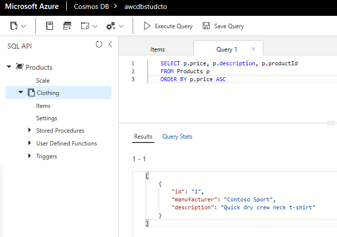

# DP 200 - 데이터 플랫폼 솔루션 구현
# 랩 4 - Cosmos DB를 사용하여 전 세계에 분산된 데이터베이스 구축

**예상 소요 시간**: 60분

**전제 조건**: 이 랩의 사례 연구를 읽었다고 가정합니다. 모듈 1의 콘텐츠 및 랩이 다음과 같다고 가정합니다. 데이터 엔지니어를 위한 Azure도 완료되었습니다.

**랩 파일**: 이 랩용 파일은 _Allfiles\Labfiles\Starter\DP-200.4_ 폴더에 있습니다.

## 랩 개요

수강생들은 Azure Cosmos DB가 조직에 도움이 되는 기능을 설명하고 시연할 수 있습니다. Cosmos DB 인스턴스를 만들고 포털과 .Net 애플리케이션을 통해 데이터를 업로드하고 쿼리하는 방법을 제시할 수 있습니다. 그런 다음 Cosmos DB 데이터베이스의 전역 규모를 활성화하는 방법을 시연할 수 있습니다.

## 랩 목표
  
이 랩을 완료하면 다음을 할 수 있습니다.

1. 확장할 수 있도록 빌드된 Azure Cosmos DB 데이터베이스 만들기
2. Azure Cosmos DB 데이터베이스에서 데이터 삽입 및 쿼리
3. Azure Cosmos DB를 사용하여 데이터 전역 배포

## 시나리오
  
AdventureWorks의 개발자 및 정보 서비스 부서는 최근 Azure에서 출시된 Cosmos DB로 알려진 새로운 서비스가 거의 실시간으로 데이터에 대한 행성 규모의 액세스를 제공할 수 있다는 것을 알고 있습니다. 그들은 서비스가 제공할 수 있는 기능과 어떠한 환경에서든 AdventureWorks에 가치를 가져다줄 수 있는 방법을 이해하려고 합니다.

정보 서비스 부서는 서비스를 설정하는 방법과 데이터를 업로드하는 방법을 이해하려고 합니다. 개발자는 Cosmos에 데이터를 업로드하는 데 사용할 수 있는 애플리케이션의 예를 보고 싶어합니다. 둘 다 행성 규모의 주장을 충족할 수 있는 방법을 이해하고 싶어합니다.

이 랩을 마치면 다음 작업을 수행할 수 있습니다.

1. 확장할 수 있도록 빌드된 Azure Cosmos DB 데이터베이스 만들기
2. Azure Cosmos DB 데이터베이스에서 데이터 삽입 및 쿼리
3. Azure Cosmos DB를 사용하여 데이터 전역 배포

> **중요**: 이 랩을 진행하면서 프로비전 또는 구성 작업에서 발생한 문제를 기록하고 _\Labfiles\DP-200-Issues-Doc.docx_에 있는 문서의 테이블에 로그인합니다. 랩 번호를 문서화하고, 기술을 기록하며, 문제를 설명하고, 해결 방법이 무엇인지 설명합니다. 이 문서를 나중에 모듈에서 다시 참조할 수 있도록 저장합니다.

## 연습 1: 확장할 수 있도록 빌드된 Azure Cosmos DB 데이터베이스 만들기

예상 소요 시간: 10분

개인 연습
  
이 연습의 주요 작업은 다음과 같습니다.

1. Azure Cosmos DB 인스턴스 만들기

### 작업 1: Azure Cosmos DB 인스턴스 만들기

1. Azure Portal에서 필요할 경우 **홈** 하이퍼링크를 클릭합니다.

2. **+ 리소스 만들기** 아이콘으로 이동합니다.

3. 새 화면에서 **마켓플레이스 검색** 텍스트 상자를 클릭하고 **Cosmos**라는 단어를 입력합니다. 표시되는 목록에서 **Azure Cosmos DB**를 클릭합니다.

4. **Azure Cosmos DB** 화면에서 **만들기**를 클릭합니다.

5. **Azure Cosmos DB 계정 만들기** 화면에서 다음 설정을 사용하여 Azure Cosmos DB 계정을 만듭니다.

    - 화면의 프로젝트 세부 정보에 다음 정보를 입력합니다.
    
        - **구독**: 이 랩에서 사용 중인 구독의 이름

        - **리소스 그룹**: **awrgstudxx**, 여기서 **xx**는 귀하의 이니셜입니다.

    - 화면의 인스턴스 세부 정보에 다음 정보를 입력합니다.

        - **계정 이름**: **awcdbstudxx**, 여기서 **xx**는 귀하의 이니셜입니다.

        - **API**: **코어(SQL)**

        - **Notebook(미리 보기)**: **꺼짐**

        - **위치**: 랩 위치와 가장 가까운 Azure 지역의 이름이며 Azure VM을 프로비전할 수 있는 위치입니다.

        - 나머지 옵션은 기본값 설정으로 둡니다.

            

6. **Azure Cosmos DB 계정 만들기** 블레이드에서 **검토 + 만들기**를 클릭합니다.

7. **Azure Cosmos DB 계정 만들기** 블레이드에서 유효성 검사를 완료한 후에 **만들기**를 클릭합니다.

   > **참고**: 프로비전하는 데 약 5분이 소요됩니다. 이러한 랩에서 자주 건너뛰는 것은 Azure에서 서비스를 프로비전할 때 추가 탭에 대한 설명입니다. 프로비전 화면에 네트워크, 태그, 고급과 같은 추가 탭이 있습니다. 이를 사용하여 서비스에 대한 사용자 지정 설정을 정의할 수 있습니다. 예를 들어 여러 서비스의 네트워크 탭을 사용하면 가상 네트워크 구성을 정의할 수 있으므로 지정된 데이터 서비스에 대한 네트워크 트래픽을 제어하고 보호할 수 있습니다. 태그 옵션은 여러 리소스 및 리소스 그룹에 동일한 태그를 적용하여 리소스를 분류하고 통합 청구를 볼 수 있는 이름/값 쌍입니다. 고급 탭은 탭이 표시되는 서비스에 따라 다릅니다. 그러나 이러한 영역을 제어할 수 있으며 네트워크 관리자 또는 재무 부서와 협력하여 이러한 옵션을 구성하는 방법을 알아보는 것이 중요합니다.

8. 프로비전이 완료되면 "배포가 완료됨" 화면이 나타납니다. **리소스로 이동**을 클릭하고 다음 연습으로 이동합니다. 

>**결과**이 연습에서 Azure Cosmos DB 계정을 프로비전했습니다.

## 연습 2: Azure Cosmos DB 데이터베이스에서 데이터 삽입 및 쿼리
  
예상 소요 시간: 20분

개인 연습
  
이 연습의 주요 작업은 다음과 같습니다.

1. Azure Cosmos DB 데이터베이스 및 컨테이너 설정 

2. 포털을 사용하여 데이터 추가

3. Azure Portal에서 쿼리 실행

4. 데이터에 대한 복잡한 작업 실행

### 작업 1: Azure Cosmos DB 컨테이너 및 데이터베이스 설정

1. Azure Portal에서 Cosmos DB의 배포가 완료되면 **리소스로 이동** 단추를 클릭합니다.

2. Cosmos DB 화면에서 **개요** 링크를 클릭합니다.

3. **awcdbstudxx** 화면에서 **+ 컨테이너 추가**를 클릭합니다. 그러면 **awcdbstudxx Data Explorer** 블레이드와 **컨테이너 추가** 블레이드가 열립니다.

4. **컨테이너 추가** 블레이드에서 다음 설정을 사용하여 Clothing이라는 컨테이너가 있는 Products 데이터베이스를 만듭니다.

    - **데이터베이스 ID**: **Products**
    
    - **처리량**:  **400**

    - **컨테이너 ID**:  **Clothing**

    - **파티션 키**: **/productId**

    - 나머지 옵션은 기본값으로 둡니다.

        

5. **컨테이너 추가** 화면에서 **확인**을 클릭합니다.

### 작업 2: 포털을 사용하여 데이터 추가

1. **awcdbstudcto - Data Explorer** 화면의 새 컨테이너 단추 반대쪽에 있는 Data Explorer 도구 모음에서 **전체 화면 열기** 단추를 클릭합니다. 전체 화면 열기 대화 상자에서 **열기**를 클릭합니다. Microsoft Edge에서 새 탭이 열립니다.

2. **SQL API** 창에서 새로 고침 아이콘을 클릭하고 **Products**와 **Clothing**을 차례로 확장한 다음 **항목**을 클릭합니다. 

3. 문서 창에서 **새 항목** 아이콘을 클릭합니다. 이제 대체할 샘플 JSON과 함께 새 문서가 나타납니다.

4. 다음 코드를 복사하여 **문서**탭에 붙여 넣습니다.

    ```JSON
    {
       "id": "1",
       "productId": "33218896",
       "category": "Women's Clothing",
       "manufacturer": "Contoso Sport",
       "description": "Quick dry crew neck t-shirt",
       "price": "14.99",
       "shipping": {
           "weight": 1,
           "dimensions": {
           "width": 6,
           "height": 8,
           "depth": 1
          }
       }
    }
    ```

    

5. 문서 탭에 JSON을 추가한 후 **저장**을 클릭합니다.

6. 문서 창에서 **새 항목** 아이콘을 클릭합니다.

7. 다음 코드를 복사하여 **항목** 탭에 붙여 넣습니다.

    ```JSON
    {
        "id": "2",
        "productId": "33218897",
        "category": "Women's Outerwear",
        "manufacturer": "Contoso",
        "description": "Black wool pea-coat",
        "price": "49.99",
        "shipping": {
            "weight": 2,
            "dimensions": {
            "width": 8,
            "height": 11,
            "depth": 3
            }
        }
    }
    ```

    

7. 문서 탭에 JSON을 추가한 후 **저장**을 클릭합니다.

8. 왼쪽 메뉴의 각 문서를 클릭하여 저장한 각 문서를 볼 수 있습니다. ID가 1인 첫 번째 항목의 값은 **33218896**이고(제품 ID에 따라 명명) 두 번째 항목의 값은 **33218897**입니다.

### 작업 3: Azure Portal에서 쿼리를 실행합니다.

1. Microsoft Edge 브라우저가 열리면 데이터 탐색기의 **항목** 화면에서 **SQL API** 블레이드 상단의 **새로 고침** 아이콘 위에 있는 **새 SQL 쿼리** 단추를 클릭합니다.

    > **참고**: **SELECT * FROM c** 쿼리가 표시된 쿼리 1 화면 탭이 나타납니다.

2. 제품 ID 1의 세부 정보를 나타내는 JSON 파일을 반환하는 쿼리를 변경합니다.

    ```SQL
    SELECT *
    FROM Products p
    WHERE p.id ="1"
    ```

3. **쿼리 실행**아이콘을 클릭합니다. 다음 결과가 반환됩니다.

    ```JSON
    [
        {
            "id": "1",
            "productId": "33218896",
            "category": "Women's Clothing",
            "manufacturer": "Contoso Sport",
            "description": "Quick dry crew neck t-shirt",
            "price": "14.99",
            "shipping": {
                "weight": 1,
                "dimensions": {
                    "width": 6,
                    "height": 8,
                    "depth": 1
                }
            },
            "_rid": "I2YsALxG+-EBAAAAAAAAAA==",
            "_self": "dbs/I2YsAA==/colls/I2YsALxG+-E=/docs/I2YsALxG+-EBAAAAAAAAAA==/",
            "_etag": "\"0000844e-0000-1a00-0000-5ca79f840000\"",
            "_attachments": "attachments/",
            "_ts": 1554489220
        }
    ]
    ```

    

4. 기존 쿼리 창에서 제품 ID에 대해 이전 쿼리 대신에 ID, 제조업체 및 설명을 반환하는 쿼리를 JSON 파일에 작성합니다. 

    ```SQL
    SELECT
        p.id,
        p.manufacturer,
        p.description
    FROM Products p
    WHERE p.id ="1"
    ```

5. **쿼리 실행**아이콘을 클릭합니다. 다음 결과가 반환됩니다.

    ```JSON
    [
    {
        "id": "1",
        "manufacturer": "Contoso Sport",
        "description": "Quick dry crew neck t-shirt"
    }
    ]
    ```

    

6. 기존 쿼리 창에서 이전 쿼리 대신 모든 제품의 가격, 설명 및 제품 ID를 가격 기준 오름차순으로 정렬하여 반환하는 쿼리를 작성합니다.

    ```SQL
    SELECT p.price, p.description, p.productId
    FROM Products p
    ORDER BY p.price ASC
    ```

7. **쿼리 실행**아이콘을 클릭합니다. 다음 결과가 반환됩니다.

    ```JSON
    [
        {
            "price": "14.99",
            "description": "Quick dry crew neck t-shirt",
            "productId": "33218896"
        },
        {
            "price": "49.99",
            "description": "Black wool pea-coat",
            "productId": "33218897"
        }
    ]
    ```

    

### 작업 4: 데이터에 대한 복잡한 작업 실행

1. Microsoft Edge 브라우저가 열리면 데이터 탐색기의 **항목** 화면에서 쿼리 열기 단추 옆에 있는 **새 저장 프로시저** 단추를 클릭합니다.

    > **참고**: 샘플 저장 프로시저를 보여 주는 새 저장 프로시저 화면이 나타납니다.

2. 새 저장 프로시저 화면에서 **저장 프로시저 ID** 텍스트 상자에 **createMyDocument**를 입력합니다.

3. 다음 코드를 사용하여 저장 프로시저 본문에 저장 프로시저를 만듭니다.

    ```Javascript
    function createMyDocument() {
        var context = getContext();
        var collection = context.getCollection();

        var doc = {
            "id": "3",
            "productId": "33218898",
            "description": "Contoso microfleece zip-up jacket",
            "price": "44.99"
        };

        var accepted = collection.createDocument(collection.getSelfLink(),
            doc,
            function (err, documentCreated) {
                if (err) throw new Error('Error' + err.message);
                context.getResponse().setBody(documentCreated)
            });
        if (!accepted) return;
    }
    ```

4. 새 저장 프로시저 화면에서 **저장**을 클릭합니다.

5. 새 저장 프로시저 화면에서 **실행**을 클릭합니다.

6. 매개 변수 입력 화면에서 **파티션 키 값**을 설정합니다. **유형**은 **문자열**로, **값**은 **33218898**로 설정한 후 다른 설정은 그대로 두고 **실행**을 클릭합니다.

아래 내용을 참조하세요.


다음 결과가 반환됩니다.

    ```JSON
    {
        "id": "3",
        "productId": "33218898",
        "description": "Contoso microfleece zip-up jacket",
        "price": "44.99",
        "_rid": "I2YsALxG+-EDAAAAAAAAAA==",
        "_self": "dbs/I2YsAA==/colls/I2YsALxG+-E=/docs/I2YsALxG+-EDAAAAAAAAAA==/",
        "_etag": "\"0000874e-0000-1a00-0000-5ca7a7050000\"",
        "_attachments": "attachments/"
    }
    ```

7. Microsoft Edge 브라우저가 열리면 데이터 탐색기에서 **새 저장 프로시저** 드롭다운 단추를 클릭하고 **새 UDF**를 클릭합니다.

    > **참고**: **function userDefinedFunction(){}**을 보여 주는 새 UDF 1 화면이 표시됩니다.

8. 새 정의 함수 화면에서 **사용자 정의 함수 ID** 텍스트 상자에 **producttax**를 입력합니다.

9. 다음 코드를 사용하여 사용자 정의 함수 본문에 사용자 정의 함수를 만듭니다.

    ```Javascript
    function producttax(price) {
        if (price == undefined) 
            throw 'no input';

        var amount = parseFloat(price);

        if (amount < 1000) 
            return amount * 0.1;
        else if (amount < 10000) 
            return amount * 0.2;
        else
            return amount * 0.4;
    }
    ```

10. 새 UDF 1 화면에서 **저장**을 클릭합니다.

11. 쿼리 1 탭을 클릭하고 기존 쿼리를 다음 쿼리로 바꿉니다.

    ```SQL
    SELECT c.id, c.productId, c.price, udf.producttax(c.price) AS producttax FROM c
    ```

12. 쿼리 1 화면에서 **쿼리 실행**을 클릭합니다.

다음 결과가 반환됩니다.

    ```JSON
    [
        {
            "id": "1",
            "productId": "33218896",
            "price": "14.99",
            "producttax": 1.499
        },
        {
            "id": "2",
            "productId": "33218897",
            "price": "49.99",
            "producttax": 4.9990000000000005
        },
        {
            "id": "3",
            "productId": "33218898",
            "price": "44.99",
            "producttax": 4.4990000000000005
        }
    ]
    ```

## 연습 3: Azure Cosmos DB를 사용하여 데이터 전역 배포

예상 소요 시간: 15분

개인 연습

이 연습의 주요 작업은 다음과 같습니다.

1. 여러 지역으로 데이터 복제

2. 장애 조치(failover) 관리

### 작업 1: 여러 지역으로 데이터 복제

1. Azure Portal에서 Cosmos DB 리소스 **awcdbstudxx** 창으로 이동하여 **설정** 블레이드에서 **전역으로 데이터 복제**를 클릭합니다.

    

2. 세계 지도에서 거주 중인 대륙의 데이터 센터 위치를 한 번 클릭하고 **저장**을 클릭합니다.

>**참고**추가 데이터 센터의 프로비전에는 약 7분이 걸립니다.

### 작업 2: 장애 조치(failover) 관리.

1. **awcdbstudxx - 전역으로 데이터 복제** 창에서 **수동 장애 조치(failover)**를 클릭합니다.

2. **읽기 영역** 데이터 센터 위치를 클릭한 다음 "현재 쓰기 영역에서 장애 조치(failover)를 트리거하는 것을 이해하고 이에 동의합니다(I understand and agree to trigger a failover on my current Write Region)." 옆의 확인란을 클릭하고 **확인**을 클릭합니다.

>**참고** 수동 장애 조치(Failover)는 약 3분 정도 걸립니다. 화면이 다음과 같이 표시됩니다. 아이콘 색상이 변경됩니다.


3. **awcdbstudxx - 전역으로 데이터 복제** 창에서 **자동 장애 조치(failover)**를 클릭합니다

4. "자동 장애 조치(failover)" 화면에서 **켜기(ON)** 단추를 클릭한 다음 **확인**을 클릭합니다.

>**참고** 자동 장애 조치(failover)의 프로비전에는 약 3분이 걸립니다.


