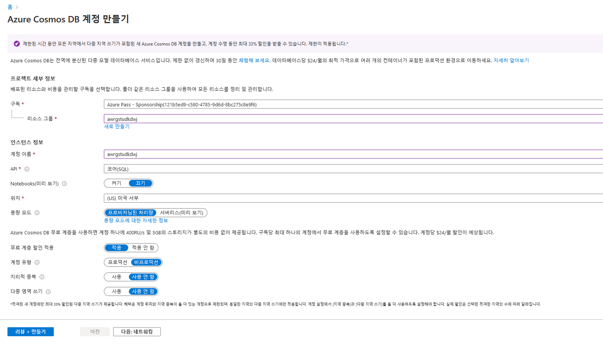
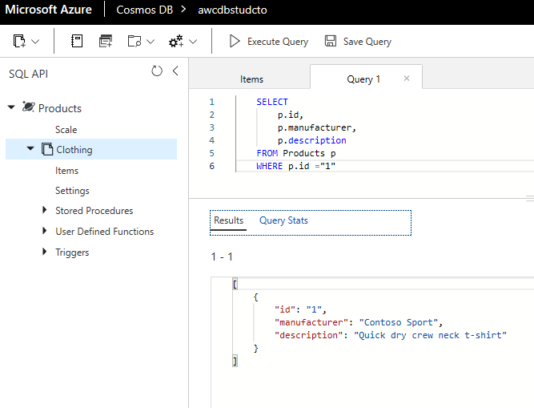

---
lab:
    title: 'Cosmos DB를 사용하여 전역으로 분산되는 데이터베이스 작성'
    module: '모듈 4: Cosmos DB로 전 세계에 분산된 데이터베이스 구축'
---

# DP 200 - 데이터 플랫폼 솔루션 구현
# 랩 4 - Cosmos DB를 사용하여 전 세계에 분산된 데이터베이스 빌드

**예상 시간**: 90분

**필수 구성 요소**: 이 랩에 대한 사례 연구는 이미 읽은 것으로 가정합니다. 콘텐츠와 랩은 모듈 1로 가정합니다. 데이터 엔지니어용 Azure도 완료되었습니다.

**랩 파일**: 이 랩의 파일은 _Allfiles\Labfiles\Starter\DP-200.4_ 폴더에 있습니다.

## 랩 개요

학생들은 Azure Cosmos DB가 조직에 가져올 수 있는 기능을 설명하고 시연할 수 있습니다. Cosmos DB 인스턴스를 만들고 포털과 .Net 애플리케이션을 통해 데이터를 업로드하고 쿼리하는 방법을 제시할 수 있습니다. 그런 다음 Cosmos DB 데이터베이스의 글로벌 확장을 활성화하는 방법을 시연할 수 있습니다.

## 랩 목표
  
이 랩을 완료하면 다음과 같은 것들을 수행할 수 있습니다.

1. 확장하도록 빌드된 Azure Cosmos DB 데이터베이스 만들기
1. Azure Cosmos DB 데이터베이스에 데이터 삽입 및 쿼리
1. Azure Cosmos DB를 사용하여 데이터를 전 세계에 배포하세요
1. (선택 사항) Visual Studio Code에서 Azure Cosmos DB용 .NET Core 앱 빌드

## 시나리오
  
AdventureWorks의 개발자 및 정보 서비스 부서는 최근 Azure에서 출시된 Cosmos DB라는 새로운 서비스가 거의 실시간으로 데이터에 대한 지구 규모의 액세스를 제공할 수 있다는 것을 알고 있습니다. 서비스가 제공할 수 있는 기능을 파악하고 어떻게 하면 서비스가 어떠한 환경에서든지 AdventureWorks의 가치를 끌어낼 수 있을지 알아보고자 합니다.

정보 서비스 부서는 서비스를 설정하는 방법과 데이터를 업로드하는 방법을 이해하려고 합니다. 개발자는 Cosmos에 데이터를 업로드하는 데 사용할 수 있는 애플리케이션의 예를 확인하고 싶어합니다. 둘 다 지구 규모의 클레임을 충족할 수 있는 방법을 이해하고 싶어합니다.

이 랩을 마치면 다음 작업을 할 수 있게 됩니다.

1. 확장할 수 있도록 빌드된 Azure Cosmos DB 데이터베이스 만들기
1. Azure Cosmos DB 데이터베이스에 데이터 삽입 및 쿼리
1. Azure Cosmos DB를 사용하여 데이터를 전역에 배포
1. (선택 사항) Visual Studio Code에서 Azure Cosmos DB용 .NET Core 앱 빌드

> **중요**: 이 랩을 진행하면서 프로비전 또는 구성 작업에서 발생한 문제를 적어두고 _\Labfiles\DP-200-Issues-Doc.docx_에 있는 문서의 테이블에 기록합니다. 랩 번호를 문서화하고, 기술을 기록하며, 문제와 해결 방법을 설명합니다. 나중에 모듈에서 다시 참조할 수 있도록 이 문서를 저장합니다.

## 연습 1: 확장하도록 빌드된 Azure Cosmos DB 데이터베이스 만들기

예상 시간: 10분

개인 연습
  
이 연습의 주요 작업은 다음과 같습니다.

1. Azure Cosmos DB 인스턴스 만들기

### 작업 1: Azure Cosmos DB 인스턴스 만들기

1. Azure Portal에서 **홈** 하이퍼링크를 클릭하는 경우.

1. **+ 리소스 만들기** 아이콘으로 이동합니다.

1. 새 화면에서 **마켓플레이스 검색** 텍스트 상자를 클릭하여 **Cosmos**라는 단어를 입력합니다. 표시되는 목록에서 **Azure Cosmos DB**를 클릭합니다.

1. **Azure Cosmos DB** 화면에서 **만들기**를 클릭합니다.

1. **Azure Cosmos DB 계정 만들기** 화면에서 다음 설정을 사용하여 Azure Cosmos DB 계정을 만듭니다.

    - 화면의 프로젝트 세부 정보에서 다음 정보를 입력합니다.
    
        - **구독**: 이 랩에서 사용 중인 구독의 이름

        - **리소스 그룹**: **awrgstudxx**, 여기서 **xx**는 사용자의 이니셜입니다.

    - 화면의 인스턴스 세부 정보에 다음 정보를 입력합니다.

        - **계정 이름**: **awcdbstudxx**, 여기서 **xx**는 사용자의 이니셜입니다.

        - **API**: **코어(SQL)**

        - **Apache Spark**: **없음**

        - **위치**: 랩 위치와 가장 가까운 Azure 지역의 이름이며 Azure VM을 프로비저닝할 수 있는 위치입니다.

        - 나머지 옵션은 기본 설정으로 둡니다.

            

1. **Azure Cosmos DB 계정 만들기** 블레이드에서 **검토 + 만들기**를 클릭합니다.

1. **Azure Cosmos DB 계정 만들기** 블레이드의 유효성 검사를 완료한 후에 **만들기**를 클릭합니다.

   > **참고**: 프로비전하는 데 약 5분이 소요됩니다. 이러한 랩에서 자주 건너뛰는 것은 Azure에서 서비스를 프로비전할 때 추가 탭에 대한 설명입니다. 프로비저닝 화면에 네트워크, 태그, 고급과 같은 추가 탭이 있습니다. 이를 사용하여 서비스에 대한 사용자 지정 설정을 정의할 수 있습니다. 예를 들어 여러 서비스의 네트워크 탭을 사용하면 가상 네트워크 구성을 정의할 수 있으므로 지정된 데이터 서비스에 대한 네트워크 트래픽을 제어하고 보호할 수 있습니다. 태그 옵션은 여러 리소스 및 리소스 그룹에 같은 태그를 적용하여 리소스를 분류하고 통합 청구 정보를 확인하는 데 사용할 수 있는 이름/값 쌍입니다. 고급 탭은 탭이 가진 서비스에 따라 다릅니다. 그러나 이러한 영역은 제어할 수 있으며, 네트워크 관리자나 경리부와의 공동 작업을 통해 이러한 옵션을 구성해야 하는 방법을 파악할 수 있습니다.

1. 프로비저닝이 완료되면 "배포가 완료됨" 화면이 나타납니다. **리소스로 이동**을 클릭하고 다음 연습으로 이동합니다. 

>**결과** 이 연습에서 Azure Cosmos DB 계정을 프로비전했습니다.

## 연습 2: Azure Cosmos DB 데이터베이스에 데이터 삽입 및 쿼리
  
예상 시간: 20분

개별 연습
  
이 연습의 주요 작업은 다음과 같습니다.

1. Azure Cosmos DB 데이터베이스 및 컬렉션 설정

1. 포털을 사용하여 데이터 추가

1. Azure Portal에서 쿼리 실행

1. 데이터에 대한 복잡한 작업 실행

### 작업 1: Azure Cosmos DB 데이터베이스 및 컬렉션 설정

1. Azure Portal에서 Cosmos DB의 배포가 완료되면 **리소스로 이동** 단추를 클릭합니다.

1. Cosmos DB 화면에서 **개요** 단추를 클릭합니다.

1. **awcdbstudxx** 화면에서 **+ 컨테이너 추가**를 클릭합니다. 그러면 **awcdbstudxx 데이터 탐색기** 화면과 **컨테이너 추가** 블레이드가 열립니다.

1. **컨테이너 추가** 블레이드에서 다음 설정을 사용하여 Clothing이라는 컨테이너가 있는 Products 데이터베이스를 만듭니다.

    - **데이터베이스 ID**: **제품**
    
    - **처리량**:  **400**

    - **컨테이너 ID**:  **Clothing**

    - **파티션 키**: **/productId**

    - 나머지 옵션은 기본값으로 둡니다.

        

1. **컨테이너 추가** 화면에서 **확인**을 클릭합니다.

### 작업 2: 포털을 사용하여 데이터 추가

1. **awcdbstudcto - 데이터 탐색기** 화면의 새 컨테이너 단추 반대쪽에 있는 데이터 탐색기 도구 모음에서 **전체 화면 열기** 단추를 클릭합니다. 전체 화면 열기 대화 상자에서 **열기**를 클릭합니다. Microsoft Edge에서 새 탭이 열립니다.

1. **SQL API** 창에서 새로 고침 아이콘을 클릭한 다음 **Products**, **Clothing**을 차례로 확장하고 **항목**을 클릭합니다. 

1. 문서 창에서 **새 항목**의 아이콘을 클릭합니다. 그러면 새 문서와 샘플 JSON이 표시됩니다. 이제 JSON을 바꿀 것입니다.

1. 다음 코드를 복사하여 **문서** 탭에 붙여넣습니다.

    ```JSON
    {
       "id": "1",
       "productId": "33218896",
       "category": "Women's Clothing",
       "manufacturer": "Contoso Sport",
       "description": "Quick dry crew neck t-shirt",
       "price": "14.99",
       "shipping": {
           "weight": 1,
           "dimensions": {
           "width": 6,
           "height": 8,
           "depth": 1
          }
       }
    }
    ```

    

1. 문서 탭에 JSON을 추가한 후 **저장**을 클릭합니다.

1. 문서 창에서 **새 항목**의 아이콘을 클릭합니다.

1. 다음 코드를 복사하여 **항목** 탭에 붙여넣습니다.

    ```JSON
    {
        "id": "2",
        "productId": "33218897",
        "category": "Women's Outerwear",
        "manufacturer": "Contoso",
        "설명": "Black wool pea-coat",
        "price": "49.99",
        "shipping": {
            "weight": 2,
            "dimensions": {
            "width": 8,
            "height": 11,
            "depth": 3
            }
        }
    }
    ```

    

1. 문서 탭에 JSON을 추가한 후 **저장**을 클릭합니다.

1. 왼쪽 메뉴에서 각 문서를 클릭하면 저장한 각 문서를 확인할 수 있습니다. ID가 1인 첫 번째 항목의 값은 productid를 따라 명명된 **33218896**이고 두 번째 항목의 값은 **33218897**입니다.

### 작업 3: Azure Portal에서 쿼리 실행

1. Azure Portal의 **항목** 화면에서 **SQL API** 블레이드 위의 **새 SQL 쿼리** 단추를 클릭합니다.

    > **참고**: **SELECT * FROM c** 쿼리가 표시된 쿼리 1 화면 탭이 나타납니다.

1. productId 1의 세부 정보를 보여 주는 JSON 파일을 반환하는 쿼리를 교체합니다.

    ```SQL
    SELECT *
    FROM Products p
    WHERE p.id ="1"
    ```

1. **쿼리 실행** 아이콘을 클릭합니다. 다음 결과가 반환됩니다.

    ```JSON
    [
        {
            "id": "1",
            "productId": "33218896",
            "category": "Women's Clothing",
            "manufacturer": "Contoso Sport",
            "description": "Quick dry crew neck t-shirt",
            "price": "14.99",
            "shipping": {
                "weight": 1,
                "dimensions": {
                    "width": 6,
                    "height": 8,
                    "depth": 1
                }
            },
            "_rid": "I2YsALxG+-EBAAAAAAAAAA==",
            "_self": "dbs/I2YsAA==/colls/I2YsALxG+-E=/docs/I2YsALxG+-EBAAAAAAAAAA==/",
            "_etag": "\"0000844e-0000-1a00-0000-5ca79f840000\"",
            "_attachments": "attachments/",
            "_ts": 1554489220
        }
    ]
    ```

    

1. 기존 쿼리 창에서. ID, 제조업체 및 설명을 productId의 JSON 파일에 반환하는 쿼리를 작성합니다. 

    ```SQL
    SELECT
        p.id,
        p.manufacturer,
        p.description
    FROM Products p
    WHERE p.id ="1"
    ```

1. **쿼리 실행** 아이콘을 클릭합니다. 다음 결과가 반환됩니다.

    ```JSON
    [
    {
        "id": "1",
        "manufacturer": "Contoso Sport",
        "description": "Quick dry crew neck t-shirt"
    }
    ]
    ```

    

1. 기존 쿼리 창에서 가격 기준 오름차순으로 정렬된 모든 제품에 대해 가격, 설명 및 제품 ID를 반환하는 쿼리를 작성합니다.

    ```SQL
    SELECT p.price, p.description, p.productId
    FROM Products p
    ORDER BY p.price ASC
    ```

1. **쿼리 실행** 아이콘을 클릭합니다. 다음 결과가 반환됩니다.

    ```JSON
    [
        {
            "price": "14.99",
            "description": "Quick dry crew neck t-shirt",
            "productId": "33218896"
        },
        {
            "price": "49.99",
            "description": "Black wool pea-coat",
            "productId": "33218897"
        }
    ]
    ```

    

### 작업 4: 데이터에 대한 복잡한 작업 실행

1. Azure Portal의 **항목** 화면에서 **새 저장 프로시저** 단추를 클릭합니다.

    > **참고**: 샘플 저장 프로시저를 보여주는 새 저장 프로시저 화면이 나타납니다.

1. 새 저장 프로시저 화면에서 **저장 프로시저 ID** 텍스트 상자에 **createMyDocument**를 입력합니다.

1. 다음 코드를 사용하여 저장 프로시저 본문에 저장 프로시저를 만듭니다.

    ```Javascript
    function createMyDocument() {
        var context = getContext();
        var collection = context.getCollection();

        var doc = {
            "id": "3",
            "productId": "33218898",
            "description": "Contoso microfleece zip-up jacket",
            "price": "44.99"
        };

        var accepted = collection.createDocument(collection.getSelfLink(),
            doc,
            function (err, documentCreated) {
                if (err) throw new Error('Error' + err.message);
                context.getResponse().setBody(documentCreated)
            });
        if (!accepted) return;
    }
    ```

1. 새 저장 프로시저 화면에서 **저장**을 클릭합니다.

1. 새 저장 프로시저 화면에서 **실행**을 클릭합니다.

1. 입력 매개 변수 화면의 **파티션 키 값** 텍스트 상자에서 **유형**을 **문자열**로 설정하고 **값**을 **33218898**로 설정한 다음 **실행**을 클릭합니다.

다음 결과가 반환됩니다.

    ```JSON
    {
        "id": "3",
        "productId": "33218898",
        "description": "Contoso microfleece zip-up jacket",
        "price": "44.99",
        "_rid": "I2YsALxG+-EDAAAAAAAAAA==",
        "_self": "dbs/I2YsAA==/colls/I2YsALxG+-E=/docs/I2YsALxG+-EDAAAAAAAAAA==/",
        "_etag": "\"0000874e-0000-1a00-0000-5ca7a7050000\"",
        "_attachments": "attachments/"
    }
    ```

1. Azure Portal의 데이터 탐색기 전체 화면에서 **새 저장 프로시저** 드롭다운 단추를 클릭하고 **새 UDF**를 클릭합니다.

    > **참고**: **function userDefinedFunction(){}**을 보여주는 새 UDF 1 화면이 표시됩니다.

1. 새 정의 함수 화면에서 **사용자 정의 함수 ID** 텍스트 상자에 **producttax**를 입력합니다.

1. 다음 코드를 사용하여 사용자 정의 함수 본문에 사용자 정의 함수를 만듭니다.

    ```Javascript
    function producttax(price) {
        if (price == undefined) 
            throw 'no input';

        var amount = parseFloat(price);

        if (amount < 1000) 
            return amount * 0.1;
        else if (amount < 10000) 
            return amount * 0.2;
        else
            return amount * 0.4;
    }
    ```

1. 새 UDF 1 화면에서 **저장**을 클릭합니다.

1. 쿼리 1 탭을 클릭하고 기존 쿼리를 다음 쿼리로 바꿉니다.

    ```SQL
    SELECT c.id, c.productId, c.price, udf.producttax(c.price) AS producttax FROM c
    ```

1. 쿼리 1 화면에서 **쿼리 실행**을 클릭합니다.

다음 결과가 반환됩니다.

    ```JSON
    [
        {
            "id": "1",
            "productId": "33218896",
            "price": "14.99",
            "producttax": 1.499
        },
        {
            "id": "2",
            "productId": "33218897",
            "price": "49.99",
            "producttax": 4.9990000000000005
        },
        {
            "id": "3",
            "productId": "33218898",
            "price": "44.99",
            "producttax": 4.4990000000000005
        }
    ]
    ```

## 연습 3: Azure Cosmos DB를 사용하여 데이터를 전역으로 배포

예상 시간: 15분

개인 연습

이 연습의 주요 작업은 다음과 같습니다.

1. 여러 지역으로 데이터 복제

1. 장애 조치(failover) 관리

### 작업 1: 여러 지역으로 데이터 복제

1. Microsoft Edge에서 **awcdbstudxx - 데이터 탐색기..**가 표시된 탭을 클릭합니다.

1. "연결 오류"라는 메시지가 표시되면 **새로 고침** 단추를 클릭합니다.

1. **awcdbstudxx - 데이터 탐색기** 창의 블레이드에서 **전역으로 데이터 복제**를 클릭합니다.

    

1. 세계 지도에서 거주 중인 대륙 내의 데이터 센터 위치 하나를 한 번 클릭하고 **저장**을 클릭합니다.

>**참고** 추가 데이터 센터의 프로비저닝에는 약 7분이 걸립니다.

### 작업 2: 장애 조치(failover) 관리.

1. **awcdbstudxx - 전역으로 데이터 복제** 창에서 **수동 장애 조치(failover)**를 클릭합니다.

1. **읽기 영역** 데이터 센터 위치를 클릭한 다음 "내용을 이해하며 현재 쓰기 영역에서 장애 조치(failover)를 트리거하는 데 동의합니다." 옆에 있는 확인란을 클릭한 다음 **확인**을 클릭합니다.

>**참고** 수동 장애 조치(Failover)는 약 3분 정도 걸립니다. 화면은 다음과 같이 표시됩니다. 아이콘 색상이 변경되었습니다.


1. **awcdbstudxx - 전역으로 데이터 복제** 창에서 **자동 장애 조치(failover)**를 클릭합니다

1. "자동 장애 조치(failover)" 화면에서 **ON** 단추를 클릭한 다음 **확인**을 클릭합니다.

>**참고** 자동 장애 조치(failover)의 프로비저닝에는 약 3분이 걸립니다.

## 시간이 되면

> **참고**: 랩의 이 부분까지 완료한 후에 시간이 되면 강사에게 연습 4를 진행할 수 있는지 문의하세요. Cosmos DB에 대해 애플리케이션을 빌드하는 예제입니다. DP200 시험 응시를 위한 필수 연습은 아닙니다. 이 랩에서는 사용 가능한 빌드 방법을 보여줍니다.

## 연습 4: Visual Studio Code에서 Azure Cosmos DB용 .NET Core 앱 구축

예상 시간: 45분

개별 연습

이 연습의 주요 작업은 다음과 같습니다.

1. Visual Studio Code에서 Azure Cosmos DB 리소스 사용

1. Visual Studio Code에서 애플리케이션 설정

1. 프로그래밍 방식으로 NoSQL 데이터 생성, 읽기, 업데이트 및 삭제

1. Azure Cosmos DB .NET Core SDK를 사용한 쿼리

1. 애플리케이션에서 저장 프로시저 만들기 및 실행

### 작업 1: Visual Studio Code에서 Azure Cosmos DB 리소스 사용

1. Visual Studio Code를 엽니다.

1. 왼쪽 메뉴에서 확장 단추를 클릭합니다.

1. 마켓플레이스 텍스트 상자의 확장 검색에서 **Cosmos DB**를 입력하고 **Azure Cosmos DB**를 클릭합니다. 문서가 Visual Studio Code에 나타나면 **설치**를 클릭합니다.

    > **참고**: 확장이 설치되는 동안에는 이동 막대가 표시됩니다. 그런 다음 설치가 완료되면 바로 옆에 눈금이 나타납니다.

1. 설치가 완료되면 **다시 로드**를 클릭합니다.

1. Marketplace 텍스트 상자의 확장 검색에서 **Azure 계정**을 입력한 다음 **Azure 계정 확장**을 클릭합니다. 문서가 Visual Studio Code에 나타나면 **설치**를 클릭합니다.

    > **참고**: 확장이 설치되는 동안에는 이동 막대가 표시됩니다. 그런 다음 설치가 완료되면 바로 옆에 눈금이 나타납니다.

1. 설치가 완료되면 **다시 로드**를 클릭합니다.

1. Visual Studio Code에서 **보기**, **명령 팔레트**를 클릭하고 Azure: 를 입력해 Azure에 로그인합니다.** 로그인**.

    > **참고**: 웹 브라우저의 프롬프트에 따라 Visual Studio Code 세션을 인증하는 계정을 선택합니다. 로그인되었다는 확인 메시지가 브라우저에 표시됩니다. 이 탭은 닫을 수 있습니다.

1. Visual Studio Code의 왼쪽 메뉴에서 **Azure 아이콘**을 클릭하고, Cosmos DB 아래에서 구독을 마우스 오른쪽 단추로 클릭한 다음 **계정 만들기**를 클릭합니다.

1. Visual Studio Code에 **폴더 열기** 대화 상자가 나타납니다.

1. 원하는 위치에 **learning-module**이라는 새 폴더를 만든 다음 **폴더 선택**을 클릭합니다.

    > **참고**: 작업 폴더를 설정할 때 Visual Studio Code가 다시 시작될 수 있습니다. 결과적으로 랩 문서를 다시 열어야만 합니다.

1. Visual Studio Code의 왼쪽 메뉴에서 **Azure 아이콘**을 클릭하고, **Cosmos DB** 아래에서 **구독**을 마우스 오른쪽 단추로 클릭한 다음 **계정 만들기**를 클릭합니다.

1. **새 Cosmos DB 계정 만들기** 화면의 상단에 있는 텍스트 상자에 **xxcosmos**(xx는 사용자의 이니셜)라는 Azure Cosmos DB 계정의 고유한 이름을 입력한 다음 키보드에서 **Enter** 키를 누릅니다.

1. 다음으로 **SQL(DocumentDB)**을 선택하고 **awrgstudxx** 리소스 그룹을 선택한 다음 가장 가까운 **위치**를 선택합니다.

    > **참고**: Visual Studio Code 하단에 "Cosmos DB 계정을 만드는 중..."이라는 표시줄이 나타나며 약 5분 정도 걸립니다. 생성이 성공적으로 완료되면 표시줄이 바뀝니다.

1. 계정을 만든 후, Azure: Cosmos DB 창에서 Azure 구독을 확장합니다. 그러면 확장에 새 Azure Cosmos DB 계정이 표시됩니다.

1. 새 계정을 마우스 오른쪽 단추로 클릭한 다음 **데이터베이스 만들기**를 클릭합니다.

1. 화면 상단의 입력 팔레트에서 데이터베이스 이름에 **Users**를 입력하고 **Enter** 키를 누릅니다.

1. 컬렉션 이름에 **WebCustomers**를 입력하고 **Enter** 키를 누릅니다.

1. 파티션 키에 **userId**를 입력하고 **Enter** 키를 누릅니다.

1. 마지막으로 초기 처리량 용량에서 **1000**을 확인하고 **Enter** 키를 누릅니다.

1. Azure: Cosmos DB 창과 새 사용자 데이터베이스 및 WebCustomers 컬렉션이 표시됩니다.

### 작업 2: Visual Studio Code에서 애플리케이션 설정

1. **파일** 메뉴를 클릭하고 **자동 저장**이 비어 있는 경우 선택하여 파일 자동 저장을 사용하도록 설정합니다. 여러 코드 블록으로 복사할 수 있으며 이렇게 하면 항상 파일의 최신 편집에 대해 작업할 수 있습니다.

1. 주 메뉴에서 **보기**, **터미널**을 선택하여 Visual Studio Code에서 통합 터미널을 엽니다.

1. 터미널 창을 클릭하고 키보드에서 **Enter** 키를 누른 후에 아래 명령을 복사하여 붙여넣습니다.

    ```bash
    dotnet new console
    ```

    > **참고**: 이 명령은 이미 작성한 기본 "Hello World" 프로그램이 있는 **learning-module** 폴더에 Program.cs 파일을 만들고 learning-module.csproj라는 이름의 C# 프로젝트 파일도 만듭니다.

1. 터미널 창에서 다음 명령을 복사하여 붙여넣어 **"Hello World!"** 프로그램을 실행합니다.

    ```bash
    dotnet run
    ```

1. 터미널 프롬프트에서 다음 명령 블록을 복사하여 붙여넣어 필요한 NuGet 패키지를 설치합니다.

    ```bash
    dotnet add package System.Net.Http
    dotnet add package System.Configuration
    dotnet add package System.Configuration.ConfigurationManager
    dotnet add package Microsoft.Azure.DocumentDB.Core
    dotnet add package Newtonsoft.Json
    dotnet add package System.Threading.Tasks
    dotnet add package System.Linq
    dotnet restore
    ```

1. 터미널 화면에 패키지가 로드되고 끝에 있는 **dotnet restore**에 명령이 표시되면 터미널 창에서 **입력** 키를 누릅니다.

1. 탐색기 창 상단에서 **Program.cs**를 클릭하여 파일을 엽니다. 다음 using 문을 **using System** 다음에 추가합니다.

    ```C#
    using System.Configuration;
    using System.Linq;
    using System.Threading.Tasks;
    using System.Net;
    using Microsoft.Azure.Documents;
    using Microsoft.Azure.Documents.Client;
    using Newtonsoft.Json;
    ```

> **중요**: 약 15초간 기다리다 누락된 필수 자산을 추가하는 것에 대한 메시지가 나오면 **예**를 클릭합니다.

1. learning-module 폴더에서 **App.config**라는 새 파일을 만들고 다음 코드를 추가합니다.

    ```XML
    <?xml version="1.0" encoding="utf-8"?>
    <configuration>
          <appSettings>
            <add key="accountEndpoint" value="<replace with your Endpoint URL>" />
            <add key="accountKey" value="<replace with your Primary Key>" />
          </appSettings>
    </configuration>
    ```

1. 왼쪽의 **Azure 아이콘**을 클릭하고, 구독을 확장하고, **새 Azure Cosmos DB 계정을 마우스 오른쪽 단추로 클릭**한 다음 **연결 문자열 복사**를 클릭하여 연결 문자열을 복사합니다.

1. 연결 문자열을 App.config 파일의 끝에 붙여넣은 다음, 연결 문자열에서 **AccountEndpoint** 부분을 App.config의 **accountEndpoint** 값으로 복사합니다.

1. 이제 연결 문자열에서 **AccountKey** 값을 **accountKey** 값으로 복사한 다음 복사한 **원본 연결 문자열을 삭제**합니다.

1. 최종 App.config 파일은 이와 비슷합니다.

    ```XML
    <?xml version="1.0" encoding="utf-8"?>
        <configuration>
          <appSettings>
            <add key="accountEndpoint" value="https://my-account.documents.azure.com:443/" />
            <add key="accountKey" value="6e7sRxunccGEeO7IVlMdeFt5BdsllfSGLYc28KyjzkESiCu7tfWbTaZXAErt2v88gOcMbOYgwp1q4NYDifD7ew==" />
          </appSettings>
    </configuration>
    ```

1. 터미널 프롬프트에서 다음 명령을 복사하여 붙여넣어 프로그램을 실행합니다.

    ```bash
    dotnet run
    ```

    > **참고**: 이 프로그램은 터미널에 Hello World!를 표시합니다.

1. 탐색기 창에서, Program.cs를 클릭하여 파일을 엽니다. Program 클래스의 시작 부분에 다음을 추가합니다.

    ```C#
    private DocumentClient client;
    ```

1. 새 클라이언트를 만드는 비동기 작업을 새로 추가하고, Main 메서드 다음에 아래 메서드를 추가하여 사용자 데이터베이스가 있는지 확인합니다.

    ```C#
    private async Task BasicOperations()
    {
        this.client = new DocumentClient(new Uri(ConfigurationManager.AppSettings["accountEndpoint"]), ConfigurationManager.AppSettings["accountKey"]);

        await this.client.CreateDatabaseIfNotExistsAsync(new Database { Id = "Users" });

        await this.client.CreateDocumentCollectionIfNotExistsAsync(UriFactory.CreateDatabaseUri("Users"), new DocumentCollection { Id = "WebCustomers" });

        Console.WriteLine("Database and collection validation complete");
    }
    ```

1. 통합 터미널에서 다시 다음 명령을 복사하여 붙여넣고 프로그램을 실행하여 코드가 실행되는지 확인합니다. 콘솔에 "Hello World!"가 반환됩니다.

    ```bash
    dotnet run
    ```

1. 다음 코드를 복사한 다음 Main 메서드에 붙여넣어 현재 **Console.WriteLine("Hello World!");** 코드를 덮어씁니다.

    ```C#
    try
    {
        Program p = new Program();
        p.BasicOperations().Wait();
    }
    catch (DocumentClientException de)
    {
        Exception baseException = de.GetBaseException();
        Console.WriteLine("{0} error occurred: {1}, Message: {2}", de.StatusCode, de.Message, baseException.Message);
    }
    catch (Exception e)
    {
        Exception baseException = e.GetBaseException();
        Console.WriteLine("Error: {0}, Message: {1}", e.Message, baseException.Message);
    }
    finally
    {
        Console.WriteLine("End of demo, press any key to exit.");
        Console.ReadKey();
    }
    ```

1. 마찬가지로 통합 터미널에서 다음 명령을 복사한 다음 붙여넣고 프로그램을 실행하여 프로그램이 실행되는지 확인합니다.

    ```bash
    dotnet run
    ```

1. 다음 결과가 표시되어야 합니다.

    ```bash
    Database and collection validation complete
    데모가 끝났습니다. 종료하려면 아무 키나 누르세요.
    ```

>**결과** 이 연습에서 Azure Cosmos DB에 연결할 수 있는 클라이언트 측 애플리케이션을 만들었습니다.

### 작업 3: 프로그래밍 방식으로 NoSQL 데이터 생성, 읽기, 업데이트 및 삭제

#### 문서 만들기

1. Azure Cosmos DB에 저장할 개체를 나타내는 **User** 클래스를 만듭니다. 또한 **User **내에서 사용되는 **OrderHistory** 및 **ShippingPreference**를 만듭니다. 문서에는 JSON에서 ID로 직렬화된 ID 속성이 있어야 합니다.

1. 이러한 클래스를 만들려면 다음 **User**, **OrderHistory**, **ShippingPreference** 및 **CouponsUsed** 클래스를 복사하여 **BasicOperations** 메서드 아래에 붙여넣습니다.

    ```C#
    public class User
    {
        [JsonProperty("id")]
        public string Id { get; set; }
        [JsonProperty("userId")]
        public string UserId { get; set; }
        [JsonProperty("lastName")]
        public string LastName { get; set; }
        [JsonProperty("firstName")]
        public string FirstName { get; set; }
        [JsonProperty("email")]
        public string Email { get; set; }
        [JsonProperty("dividend")]
        public string Dividend { get; set; }
        [JsonProperty("OrderHistory")]
        public OrderHistory[] OrderHistory { get; set; }
        [JsonProperty("ShippingPreference")]
        public ShippingPreference[] ShippingPreference { get; set; }
        [JsonProperty("CouponsUsed")]
        public CouponsUsed[] Coupons { get; set; }
        public override string ToString()
        {
            return JsonConvert.SerializeObject(this);
        }
    }

    public class OrderHistory
    {
        public string OrderId { get; set; }
        public string DateShipped { get; set; }
        public string Total { get; set; }
    }

    public class ShippingPreference
    {
        public int Priority { get; set; }
        public string AddressLine1 { get; set; }
        public string AddressLine2 { get; set; }
        public string City { get; set; }
        public string State { get; set; }
        public string ZipCode { get; set; }
        public string Country { get; set; }
    }

    public class CouponsUsed
    {
        public string CouponCode { get; set; }

    }

    private void WriteToConsoleAndPromptToContinue(string format, params object[] args)
    {
        Console.WriteLine(format, args);
        Console.WriteLine("Press any key to continue ...");
        Console.ReadKey();
    }
    ```

1. 마찬가지로 통합 터미널에서 다음 명령을 복사한 다음 붙여넣고 프로그램을 실행하여 프로그램이 실행되는지 확인합니다.

    ```bash
    dotnet run
    ```

1. 다음 결과가 표시되어야 합니다.

    ```text
    데이터베이스 및 컬렉션 유효성 검사 완료
    데모 끝, 종료하려면 아무 키나 누르십시오.
    ```

1. 이제 **CreateUserDocumentIfNotExists** 작업을 복사하여 Program.cs 파일 끝부분의 **WriteToConsoleAndPromptToContinue** 메서드 아래에 붙여넣습니다.

    ```C#
    private async Task CreateUserDocumentIfNotExists(string databaseName, string collectionName, User user)
    {
        try
        {
            await this.client.ReadDocumentAsync(UriFactory.CreateDocumentUri(databaseName, collectionName, user.Id), new RequestOptions { PartitionKey = new PartitionKey(user.UserId) });
            this.WriteToConsoleAndPromptToContinue("User {0} already exists in the database", user.Id);
        }
        catch (DocumentClientException de)
        {
            if (de.StatusCode == HttpStatusCode.NotFound)
            {
                await this.client.CreateDocumentAsync(UriFactory.CreateDocumentCollectionUri(databaseName, collectionName), user);
                this.WriteToConsoleAndPromptToContinue("Created User {0}", user.Id);
            }
            else
            {
                throw;
            }
        }
    }
    ```

1. 그런 다음 **BasicOperations** 메서드로 돌아가서 해당 메서드의 끝에 다음을 추가합니다.

    ```C#
    User yanhe = new User
    {
        Id = "1",
        UserId = "yanhe",
        LastName = "He",
        FirstName = "Yan",
        Email = "yanhe@contoso.com",
        OrderHistory = new OrderHistory[]
            {
                new OrderHistory {
                    OrderId = "1000",
                    DateShipped = "08/17/2018",
                    Total = "52.49"
                }
            },
            ShippingPreference = new ShippingPreference[]
            {
                    new ShippingPreference {
                            Priority = 1,
                            AddressLine1 = "90 W 8th St",
                            City = "New York",
                            State = "NY",
                            ZipCode = "10001",
                            Country = "USA"
                    }
            },
    };

    await this.CreateUserDocumentIfNotExists("Users", "WebCustomers", yanhe);

    User nelapin = new User
    {
        Id = "2",
        UserId = "nelapin",
        LastName = "Pindakova",
        FirstName = "Nela",
        Email = "nelapin@contoso.com",
        Dividend = "8.50",
        OrderHistory = new OrderHistory[]
        {
            new OrderHistory {
                OrderId = "1001",
                DateShipped = "08/17/2018",
                Total = "105.89"
            }
        },
            ShippingPreference = new ShippingPreference[]
        {
            new ShippingPreference {
                    Priority = 1,
                    AddressLine1 = "505 NW 5th St",
                    City = "New York",
                    State = "NY",
                    ZipCode = "10001",
                    Country = "USA"
            },
            new ShippingPreference {
                    Priority = 2,
                    AddressLine1 = "505 NW 5th St",
                    City = "New York",
                    State = "NY",
                    ZipCode = "10001",
                    Country = "USA"
            }
        },
        Coupons = new CouponsUsed[]
        {
            new CouponsUsed{
                CouponCode = "Fall2018"
            }
        }
    };

    await this.CreateUserDocumentIfNotExists("Users", "WebCustomers", nelapin);
    ```

1. 마찬가지로 통합 터미널에서 다음 명령을 복사한 다음 붙여넣고 프로그램을 실행하여 프로그램이 실행되는지 확인합니다.

    ```bash
    dotnet run
    ```

1. 다음 결과가 표시되어야 합니다.

    ```text
    데이터베이스 및 컬렉션 유효성 검사 완료
    만들어진 사용자 1
    계속하려면 아무 키나 누르십시오.
    만들어진 사용자 2
    계속하려면 아무 키나 누르십시오.
    데모가 끝났습니다. 종료하려면 아무 키나 누르십시오.
    ```

#### 문서 읽기

1. 데이터베이스에서 문서를 읽으려면 다음 코드를 복사하여 Program.cs 파일의 **WriteToConsoleAndPromptToContinue** 메서드 다음에 추가합니다.

    ```C#
    private async Task ReadUserDocument(string databaseName, string collectionName, User user)
    {
        try
        {
            await this.client.ReadDocumentAsync(UriFactory.CreateDocumentUri(databaseName, collectionName, user.Id), new RequestOptions { PartitionKey = new PartitionKey(user.UserId) });
            this.WriteToConsoleAndPromptToContinue("Read user {0}", user.Id);
        }
        catch (DocumentClientException de)
        {
            if (de.StatusCode == HttpStatusCode.NotFound)
            {
                this.WriteToConsoleAndPromptToContinue("User {0} not read", user.Id);
            }
            else
            {
                throw;
            }
        }
    }
    ```

1. 다음 코드를 복사하여 BasicOperations 메서드 끝부분의 **await this.CreateUserDocumentIfNotExists("Users", "WebCustomers", nelapin);** 줄 다음에 붙여넣습니다.

    ```C#
    await this.ReadUserDocument("Users", "WebCustomers", yanhe);
    ```

1. 마찬가지로 통합 터미널에서 다음 명령을 복사한 다음 붙여넣고 프로그램을 실행하여 프로그램이 실행되는지 확인합니다.

    ```bash
    dotnet run
    ```

1. 다음 결과가 표시됩니다.

    ```text
    데이터베이스 및 컬렉션 유효성 검사 완료
    사용자 1이 이미 데이터베이스에 존재합니다.
    계속하려면 아무 키나 누르십시오.
    사용자 2가 이미 데이터베이스에 존재합니다.
    계속하려면 아무 키나 누르십시오.
    사용자 1 읽기
    계속하려면 아무 키나 누르십시오.
    데모가 끝났습니다. 종료하려면 아무 키나 누르세요.
    ```

#### 문서 바꾸기

1. **ReplaceUserDocument** 메서드를 복사하여 Program.cs의 **ReadUserDocument** 메서드 뒤에 붙여넣습니다.

    ```C#
    private async Task ReplaceUserDocument(string databaseName, string collectionName, User updatedUser)
    {
        try
        {
            await this.client.ReplaceDocumentAsync(UriFactory.CreateDocumentUri(databaseName, collectionName, updatedUser.Id), updatedUser, new RequestOptions { PartitionKey = new PartitionKey(updatedUser.UserId) });
            this.WriteToConsoleAndPromptToContinue("Replaced last name for {0}", updatedUser.LastName);
        }
        catch (DocumentClientException de)
        {
            if (de.StatusCode == HttpStatusCode.NotFound)
            {
                this.WriteToConsoleAndPromptToContinue("User {0} not found for replacement", updatedUser.Id);
            }
            else
            {
                throw;
            }
        }
    }
    ```

1. 다음 코드를 복사하여 **BasicOperations** 메서드 끝부분의 **await this.CreateUserDocumentIfNotExists("Users", "WebCustomers", nelapin);** 줄 다음에 붙여넣습니다.

    ```C#
    yanhe.LastName = "Suh";
    await this.ReplaceUserDocument("Users", "WebCustomers", yanhe);
    ```

1. 마찬가지로 통합 터미널에서 다음 명령을 복사한 다음 붙여넣고 프로그램을 실행하여 프로그램이 실행되는지 확인합니다.

    ```bash
    dotnet run
    ```

1. 다음 결과가 표시되어야 합니다.

    ```text
        데이터베이스 및 컬렉션 유효성 검사 완료
        데이터베이스에 사용자1이 이미 존재합니다.
        계속하려면 아무 키나 누르세요.
         데이터베이스에 사용자2가 이미 존재합니다.
        계속하려면 아무 키나 누르세요.
         Suh의 성을 교체함
        계속하려면 아무 키나 누르세요.
         사용자1 읽기
        계속하려면 아무 키나 누르세요.
         데모 끝. 종료하려면 아무키나 누르세요.
    ```

#### 문서 삭제

1. **DeleteUserDocument** 메서드를 복사하여 **ReplaceUserDocument** 메서드 아래에 붙여넣습니다.

    ```C#
    private async Task DeleteUserDocument(string databaseName, string collectionName, User deletedUser)
    {
        try
        {
            await this.client.DeleteDocumentAsync(UriFactory.CreateDocumentUri(databaseName, collectionName, deletedUser.Id), new RequestOptions { PartitionKey = new PartitionKey(deletedUser.UserId) });
            Console.WriteLine("Deleted user {0}", deletedUser.Id);
        }
        catch (DocumentClientException de)
        {
            if (de.StatusCode == HttpStatusCode.NotFound)
            {
                this.WriteToConsoleAndPromptToContinue("User {0} not found for deletion", deletedUser.Id);
            }
            else
            {
                throw;
            }
        }
    }
    ```

1. 다음 코드를 복사하여 **BasicOperations** 메서드의 끝에 붙여넣습니다.

    ```C#
    await this.DeleteUserDocument("Users", "WebCustomers", yanhe);
    ```

1. 마찬가지로 통합 터미널에서 다음 명령을 복사한 다음 붙여넣고 프로그램을 실행하여 프로그램이 실행되는지 확인합니다.

    ```bash
    dotnet run
    ```

1. 다음 결과가 표시되어야 합니다.

    ```text
    Database and collection validation complete
    User 1 already exists in the database
    Press any key to continue ...
        User 2 already exists in the database
    Press any key to continue ...
        Replaced last name for Suh
    Press any key to continue ...
        Read user 1
    Press any key to continue ...
        Deleted user 1
    End of demo, press any key to exit.
    ```

### 작업 4: Azure Cosmos DB .NET Core SDK를 사용한 쿼리

1. 다음 샘플에는 .NET 코드의 SQL, LINQ 또는 LINQ 람다에서 쿼리하는 방법이 제시되어 있습니다. 코드를 복사하여 Program.cs 파일 끝부분에서 **private async Task CreateUserDocumentIfNotExists** 다음에 추가합니다.

    ```C#
    private void ExecuteSimpleQuery(string databaseName, string collectionName)
    {
        // 몇 가지 일반적인 쿼리 옵션 설정
        FeedOptions queryOptions = new FeedOptions { MaxItemCount = -1, EnableCrossPartitionQuery = true };

        // 여기에서 LastName을 통해 nelapin을 찾을 수 있음
        IQueryable<User> userQuery = this.client.CreateDocumentQuery<User>(
                UriFactory.CreateDocumentCollectionUri(databaseName, collectionName), queryOptions)
                .Where(u => u.LastName == "Pindakova");

        // 여기에서 쿼리는 동기적으로 실행되지만 IDocumentQuery<T> 인터페이스를 통해 비동기적으로 실행될 수도 있습니다.
        Console.WriteLine("Running LINQ query...");
        foreach (User user in userQuery)
        {
            Console.WriteLine("\tRead {0}", user);
        }

        // 이제 직접 SQL을 이용해 동일한 쿼리를 실행하세요
        IQueryable<User> userQueryInSql = this.client.CreateDocumentQuery<User>(
                UriFactory.CreateDocumentCollectionUri(databaseName, collectionName),
                "SELECT * FROM User WHERE User.lastName = 'Pindakova'", queryOptions );

        Console.WriteLine("Running direct SQL query...");
        foreach (User user in userQueryInSql)
        {
                Console.WriteLine("\tRead {0}", user);
        }

        Console.WriteLine("Press any key to continue ...");
        Console.ReadKey();
    }
    ```

1. 다음 코드를 복사하여 BasicOperations 메서드에서 **await this.DeleteUserDocument("Users", "WebCustomers", yanhe);** 줄 앞에 붙여넣습니다.

    ```C#
    this.ExecuteSimpleQuery("Users", "WebCustomers");
    ```

1. 마찬가지로 통합 터미널에서 다음 명령을 복사한 다음 붙여넣고 프로그램을 실행하여 프로그램이 실행되는지 확인합니다.

    ```bash
    dotnet run
    ```

1. 다음 결과가 표시되어야 합니다.

    ```text
    Database and collection validation complete
    Created User 1
    Press any key to continue ...
     User 2 already exists in the database
    Press any key to continue ...
     Replaced last name for Suh
    Press any key to continue ...
     Read user 1
    Press any key to continue ...
     Running LINQ query...
            Read {"id":"2","userId":"nelapin","lastName":"Pindakova","firstName":"Nela","email":"nelapin@contoso.com","dividend":"8.50","OrderHistory":[{"OrderId":"1001","DateShipped":"08/17/2018","Total":"105.89"}],"ShippingPreference":[{"Priority":1,"AddressLine1":"505 NW 5th St","AddressLine2":null,"City":"New York","State":"NY","ZipCode":"10001","Country":"USA"},{"Priority":2,"AddressLine1":"505 NW 5th St","AddressLine2":null,"City":"New York","State":"NY","ZipCode":"10001","Country":"USA"}],"CouponsUsed":[{"CouponCode":"Fall2018"}]}
    Running direct SQL query...
            Read {"id":"2","userId":"nelapin","lastName":"Pindakova","firstName":"Nela","email":"nelapin@contoso.com","dividend":"8.50","OrderHistory":[{"OrderId":"1001","DateShipped":"08/17/2018","Total":"105.89"}],"ShippingPreference":[{"Priority":1,"AddressLine1":"505 NW 5th St","AddressLine2":null,"City":"New York","State":"NY","ZipCode":"10001","Country":"USA"},{"Priority":2,"AddressLine1":"505 NW 5th St","AddressLine2":null,"City":"New York","State":"NY","ZipCode":"10001","Country":"USA"}],"CouponsUsed":[{"CouponCode":"Fall2018"}]}
    계속하려면 아무 키나 누르십시오 ...
     삭제된 사용자 1
    데모 끝, 종료하려면 아무 키나 누르십시오.
    ```

### 작업 5: 애플리케이션에서 저장 프로시저 만들기 및 실행

1. Visual Studio Code의 **Azure: Cosmos DB 탭**에서 **Azure Cosmos DB 계정**, **Users**, **WebCustomers**를 차례로 펼친 다음 **저장 프로시저**를 마우스 오른쪽 버튼으로 클릭하고 **저장 프로시저 만들기**를 클릭합니다.

1. 화면 상단의 텍스트 상자에서 **UpdateOrderTotal**을 입력하고 입력 키를 눌러 저장 프로시저의 이름을 지정합니다.

    > **참고**: 기본적으로 첫 번째 항목을 검색하는 저장 프로시저가 제공됩니다. 그렇지 않은 경우 다음 단계를 수행합니다.

1. **Azure: Cosmos DB 탭**에서 **저장 프로시저**를 확장하고 **UpdateOrderTotal**을 클릭합니다.

1. 애플리케이션에서 이 기본 저장 프로시저를 실행하려면 다음 코드를 **Program.cs** 파일에서 **class Program** 다음의 첫 번째 항목으로 추가합니다.

    ```C#
    public async Task RunStoredProcedure(string databaseName, string collectionName, User user)
    {
        await client.ExecuteStoredProcedureAsync<string>(UriFactory.CreateStoredProcedureUri(databaseName, collectionName, "UpdateOrderTotal"), new RequestOptions { PartitionKey = new PartitionKey(user.UserId) });
        Console.WriteLine("Stored procedure complete");
    }
    ```

1. 다음 코드를 복사하여 BasicOperations 메서드에서 await this.DeleteUserDocument("Users", "WebCustomers", yanhe); 줄 앞에 붙여넣습니다.

    ```C#
    await this.RunStoredProcedure("Users", "WebCustomers", yanhe);
    ```

1. 마찬가지로 통합 터미널에서 다음 명령을 복사한 다음 붙여넣고 프로그램을 실행하여 프로그램이 실행되는지 확인합니다.

    ```bash
    dotnet run
    ```

1. 다음 결과가 표시되어야 합니다.

    ```text
    Database and collection validation complete
    Created User 1
    Press any key to continue ...
     사용자 2는 데이터베이스에 이미 존재합니다.
    계속하려면 아무 키나 누르세요.
     Suh의 성을 교체함
    계속하려면 아무 키나 누르세요.
     사용자 1 읽기
    계속하려면 아무 키나 누르세요.
     LINQ 쿼리 실행 중...
            Read {"id":"2","userId":"nelapin","lastName":"Pindakova","firstName":"Nela","email":"nelapin@contoso.com","dividend":"8.50","OrderHistory":[{"OrderId":"1001","DateShipped":"08/17/2018","Total":"105.89"}],"ShippingPreference":[{"Priority":1,"AddressLine1":"505 NW 5th St","AddressLine2":null,"City":"New York","State":"NY","ZipCode":"10001","Country":"USA"},{"Priority":2,"AddressLine1":"505 NW 5th St","AddressLine2":null,"City":"New York","State":"NY","ZipCode":"10001","Country":"USA"}],"CouponsUsed":[{"CouponCode":"Fall2018"}]}
    Running direct SQL query...
            Read {"id":"2","userId":"nelapin","lastName":"Pindakova","firstName":"Nela","email":"nelapin@contoso.com","dividend":"8.50","OrderHistory":[{"OrderId":"1001","DateShipped":"08/17/2018","Total":"105.89"}],"ShippingPreference":[{"Priority":1,"AddressLine1":"505 NW 5th St","AddressLine2":null,"City":"New York","State":"NY","ZipCode":"10001","Country":"USA"},{"Priority":2,"AddressLine1":"505 NW 5th St","AddressLine2":null,"City":"New York","State":"NY","ZipCode":"10001","Country":"USA"}],"CouponsUsed":[{"CouponCode":"Fall2018"}]}
    계속하려면 아무 키나 누르십시오 ...
     저장 프로시저 완료
    Deleted user 1
    End of demo, press any key to exit.
   ```

>**결과** 이 연습에서는 Visual Studio Code를 Azure Cosmos DB와 연결하도록 설정하여 콘솔 애플리케이션을 처음부터 빌드했습니다. 그런 다음 프로그래밍 방식으로 NoSQL 데이터를 만들고, 읽고, 업데이트하고, 삭제하는 .Net 코드를 만들었습니다. 그런 다음 Cosmos DB를 쿼리하는 코드를 추가하고 Cosmos DB에 대해 작업할 저장 프로시저와 같은 프로그래밍 개체를 만드는 방법을 배웠습니다.

