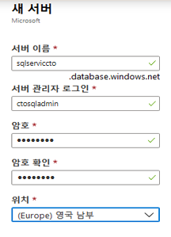
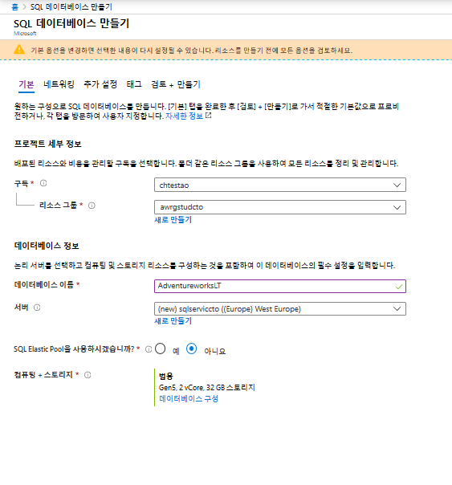
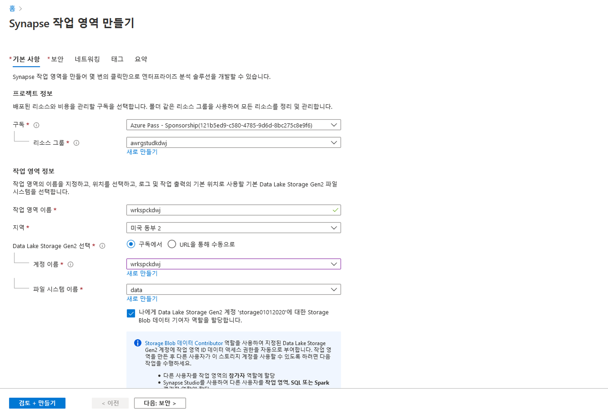
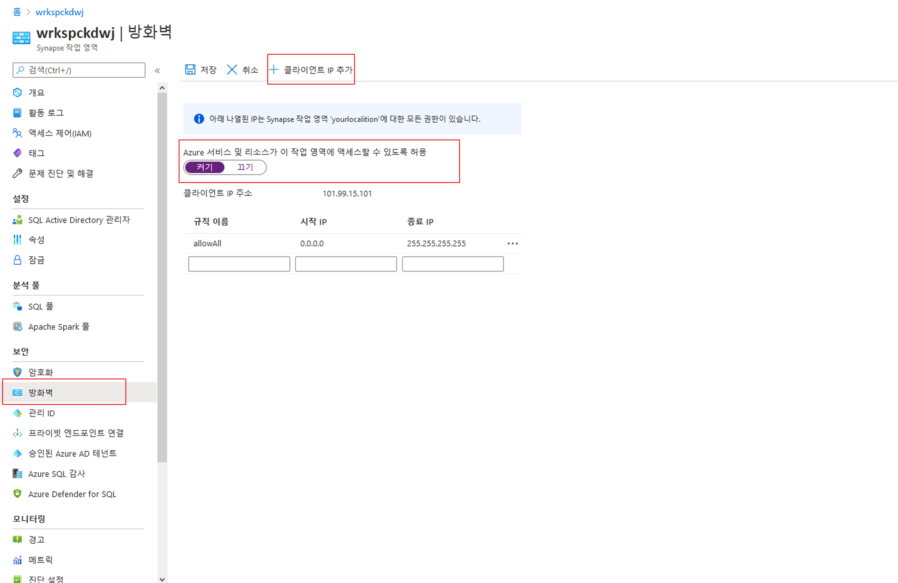
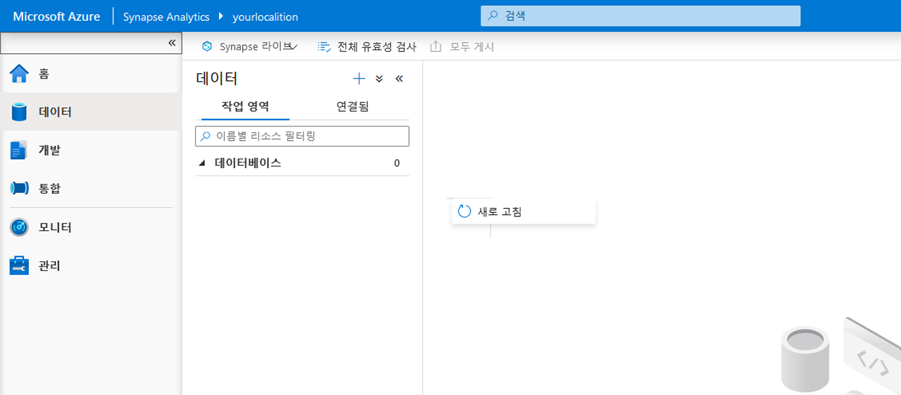

# DP 200 - 데이터 플랫폼 솔루션 구현
# 랩 5 - 클라우드의 관계형 데이터 저장소로 작업

**예상 소요 시간**: 75분

**전제 조건**: 이 랩의 사례 연구를 읽었다고 가정합니다. 모듈 1의 콘텐츠 및 랩이 다음과 같다고 가정합니다. 데이터 엔지니어를 위한 Azure도 완료되었습니다.

**랩 파일**: 이 랩용 파일은 _Allfiles\Labfiles\Starter\DP-200.5_ 폴더에 있습니다.

## 랩 개요

학생들은 Azure SQL Database 및 Azure Synapse Analytics 서버를 프로비전하고 생성된 인스턴스 중 하나에 대해 쿼리할 수 있습니다. 또한 데이터 웨어하우스를 여러 다른 데이터 플랫폼 기술과 통합하고 PolyBase를 사용하여 하나의 데이터 원본에서 Azure Synapse Analytics로 데이터를 로드할 수 있습니다.

## 랩 목표
  
이 랩을 완료하면 다음을 할 수 있습니다.

1. Azure SQL Database 사용
2. Azure Synapse Analytics 설명 
3. Azure Synapse Analytics 만들고 쿼리하기 
4. PolyBase를 사용하여 Azure Synapse Analytics에 데이터 로드 

## 시나리오
  
귀하는 AdventureWorks의 수석 데이터 엔지니어이며 팀과 협력하여 온-프레미스 SQL Server에서 Azure에 있는 Azure SQL Database로 관계형 데이터베이스 시스템을 전환합니다. 먼저 회사의 샘플 데이터베이스를 사용하여 Azure SQL Database의 인스턴스를 만듭니다. 이 인스턴스를 주니어 데이터 엔지니어에게 넘겨 부서별 데이터베이스의 일부 테스트를 수행하려고 합니다.

그런 다음 Azure Synapse Analytics 서버를 프로비전하고 일련의 쿼리로 샘플 데이터베이스를 테스트하여 서버 프로비전이 성공적인지 테스트합니다. 그런 다음 PolyBase를 사용하여 Azure Blob에서 차원 테이블을 로드하여 이러한 데이터 플랫폼 기술과 Azure Synapse Analytics가 통합되어 있는지 테스트합니다.

이 랩을 마치게 되면 다음을 수행했습니다.

1. Azure SQL Database 사용
2. Azure Synapse Analytics 설명 
3. Azure Synapse Analytics 작성 및 쿼리 
4. PolyBase를 사용하여 Azure Synapse Analytics에 데이터 로드 

> **중요**: 이 랩을 진행하면서 프로비전 또는 구성 작업에서 발생한 문제를 기록하고 _\Labfiles\DP-200-Issues-Doc.docx_에 있는 문서의 테이블에 로그인합니다. 랩 번호를 문서화하고, 기술을 기록하며, 문제를 설명하고, 해결 방법이 무엇인지 설명합니다. 이 문서를 나중에 모듈에서 다시 참조할 수 있도록 저장합니다.

## 연습 1: Azure SQL Database 사용

예상 소요 시간: 15분

개인 연습
  
이 연습의 주요 작업은 다음과 같습니다.

1. SQL Database 인스턴스를 만들고 구성합니다.

### 작업 1: SQL Database 인스턴스를 만들고 구성합니다.

1. Azure Portal에서 **+ 리소스 생성** 블레이드를 탐색합니다.

2. 새 화면에서 **마켓플레이스 검색** 텍스트 상자를 클릭하고 **SQL Database**라는 단어를 입력합니다. 표시되는 목록에서 **SQL Database**를 클릭합니다.

3. **SQL Database** 화면에서 **만들기**를 클릭합니다.

4. **SQL Database 만들기** 화면에서 다음 설정을 사용하여 Azure SQL Database를 만듭니다.

    - 프로젝트 세부 정보 섹션에서 다음 값을 입력합니다.
    
        - **구독**: 이 랩에서 사용 중인 구독의 이름

        - **리소스 그룹**: **awrgstudxx**, 여기서 **xx**는 귀하의 이니셜입니다.

    - **추가 설정** 탭을 클릭하고 **샘플**을 클릭합니다. AdventureworksLT 샘플 데이터베이스가 자동으로 선택됩니다. 
    
    - 이 작업이 완료되면 **기본**탭을 클릭합니다.
    
    - 데이터베이스 세부 정보 섹션에서 다음 값을 입력합니다.
    
        - 데이터베이스 이름: **AdventureworksLT**를 입력
     
        - 서버: **새로 만들기**를 클릭해 다음 설정을 사용하여 새 서버를 만들고 **확인**을 클릭합니다.
            - **서버 이름**: **SQLServicexx**, 여기서 **xx**는 귀하의 이니셜입니다.
            - **서버 관리자 로그인**: **xxsqladmin**, 여기서 **xx**는 귀하의 이니셜입니다.
            - **암호**: **Pa55w.rd**
            - **암호 확인**: **Pa55w.rd**
            - **위치**: 가까운 **위치**를 선택합니다.
            - **확인**을 클릭합니다.

                

            - 다른 설정을 기본값으로 두고 **확인**을 클릭합니다.
            

    

5. **SQL Database 만들기** 블레이드에서 **검토 + 만들기**를 클릭합니다.

6. **SQL Database 만들기*** 블레이드의 유효성을 검사한 후 **만들기**를 클릭합니다.

   > **참고**: 프로비전하는 데 약 4분이 소요됩니다.

> **결과**: 이 연습을 통해 Azure SQL Database 인스턴스를 만들었습니다.

## 연습 2: Azure Synapse Analytics 설명
  
예상 소요 시간: 15분

개인 연습
  
이 연습의 주요 작업은 다음과 같습니다.

1. Azure Synapse Analytics 인스턴스를 만들고 구성합니다.

2. 서버 방화벽 구성

3. 웨어하우스 데이터베이스 일시 중지

### 작업 1: Azure Synapse Analytics 인스턴스를 만들고 구성합니다.

1. Azure Portal에서 화면 왼쪽 위의 **홈** 링크를 클릭합니다.

2. Azure Portal에서 **+ 리소스 만들기**를 클릭합니다.

3. 새 블레이드에서 **마켓플레이스 검색** 텍스트 상자로 이동하여 **Synapse**라는 단어를 입력합니다. 표시되는 목록에서 **Azure Synapse Analytics**를 클릭합니다.

4. **Azure Synapse Analytics** 블레이드에서 **만들기**를 클릭합니다.

5. **Synapse 작업 영역 만들기** **기본 사항** 블레이드에서 다음 설정을 사용하여 Azure Synapse Analytics 작업 영역을 만듭니다.

    - 프로젝트 세부 정보 섹션에서 다음 값을 입력합니다.

        - **구독**: 이 랩에서 사용 중인 구독의 이름

        - **리소스 그룹**: **awrgstudxx**, 여기서 **xx**는 귀하의 이니셜입니다.

    - 작업 영역 세부 정보 섹션에서 다음 설정을 사용하여 작업 영역을 만듭니다.
        
        - **작업 영역 이름**: **wrkspcxx**. 여기서 **xx**는 귀하의 이니셜입니다.
        - **지역**: 사용자의 현재 위치 및 리소스 그룹을 배포한 위치와 가장 가까운 지역을 선택합니다.
        - **Data Lake Storage Gen2 선택**: "구독에서"
        - **계정 이름**: **awdlsstudxx**를 선택합니다. 여기서 **xx**는 귀하의 이니셜입니다.
        - **파일 시스템 이름**: **data**를 선택합니다.
        - "나에게 Data Lake Storage Gen2 계정 'awdlsstudxx'의 Storage Blob 데이터 기여자 역할 할당"을 **선택**합니다. 

         

    - **Synapse 작업 영역 만들기** 블레이드의 **보안** 탭으로 이동합니다. 

    - SQL 관리자 자격 증명 섹션에서 다음 정보를 입력합니다.
        - **암호**: **Pa55w.rd**
        - **암호 확인**: **Pa55w.rd**
        - 다른 모든 설정은 **기본값**으로 유지합니다. 

    - 화면에서 **검토 + 만들기**를 클릭합니다.
    - 블레이드에서 **만들기**를 클릭합니다.

   > **참고**: 프로비전하는 데 약 7분이 소요됩니다.

6. 작업 영역이 프로비전되면 **리소스로 이동**을 선택합니다. 그러면 Azure Synapse Analytics 작업 영역의 **개요** 페이지가 표시됩니다.  

7. **+ 새 전용 SQL 풀**을 선택합니다.

8. **전용 SQL 풀 만들기** 블레이드의 **기본 사항** 페이지에서 다음 설정을 구성합니다.
        - 전용 SQL 풀 이름: **dedsqlxx**. 여기서 **xx**는 귀하의 이니셜입니다.
        - 다른 모든 설정은 기본값으로 유지합니다.

9. **전용 SQL 풀 만들기** 화면에서 **검토 + 만들기**를 클릭합니다.

10. **전용 SQL 풀 만들기** 블레이드에서 **만들기**를 클릭합니다.
  

   > **참고**: 프로비전하는 데 약 7분이 소요됩니다.

### 작업 2: 서버 방화벽 구성

1. Azure Portal의 블레이드에서 **리소스 그룹**을 클릭하고 **awrgstudxx**, **wrkspcxx**를 차례로 클릭합니다. 여기서 **xx**는 귀하의 이니셜입니다.

2. **wrkspcxx** 화면에서 **방화벽**을 클릭합니다.

3. **wrkspcxx**- 방화벽 화면에서 **+ 클라이언트 IP 추가** 옵션을 클릭하고 **Azure 서비스 및 리소스가 이 작업 영역에 액세스할 수 있도록 허용**이 **켜짐**으로 설정되어 있는지 확인한 후에 **저장**을 클릭합니다. 성공 화면에서 **확인**을 클릭합니다.

    

    > **참고**: 서버 방화벽 규칙이 성공적으로 업데이트되었다는 메시지가 나타납니다.

4. 방화벽 화면을 닫습니다.

> **결과**: 이 연습을 완료하면 Azure Synapse Analytics 인스턴스를 만들고 서버 방화벽을 구성하여 연결을 활성화합니다.

### 작업 3: **dedsqlxx** 전용 SQL 풀 일시 중지

1. 리소스 그룹의 **dedsqlxx** 리소스로 이동합니다. 

2. **dedsqlxx**를 클릭합니다. 여기서 **xx**는 귀하의 이니셜입니다.

3. **dedsqlkxx (wrkspcxx/dedsqlxx)** 화면에서 **일시 중지**를 클릭합니다.

4. **dedsqlxx** 일시 중지 화면에서 **예**를 클릭합니다.


## 연습 3: Azure Synapse Analytics 데이터베이스 및 테이블 만들기

예상 소요 시간: 25분

개인 연습

이 연습의 주요 작업은 다음과 같습니다.

1. Synapse Studio의 기능 파악 및 전용 SQL 풀에 연결

2. 전용 SQL 풀 데이터베이스 만들기

3. 전용 SQL 풀 테이블 만들기

    > **참고**: Transact-SQL에 익숙하지 않은 경우 **Allfiles\Labfiles\Starter\DP-200.5\SQL DW Files** 위치에 다음 랩을 위한 문이 있습니다.

### 작업 1: Azure Synapse Studio에 전용 SQL 풀 연결

1. 리소스 그룹의 **dedsqlxx** 리소스로 이동합니다. 

2. **개요** 섹션에서 **Synapse Studio 시작**으로 이동합니다.

3. 화면 왼쪽에서 **데이터 허브**를 선택합니다.

4. **dedsqlxx** 풀을 엽니다. 

5. **dedsqlxx** 풀 옆의 Eclipse를 선택합니다. 

6. **새 SQL 스크립트**, **빈 스크립트**를 차례로 선택합니다.

    


7. 쿼리 창에 아래 쿼리를 붙여 넣습니다. 이 쿼리는 서비스 목표가 DW100이고 최대 크기가 1024GB인 **DWDB** 데이터베이스를 만듭니다.

    ```SQL
    CREATE DATABASE DWDB COLLATE SQL_Latin1_General_CP1_CI_AS
    (
        EDITION             = 'DataWarehouse'
    ,   SERVICE_OBJECTIVE   = 'DW100C'
    ,   MAXSIZE             = 1024 GB
    );
    ```

8. **데이터베이스 사용**으로 이동하여 **마스터**를 선택합니다. 

9. **실행**을 클릭합니다. 

 > **참고**: 데이터베이스를 만드는 데 약 6분이 걸립니다.

10. 쿼리 실행이 완료되면 새로 고침을 클릭하고 Eclipse를 열어서 **데이터베이스** 아래에 표시되는 새로 작성된 데이터베이스로 이동합니다.


### 작업 3: 전용 SQL 풀 테이블 만들기

1. Synapse Studio에서 **데이터 허브** 탭의 Eclipse를 열어서 **데이터베이스** 아래에 표시되는 새로 작성된 데이터베이스로 이동합니다. **DWDB**를 클릭합니다.

2. **DWDB** 데이터베이스 옆의 Eclipse를 선택합니다.

3. **새 SQL 스크립트**, **빈 스크립트**를 차례로 선택합니다.

    >**참고**: Transact-SQL 사용법을 모르는 경우 Allfiles\Solution\DP-200.5\ 폴더의 **Exercise3 Task3Step2 script.sql** 스크립트를 참조할 수 있습니다. 이 스크립트에는 테이블을 만드는 데 필요한 코드가 대량 포함되어 있습니다. 하지만 각 테이블에 사용할 배포 형식을 선택하여 코드를 완성해야 합니다. 

4. 다음 열을 사용하여 **클러스터형 columnstore** 인덱스가 있고 **복제** 배포를 사용하는 **dbo.Users**라는 테이블을 만듭니다.

    | 열 이름 | 데이터 형식 | 무효화 가능성|
    |-------------|-----------|------------|
    | userId | int | Null|
    | City | nvarchar(100) | Null|
    | Region | nvarchar(100) | Null|
    | Country | nvarchar(100) | Null|

      >**참고**: 스크립트가 **DWDB**에 연결되어 있으며 **DWDB** 데이터베이스를 사용하는지 확인합니다. 


5. **Synapse Studio**에서 **실행**을 클릭하면 쿼리가 실행됩니다. **dbo.Users** 테이블이 생성되었는지 확인하려는 경우 새로 고침을 클릭하고 **테이블**로 이동하면 됩니다. 이 섹션을 확장하면 테이블이 표시됩니다. 

6. Synapse Studio에서 **데이터 허브** 탭의 Eclipse를 열어서 **데이터베이스** 아래에 표시되는 새로 작성된 데이터베이스로 이동합니다. **DWDB**를 클릭합니다.

7. **DWDB** 데이터베이스 옆의 Eclipse를 선택합니다.

8. **새 SQL 스크립트**, **빈 스크립트**를 차례로 선택합니다.

9. 다음 열을 사용하여 **클러스터형 columnstore** 인덱스가 있고 **라운드 로빈** 배포를 사용하는 **dbo.Products**라는 테이블을 만듭니다.

    | 열 이름 | 데이터 형식 | 무효화 가능성|
    |-------------|-----------|------------|
    | Productid | int | Null|
    | EnglishProductName | nvarchar(100) | Null|
    | Color | nvarchar(100) | Null|
    | StandardCost | int | Null|
    | ListPrice | int | Null|
    | Size | nvarchar(100) | Null|
    | Weight | int | Null|
    | DaysToManufacture | int | Null|
    | Class | nvarchar(100) | Null|
    | Style | nvarchar(100) | Null|

    >**참고**: 스크립트가 **DWDB**에 연결되어 있으며 **DWDB** 데이터베이스를 사용하는지 확인합니다. 

10. **Synapse Studio**에서 **실행**을 클릭하면 쿼리가 실행됩니다. **dbo.Products** 테이블이 생성되었는지 확인하려는 경우 새로 고침을 클릭하고 **테이블**로 이동하면 됩니다. 이 섹션을 확장하면 테이블이 표시됩니다. 

11. Synapse Studio에서 **데이터 허브** 탭의 Eclipse를 열어서 **데이터베이스** 아래에 표시되는 새로 작성된 데이터베이스로 이동합니다. **DWDB**를 클릭합니다.

12. **DWDB** 데이터베이스 옆의 Eclipse를 선택합니다.

13. **새 SQL 스크립트**, **빈 스크립트**를 차례로 선택합니다.

14. 다음 열을 사용하여 **클러스터형 columnstore** 인덱스가 있고 **해시** 배포를 사용하는 **dbo.FactSales**라는 테이블을 만듭니다.

    | 열 이름 | 데이터 형식 | 무효화 가능성|
    |-------------|-----------|------------|
    | DateId | int | Null|
    | Productid | int | Null|
    | UserId | int | Null|
    | UserPreferenceId | int | Null|
    | SalesUnit | int | Null|

    >**참고**: 스크립트가 **DWDB**에 연결되어 있으며 **DWDB** 데이터베이스를 사용하는지 확인합니다. 

15. **Synapse Studio**에서 **실행**을 클릭하면 쿼리가 실행됩니다. **dbo.FactSales** 테이블이 생성되었는지 확인하려는 경우 새로 고침을 클릭하고 **테이블**로 이동하면 됩니다. 이 섹션을 확장하면 테이블이 표시됩니다. 

> **결과**: 이 연습에서는 Synapse Studio를 사용하여 데이터 웨어하우스(DWDB)와 테이블 3개(Users, Products, FactSales)를 만들었습니다.

## 연습 4: PolyBase를 사용하여 Azure Synapse Analytics에 데이터 로드 

예상 소요 시간: 10분

개인 연습

이 연습의 주요 작업은 다음과 같습니다.

1. Data Lake Storage 컨테이너 및 주요 세부 정보 수집

2. Azure Data Lake Storage의 PolyBase를 사용하는 dbo.Dates 테이블 만들기

### 작업 1: Azure Blob 계정 이름 및 주요 세부 정보 수집

1. Azure Portal에서 **리소스 그룹**을 선택하고 **awrgstudxx**를 클릭한 다음, **awdlsstudxx**을 클릭합니다. 여기에서 xx는 귀하의 이름 이니셜입니다.

2. **awdlsstudxx** 화면에서 **액세스 키**를 클릭합니다. **스토리지 계정 이름** 옆에 있는 아이콘을 클릭하고 메모장에 붙여 넣습니다.

3. **awdlsstudxx - 액세스 키** 화면의 **key1** 아래에서 **키** 옆에 있는 아이콘을 클릭하여 키를 메모장에 붙여 넣습니다.

### 작업 2: Azure Blob의 PolyBase를 사용하는 dbo.Dates 테이블 만들기

1. Synapse Studio에서 **데이터 허브** 탭의 Eclipse를 열어서 **데이터베이스** 아래에 표시되는 새로 작성된 데이터베이스로 이동합니다. **DWDB**를 클릭합니다.

2. **DWDB** 데이터베이스 옆의 Eclipse를 선택합니다.

3. **새 SQL 스크립트**, **빈 스크립트**를 차례로 선택합니다.

4. **DWDB** 데이터베이스에 대해 **마스터 키**를 만듭니다. 쿼리 편집기에서 다음 코드를 입력합니다.

    ```SQL
    CREATE MASTER KEY;
    ```
    >**참고**: 스크립트가 **DWDB**에 연결되어 있으며 **DWDB** 데이터베이스를 사용하는지 확인합니다. 

5. **Synapse Studio**에서 **실행**을 클릭하면 쿼리가 실행됩니다.

6. Synapse Studio에서 **데이터 허브** 탭의 Eclipse를 열어서 **데이터베이스** 아래에 표시되는 새로 작성된 데이터베이스로 이동합니다. **DWDB**를 클릭합니다.

7. **DWDB** 데이터베이스 옆의 Eclipse를 선택합니다.

8. **새 SQL 스크립트**, **빈 스크립트**를 차례로 선택합니다.

9. 다음 세부 정보를 사용하여 데이터베이스 범위 자격 증명 **AzureStorageCredential**을 만듭니다. 쿼리 편집기에 다음 코드를 입력하면 됩니다.
    - ID: **MOCID**
    - SECRET: **스토리지 계정의 액세스 키**

    ```SQL
    CREATE DATABASE SCOPED CREDENTIAL AzureStorageCredential
    WITH
    IDENTITY = 'MOCID',
    SECRET = 'Your storage account key'
;
    ```
    >**참고**: 스크립트가 **DWDB**에 연결되어 있으며 **DWDB** 데이터베이스를 사용하는지 확인합니다. 

10. **Synapse Studio**에서 **실행**을 클릭하면 쿼리가 실행됩니다.

11. Synapse Studio에서 **데이터 허브** 탭의 Eclipse를 열어서 **데이터베이스** 아래에 표시되는 새로 작성된 데이터베이스로 이동합니다. **DWDB**를 클릭합니다.

12. **DWDB** 데이터베이스 옆의 Eclipse를 선택합니다.

13. **새 SQL 스크립트**, **빈 스크립트**를 차례로 선택합니다.

14. 쿼리 창에 다음 코드를 입력합니다. 이 코드는 **HADOOP** 형식으로 작성되었으며 ****AzureStorageCredential을 사용하는 데이터 컨테이너 및 Blob Storage 계정용 외부 데이터 원본 **AzureStorage**를 생성합니다**. 위치 키의 **awdlsstudxx**를 귀하의 이니셜을 포함한 스토리지 계정과 바꿔야 합니다. 

    ```SQL
	CREATE EXTERNAL DATA SOURCE AzureStorage
    WITH (
        TYPE = HADOOP,
        LOCATION = 'abfs://data@awdlsstudxx.dfs.core.windows.net',
        CREDENTIAL = AzureStorageCredential
    );
    ```
    >**참고**: 스크립트가 **DWDB**에 연결되어 있으며 **DWDB** 데이터베이스를 사용하는지 확인합니다. 

15. **Synapse Studio**에서 **실행**을 클릭하면 쿼리가 실행됩니다.

16. Synapse Studio에서 **데이터 허브** 탭의 Eclipse를 열어서 **데이터베이스** 아래에 표시되는 새로 작성된 데이터베이스로 이동합니다. **DWDB**를 클릭합니다.

17. **DWDB** 데이터베이스 옆의 Eclipse를 선택합니다.

18. **새 SQL 스크립트**, **빈 스크립트**를 차례로 선택합니다.

19. 쿼리 창에 다음 코드를 입력합니다. 이 코드는 formattype이 **DelimitedText**이고 필드 종결자는 **comma**인 외부 파일 형식 **TextFile**을 생성합니다.

    ```SQL
    CREATE EXTERNAL FILE FORMAT TextFile
    WITH (
        FORMAT_TYPE = DelimitedText,
        FORMAT_OPTIONS (FIELD_TERMINATOR = ',')
    );
    ```
    >**참고**: 스크립트가 **DWDB**에 연결되어 있으며 **DWDB** 데이터베이스를 사용하는지 확인합니다. 

20. **Synapse Studio**에서 **실행**을 클릭하면 쿼리가 실행됩니다.

21. . Synapse Studio에서 **데이터 허브** 탭의 Eclipse를 열어서 **데이터베이스** 아래에 표시되는 새로 작성된 데이터베이스로 이동합니다. **DWDB**를 클릭합니다.

22. **DWDB** 데이터베이스 옆의 Eclipse를 선택합니다.

23. **새 SQL 스크립트**, **빈 스크립트**를 차례로 선택합니다.   

24. 쿼리 창에 다음 코드를 입력합니다. 이 코드는 루트 파일이 **location**, 데이터 원본이 **AzureStorage**, File_format이 **TextFile**이며 아래의 열이 포함된 외부 테이블 **dbo.DimDate2External**을 생성합니다.

    | 열 이름 | 데이터 형식 | 무효화 가능성|
    |-------------|-----------|------------|
    | Date | datetime2(3) | Null|
    | DateKey | decimal(38, 0) | Null|
    | MonthKey | decimal(38, 0) | Null|
    | Month | nvarchar(100) | Null|
    | Quarter | nvarchar(100) | Null|
    | Year | decimal(38, 0) | Null|
    | Year-Quarter | nvarchar(100) | Null|
    | Year-Month | nvarchar(100) | Null|
    | Year-MonthKey | nvarchar(100) | Null|
    | WeekDayKey| decimal(38, 0) | Null|
    | WeekDay| nvarchar(100) | Null|
    | Day Of Month| decimal(38, 0) | Null|

    ```SQL
	CREATE EXTERNAL TABLE dbo.DimDate2External (
    [Date] datetime2(3) NULL,
    [DateKey] decimal(38, 0) NULL,
    [MonthKey] decimal(38, 0) NULL,
    [Month] nvarchar(100) NULL,
    [Quarter] nvarchar(100) NULL,
    [Year] decimal(38, 0) NULL,
    [Year-Quarter] nvarchar(100) NULL,
    [Year-Month] nvarchar(100) NULL,
    [Year-MonthKey] nvarchar(100) NULL,
    [WeekDayKey] decimal(38, 0) NULL,
    [WeekDay] nvarchar(100) NULL,
    [Day Of Month] decimal(38, 0) NULL
    )
    WITH (
        LOCATION='/DimDate2.txt',
        DATA_SOURCE=AzureStorage,
        FILE_FORMAT=TextFile
    );
    ```
    >**참고**: 스크립트가 **DWDB**에 연결되어 있으며 **DWDB** 데이터베이스를 사용하는지 확인합니다. 


25. **Synapse Studio**에서 **실행**을 클릭하면 쿼리가 실행됩니다.

26. Synapse Studio에서 **데이터 허브** 탭의 Eclipse를 열어서 **데이터베이스** 아래에 표시되는 새로 작성된 데이터베이스로 이동합니다. **DWDB**를 클릭합니다.

27. **DWDB** 데이터베이스 옆의 Eclipse를 선택합니다.

28. **새 SQL 스크립트**, **빈 스크립트**를 차례로 선택합니다.  

29. 테이블에 대해 select 문을 실행하여 테이블이 생성되었는지 테스트합니다.

    ```SQL
    SELECT * FROM dbo.DimDate2External;
    ```
>**참고**: 스크립트가 **DWDB**에 연결되어 있으며 **DWDB** 데이터베이스를 사용하는지 확인합니다. 


30. **Synapse Studio**에서 **실행**을 클릭하면 쿼리가 실행됩니다.

31. Synapse Studio에서 **데이터 허브** 탭의 Eclipse를 열어서 **데이터베이스** 아래에 표시되는 새로 작성된 데이터베이스로 이동합니다. **DWDB**를 클릭합니다.

32. **DWDB** 데이터베이스 옆의 Eclipse를 선택합니다.

33. **새 SQL 스크립트**, **빈 스크립트**를 차례로 선택합니다.  

34. 쿼리 창에 **CTAS** 문을 입력합니다. 이 문은 **columnstore** 인덱스가 포함되어 있고 **배포**는 **라운드 로빈** 방식이며 **dbo.DimDate2External**에서 데이터를 로드하는 테이블 **dbo.Dates**를 생성합니다.

    ```SQL
    CREATE TABLE dbo.Dates
    WITH
    (   
        CLUSTERED COLUMNSTORE INDEX,
        DISTRIBUTION = ROUND_ROBIN
    )
    AS
    SELECT * FROM [dbo].[DimDate2External];
    ```
>**참고**: 스크립트가 **DWDB**에 연결되어 있으며 **DWDB** 데이터베이스를 사용하는지 확인합니다. 

35. **Synapse Studio**에서 **실행**을 클릭하면 쿼리가 실행됩니다.

36. Synapse Studio에서 **데이터 허브** 탭의 Eclipse를 열어서 **데이터베이스** 아래에 표시되는 새로 작성된 데이터베이스로 이동합니다. **DWDB**를 클릭합니다.

37. **DWDB** 데이터베이스 옆의 Eclipse를 선택합니다.

38. **새 SQL 스크립트**, **빈 스크립트**를 차례로 선택합니다.  
 
39. 쿼리 창에 다음 쿼리를 입력합니다. 이 쿼리는 **DateKey**, **Quarter** 및 **Month** 열의 통계를 생성합니다.

    ```SQL
    CREATE STATISTICS [DateKey] on [Dates] ([DateKey]);
    CREATE STATISTICS [Quarter] on [Dates] ([Quarter]);
    CREATE STATISTICS [Month] on [Dates] ([Month]);
    ```
>**참고**: 스크립트가 **DWDB**에 연결되어 있으며 **DWDB** 데이터베이스를 사용하는지 확인합니다. 

40. **Synapse Studio**에서 **실행**을 클릭하면 쿼리가 실행됩니다.

41. Synapse Studio에서 **데이터 허브** 탭의 Eclipse를 열어서 **데이터베이스** 아래에 표시되는 새로 작성된 데이터베이스로 이동합니다. **DWDB**를 클릭합니다.

42. **DWDB** 데이터베이스 옆의 Eclipse를 선택합니다.

43. **새 SQL 스크립트**, **빈 스크립트**를 차례로 선택합니다.

44. 테이블에 대해 선택 설명문을 실행하여 테이블이 생성되었는지 테스트합니다.

    ```SQL
    SELECT * FROM dbo.Dates;
    ```
>**참고**: 스크립트가 **DWDB**에 연결되어 있으며 **DWDB** 데이터베이스를 사용하는지 확인합니다.

45. **Synapse Studio**에서 **실행**을 클릭하면 쿼리가 실행됩니다.

