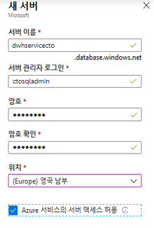
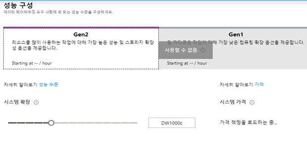
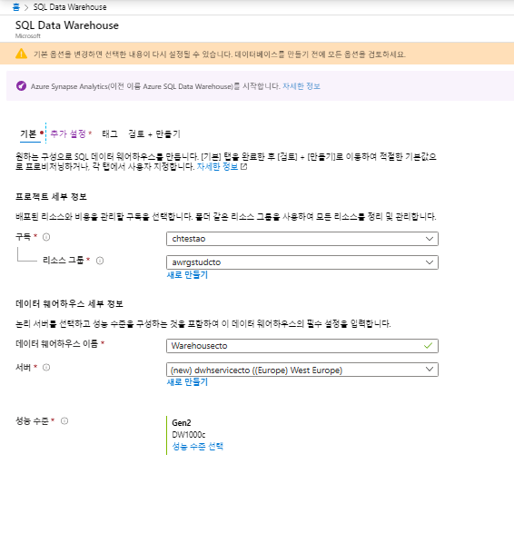

---
lab:
    title: '클라우드에서 관계형 데이터 저장소 작업'
    module: '모듈 5: 클라우드에서 관계형 데이터 저장소 작업'
---

# DP 200 - 데이터 플랫폼 솔루션 구현
# 랩 5 - 클라우드의 관계형 데이터 저장소로 작업

**예상 시간**: 75분

**필수 구성 요소**: 이 랩에 대한 사례 연구는 이미 읽은 것으로 가정합니다. 모듈 1에 대한 콘텐츠와 랩이 다음인 것으로 간주합니다. 데이터 엔지니어용 Azure도 완료되었습니다.

**랩 파일**: 이 랩의 파일은 _Allfiles\Labfiles\Starter\DP-200.5_ 폴더에 있습니다.

## 랩 개요

학생들은 Azure SQL Database 및 Azure Synapse Analytics 서버를 프로비전하고 생성된 인스턴스 중 하나에 대해 쿼리를 발급할 수 있습니다. 또한 데이터 웨어하우스를 여러 다른 데이터 플랫폼 기술과 통합하고 PolyBase를 사용하여 하나의 데이터 원본에서 Azure Synapse Analytics로 데이터를 로드할 수 있습니다.

## 랩 목표
  
이 랩을 완료하면 다음과 같은 것들을 수행할 수 있습니다.

1. Azure SQL Database 사용
1. Azure Synapse Analytics 설명 
1. Azure Synapse Analytics 만들고 쿼리하기 
1. PolyBase를 사용하여 Azure Synapse Analytics에 데이터 로드 

## 시나리오
  
귀하는 AdventureWorks의 수석 데이터 엔지니어이며 팀과 협력하여 온-프레미스 SQL Server에서 Azure에 있는 Azure SQL Database로 관계형 데이터베이스 시스템을 전환합니다. 먼저 회사의 샘플 데이터베이스를 사용하여 Azure SQL Database의 인스턴스를 만듭니다. 이 인스턴스를 주니어 데이터 엔지니어에게 넘겨 부서별 데이터베이스의 일부 테스트를 수행하려고 합니다.

그런 다음 Azure Synapse Analytics 서버를 프로비전하고 일련의 쿼리로 샘플 데이터베이스를 테스트하여 서버 프로비저닝이 성공적임을 테스트합니다. 그런 다음 PolyBase를 사용하여 Azure Blob에서 차원 테이블을 로드하여 이러한 데이터 플랫폼 기술과 Azure Synapse Analytics가 통합되어 있는지 테스트합니다.

이 랩을 마치면 다음 작업을 수행할 수 있습니다.

1. Azure SQL Database 사용
1. 설명된 Azure Synapse Analytics 
1. 생성되고 쿼리된 Azure Synapse Analytics 
1. Azure Synapse Analytics에 데이터를 로드하는 데 PolyBase를 사용했습니다. 

> **중요**: 이 랩을 진행하면서 프로비전 또는 구성 작업에서 발생한 문제를 기록하고 _\Labfiles\DP-200-Issues-Doc.docx에_있는 문서의 테이블에 로그하세요. 랩 번호를 문서화하고, 기술을 기록하며, 문제를 설명하고, 해결 방법이 무엇인지 설명합니다. 나중에 모듈에서 다시 참조할 때를 위해 이 문서를 저장합니다.

## 연습 1: Azure SQL Database 사용

예상 시간: 15분

개별 연습
  
이 연습의 주요 작업은 다음과 같습니다.

1. SQL Database 인스턴스를 만들고 구성합니다.

### 작업 1: SQL Database 인스턴스를 만들고 구성합니다.

1. Azure Portal에서 **+ 리소스 생성** 블레이드로 이동합니다.

1. 새 화면에서 **마켓플레이스 검색** 텍스트 상자를 클릭하고 **SQL Database**라는 단어를 입력합니다. 표시되는 목록에서 **SQL Database**를 클릭합니다.

1. **SQL Database** 화면에서 **만들기**를 클릭합니다.

1. **SQL Database 만들기** 화면에서 다음 설정을 사용하여 Azure SQL Database를 만듭니다.

    - 프로젝트 세부 정보 섹션에서 다음 값을 입력합니다.
    
        - **구독**: 이 랩에서 사용 중인 구독의 이름

        - **리소스 그룹**: **awrgstudxx**, 여기서 **xx**는 이니셜입니다.

    -  **추가 설정** 탭을 클릭하고 **샘플**을 클릭합니다. AdventureworksLT 샘플 데이터베이스가 자동으로 선택됩니다. 
    
    - 이 작업이 완료되면 **기본**탭을 클릭합니다.
    
    - 데이터베이스 세부 정보 섹션에서 다음 값을 입력합니다.
    
        - 데이터베이스 이름: **AdventureworksLT**를 입력
     
        - 서버: **새로 만들기**를 클릭해 다음 설정을 사용하여 새 서버를 만들고 **확인**을 클릭합니다.
            - **서버 이름**: **SQLServicexx**, 여기서 **xx**는 귀하의 이니셜입니다.
            - **서버 관리자 로그인**: **xxsqladmin**, 여기서 **xx**는 사용자의 이니셜입니다.
            - **암호**: **Pa55w.rd**
            - **암호 확인**: **Pa55w.rd**
            - **위치**: 가까운 **위치**를 선택합니다.
            - **확인**을 클릭합니다.

                

            - 다른 설정을 기본값으로 두고 **확인**을 클릭합니다.
            

    

1. **SQL Database 만들기** 블레이드에서 **검토 + 만들기**를 클릭합니다.

1. **SQL Database 만들기*** 블레이드를 유효성 검사한 후 **만들기**를 클릭합니다.

   > **참고**: 프로비전하는 데 약 4분이 소요됩니다.

> **결과**: 이 연습을 완료하면 Azure SQL Database 인스턴스를 만들게 됩니다.

## 연습 2: Azure Synapse Analytics 설명
  
예상 시간: 15분

개별 연습
  
이 연습의 주요 작업은 다음과 같습니다.

1. Azure Synapse Analytics 인스턴스를 만들고 구성합니다.

1. 서버 방화벽 구성

1. 웨어하우스 데이터베이스 일시 중지

### 작업 1: Azure Synapse Analytics 인스턴스를 만들고 구성합니다.

1. Azure Portal에서 화면 왼쪽 상단에 있는 **홈** 링크를 클릭합니다.

1. Azure Portal에서 **+ 리소스 만들기**를 클릭합니다.

1. 새 블레이드에서 **마켓플레이스 검색** 텍스트 상자로 이동하여 **Synapse**라는 단어를 입력합니다. 표시되는 목록에서 **Azure Synapse Analytics(전 SQL DW)**를 클릭합니다.

1. **>Azure Synapse Analytics(전 SQL DW)** 블레이드에서 **만들기**를 클릭합니다.

1. **SQL Data Warehouse** 블레이드에서 다음 설정을 사용하여 Azure Synapse Analytics를 만듭니다.

    - 프로젝트 세부 정보 섹션에서 다음 값을 입력합니다.

        - **구독**: 이 랩에서 사용 중인 구독의 이름

        - **리소스 그룹**: **awrgstudxx**, 여기서 **xx**는 이니셜입니다.

    - **추가 설정** 탭의 데이터 원본 아래에서 **샘플**을 클릭합니다.

    - 이 작업이 완료되면 **기본**탭을 클릭합니다.
    
    - 데이터베이스 세부 정보 섹션에서 다음 값을 입력합니다.

        - **데이터베이스 웨어하우스 이름**: **Warehousexx**(**xx**: 사용자 이니셜).

        - **서버**: **새로 만들기**를 클릭해 다음 설정을 사용하여 새 서버를 만들고 **확인**을 클릭합니다.
            - **서버 이름**: **dwhservicexx**, 여기서 **xx**는 이니셜입니다.
            - **서버 관리자 로그인**: **xxsqladmin**, 여기서 **xx**는 사용자의 이니셜입니다.
            - **암호**: **Pa55w.rd**
            - **암호 확인**: **Pa55w.rd**
            - **위치**: 가까운 **위치**를 선택합니다.
            - Azure 서비스가 서버에 액세스할 수 있도록 허용하는 확인란을 선택합니다.
            - **확인**을 클릭합니다.

                

    - 성능 수준: **성능 수준 선택**을 클릭하고 **Gen2 DW100C**를 선택합니다.

        

    -  **적용**을 클릭하면 다음 구성이 표시됩니다.

        

1. **SQL Data Warehouse** 화면에서 **검토 + 만들기**를 클릭합니다.

1. **SQL Data Warehouse** 블레이드에서 **만들기**를 클릭합니다.

   > **참고**: 프로비전하는 데 약 7분이 소요됩니다.

### 작업 2: 서버 방화벽 구성

1. Azure Portal의 블레이드에서 **리소스 그룹**을 클릭하고 **awrgstudxx**, **awdlsstudxx**를 차례로 클릭합니다. 여기서 **xx**는 이니셜입니다.

1. **dwhservicexx**를 클릭합니다. 여기서 **xx**는 사용자의 이니셜입니다.

1. **dwhservicexx** 화면에서 **방화벽 및 가상 네트워크**를 클릭합니다.

1. dwhservicexx - 방화벽 및 가상 네트워크 화면에서 **+ 클라이언트 IP 추가** 옵션을 클릭한 다음 **저장**을 클릭합니다. 성공 화면에서 **확인**을 클릭합니다.

    

    > **참고**: 서버 방화벽 규칙이 정상적으로 업데이트되었다는 메시지가 나타납니다

1. 방화벽 및 가상 네트워크 화면을 닫습니다.

> **결과**: 이 연습을 완료하면 Azure Synapse Analytics 인스턴스를 만들고 서버 방화벽을 구성하여 연결을 활성화합니다.

### 작업 3: Warehousexx 데이터베이스 일시 중지

1. **Warehousexx**를 클릭합니다. 여기서 **xx**는 이니셜입니다.

1.  **Warehousexx(dwhservicexx/Warehousexx)** 화면에서 **일시 중지**를 클릭합니다.

1. 일시 정지 Warehousexx 화면에서 **예**를 클릭합니다.


## 연습 3: Azure Synapse Analytics 데이터베이스 및 테이블 만들기

예상 시간: 25분

개별 연습

이 연습의 주요 작업은 다음과 같습니다.

1. SQL Server Management Studio를 설치하고 데이터 웨어하우스 인스턴스에 연결합니다.

1. SQL Data Warehouse 데이터베이스 만들기

1. SQL Data Warehouse 테이블 만들기

    > **참고**: Transact-SQL에 익숙하지 않은 경우 다음 위치(**Allfiles\Labfiles\Starter\DP-200.5\SQL DW Files**)에서 다음 랩의 문을 사용할 수 있습니다.

### 작업 1: SQL Server Management Studio를 설치하고 SQL Data Warehouse 인스턴스에 연결합니다.

1. Azure Portal의 **dwhservicexx - 방화벽 및 가상 네트워크** 블레이드에서 **속성**을 클릭합니다.

1. **"서버 이름"**을 복사하여 메모장에 붙여넣습니다.

1. [SQL Server Management Studio](https://docs.microsoft.com/ko-kr/sql/ssms/download-sql-server-management-studio-ssms?view=sql-server-2017)를 다운로드하여 컴퓨터에 설치

1. Windows 데스크톱에서 **시작**을 클릭하고 **"SQL Server"**를 입력한 다음 **Microsoft SQL Server Management Studio 17**을 클릭합니다.

1. **서버에 연결** 대화 상자에서, 다음 세부 사항을 기입합니다.
    - 서버 이름: **dwhservicexx.database.windows.net**
    - 인증: **SQL Server 인증**
    - 사용자 이름: **xxsqladmin**
    - 암호: **Pa55w.rd**

1. **서버 연결** 대화 상자에서 **연결**을 클릭합니다. 

### 작업 2: SQL Data Warehouse 데이터베이스를 만듭니다.

1. 개체 탐색기의 **SQL Server Management Studio**에서 dwhservicexx.database.windows.net**를 마우스 오른쪽 단추를 클릭하고** **새 쿼리**를 클릭합니다. 

1. 쿼리 창에서 서비스 목표 DW100과 최대 크기 1024GB를 사용하여 **DWDB**라는 DataWarehouse 데이터베이스를 만듭니다.

    ```SQL
    CREATE DATABASE DWDB COLLATE SQL_Latin1_General_CP1_CI_AS
    (
        EDITION             = 'DataWarehouse'
    ,   SERVICE_OBJECTIVE   = 'DW100C'
    ,   MAXSIZE             = 1024 GB
    );
    ```

    > **참고**: 데이터베이스를 만드는 데 약 2분이 걸립니다.


### 작업 3: SQL Data Warehouse 테이블을 만듭니다.

1. 개체 탐색기의 **SQL Server Management Studio**에서 **dwhservicexx.database.windows.net**를 마우스 오른쪽 단추를 클릭하고 **새 쿼리**를 클릭합니다.

1. **SQL Server Management Studio**의 SQL 편집기 도구 모음의**사용 가능한 데이터베이스**에서 **DWDB**를 클릭합니다.

    >**참고**: Transact-SQL 사용법을 모르는 경우 Allfiles\Solution\DP-200.5\ 폴더에 있는 **Exercise3 Task3Step2 script.sql**라는 이름의 스크립트를 참조할 수 있습니다. 이 스크립트에는 테이블을 만드는 데 필요한 코드가 대량 포함되어 있습니다. 하지만 각 테이블에 사용할 배포 유형을 선택하여 코드를 완성해야 합니다. 

1. 다음 열을 사용하여 **클러스터형 columnstore** 인덱스가 있고 **복제** 배포를 사용하는 **dbo.Users**라는 이름의 테이블을 만듭니다.

    | 열 이름 | 데이터 형식 | Null 허용 여부|
    |------------|-----------|------------|
    | userId | int | NULL|
    | City | nvarchar(100) | NULL|
    | Region | nvarchar(100) | NULL|
    | Country | nvarchar(100) | NULL|

1. **SQL Server Management Studio**에서 **실행**을 클릭합니다.

1. 개체 탐색기의 **SQL Server Management Studio**에서 dwhservicexx.database.windows.net**를 마우스 오른쪽 단추를 클릭하고** **새 쿼리**를 클릭합니다.

1. **SQL Server Management Studio**의 SQL 편집기 도구 모음의**사용 가능한 데이터베이스**에서 **DWDB**를 클릭합니다.

1. 다음 열을 사용하여 **클러스터형 columnstore** 인덱스가 있고 **라운드 로빈** 배포를 사용하는 **dbo.Products**라는 이름의 테이블을 만듭니다.

    | 열 이름 | 데이터 형식 | Null 허용 여부|
    |------------|-----------|------------|
    | Productid | int | NULL|
    | EnglishProductName | nvarchar(100) | NULL|
    | Color | nvarchar(100) | NULL|
    | StandardCost | int | NULL|
    | ListPrice | int | NULL|
    | Size | nvarchar(100) | NULL|
    | Weight | int | NULL|
    | DaysToManufacture | int | NULL|
    | Class | nvarchar(100) | NULL|
    | Style | nvarchar(100) | NULL|

1. **SQL Server Management Studio**에서 **실행**을 클릭합니다.

1. 개체 탐색기의 **SQL Server Management Studio**에서 dwhservicexx.database.windows.net**를 마우스 오른쪽 단추를 클릭하고** **새 쿼리**를 클릭합니다.

1. **SQL Server Management Studio**의 SQL 편집기 도구 모음의**사용 가능한 데이터베이스**에서 **DWDB**를 클릭합니다.

1. 다음 열을 사용하여 **SalesUnit**에 **클러스터형 columnstore** 인덱스가 있고 **해시** 배포를 사용하는 **dbo.FactSales**라는 이름의 테이블을 만듭니다.

    | 열 이름 | 데이터 형식 | Null 허용 여부|
    |-------------|-----------|------------|
    | DateId | int | NULL|
    | Productid | int | NULL|
    | UserId | int | NULL|
    | UserPreferenceId | int | NULL|
    | SalesUnit | int | NULL|

1. **SQL Server Management Studio**에서 **실행**을 클릭합니다.

> **결과**: 이 연습을 완료하면 SQL Server Management Studio를 설치하여 DWDB라는 데이터 웨어하우스와 Users, Products 및 FactSales라는 세 개의 테이블을 만들게 됩니다.

## 연습 4: PolyBase를 사용하여 Azure Synapse Analytics에 데이터 로드 

예상 시간: 10분

개인 연습

이 연습의 주요 작업은 다음과 같습니다.

1. Data Lake Storage 컨테이너 및 주요 세부 정보 수집

1. Azure Data Lake Storage의 PolyBase를 사용하는 dbo.Dates 테이블 만들기

### 작업 1: Azure Blob 계정 이름 및 키 세부 정보 수집

1. Azure Portal에서 **리소스 그룹**을 선택하고 **awrgstudxx**를 클릭한 다음, **awdbwsstudxx**을 클릭합니다. 여기에서 xx는 사용자의 이름 이니셜입니다.

1. **awsastudxx** 화면에서 **액세스 키**를 클릭합니다. **스토리지 계정 이름** 옆에 있는 아이콘을 클릭하여 이름을 메모장에 붙여넣습니다.

1. **awsastudxx - 액세스 키** 화면의 **key1** 아래에서 **키** 옆에 있는 아이콘을 클릭하여 키를 메모장에 붙여넣습니다.

### 작업 2: Azure Blob의 PolyBase를 사용해서 dbo.Dates 테이블 만들기

1. 개체 탐색기의 **SQL Server Management Studio**에서 **dwhservicexx.database.windows.net**를 마우스 오른쪽 단추를 클릭하고 **새 쿼리**를 클릭합니다.

1. **SQL Server Management Studio**의 SQL 편집기 도구 모음의**사용 가능한 데이터베이스**에서 **DWDB**를 클릭합니다.

1. **DWDB** 데이터베이스에 대한 **마스터 키**를 만듭니다. 쿼리 편집기에서 다음 코드를 입력합니다.

    ```SQL
    CREATE MASTER KEY;
    ```

1. 다음 세부 정보를 사용해 코드를 입력하여 **AzureStorageCredential**라는 데이터베이스 범위 자격 증명을 만듭니다.
    - ID: **MOCID**
    - SECRET: **스토리지 계정의 액세스 키**

    ```SQL
    CREATE DATABASE SCOPED CREDENTIAL AzureStorageCredential
    WITH
    IDENTITY = 'MOCID',
    SECRET = 'Your storage account key'
;
    ```

1. **SQL Server Management Studio**에서 두 문을 강조 표시한 다음 **실행**을 클릭합니다.

1. **SQL Server Management Studio**의 쿼리 창에서 **AzureStorageCredential**을 사용하는 **HADOOP** 형식으로 생성된 Blob 스토리지 계정 및 데이터 컨테이너를 위한 **AzureStorage**라는 외부 데이터 원본을 만드는 코드를 입력합니다. 위치 키의 **awdlsstudxx**를 귀하의 이니셜을 포함한 스토리지 계정과 바꿔야 합니다. 

    ```SQL
	CREATE EXTERNAL DATA SOURCE AzureStorage
    WITH (
        TYPE = HADOOP,
        LOCATION = 'abfs://data@awdlsstudxx.dfs.core.windows.net',
        CREDENTIAL = AzureStorageCredential
    );
    ```

1. **SQL Server Management Studio**의 쿼리 창에서 이름이 **TextFile**이고, 형식 유형이 **DelimitedText**이며, 필드 종결자가 **콤마**인 외부 파일 형식을 만드는 코드를 입력합니다.

    ```SQL
    CREATE EXTERNAL FILE FORMAT TextFile
    WITH (
        FORMAT_TYPE = DelimitedText,
        FORMAT_OPTIONS (FIELD_TERMINATOR = ',')
    );
    ```

1. **SQL Server Management Studio**에서 문을 강조 표시한 다음 **실행**을 클릭합니다.

1. **SQL Server Management Studio**의 쿼리 창에서 다음 열을 사용하여 **위치**가 루트 파일이고, 데이터 원본이 **AzureStorage**이며, File_format이 **TextFile**인 **dbo.DimDate2External**이라는 외부 테이블을 만드는 코드를 입력합니다.

    | 열 이름 | 데이터 형식 | Null 허용 여부|
    |------------|-----------|------------|
    | Date | datetime2(3) | NULL|
    | DateKey | decimal(38, 0) | NULL|
    | MonthKey | decimal(38, 0) | NULL|
    | Month | nvarchar(100) | NULL|
    | Quarter | nvarchar(100) | NULL|
    | Year | decimal(38, 0) | NULL|
    | Year-Quarter | nvarchar(100) | NULL|
    | Year-Month | nvarchar(100) | NULL|
    | Year-MonthKey | nvarchar(100) | NULL|
    | WeekDayKey| decimal(38, 0) | NULL|
    | WeekDay| nvarchar(100) | NULL|
    | Day Of Month| decimal(38, 0) | NULL|

    ```SQL
	CREATE EXTERNAL TABLE dbo.DimDate2External (
    [Date] datetime2(3) NULL,
    [DateKey] decimal(38, 0) NULL,
    [MonthKey] decimal(38, 0) NULL,
    [Month] nvarchar(100) NULL,
    [Quarter] nvarchar(100) NULL,
    [Year] decimal(38, 0) NULL,
    [Year-Quarter] nvarchar(100) NULL,
    [Year-Month] nvarchar(100) NULL,
    [Year-MonthKey] nvarchar(100) NULL,
    [WeekDayKey] decimal(38, 0) NULL,
    [WeekDay] nvarchar(100) NULL,
    [Day Of Month] decimal(38, 0) NULL
    )
    WITH (
        LOCATION='/DimDate2.txt',
        DATA_SOURCE=AzureStorage,
        FILE_FORMAT=TextFile
    );
    ```

1. **SQL Server Management Studio**에서 문을 강조 표시한 다음 **실행**을 클릭합니다.

1. 테이블에 대해 select 문을 실행하여 테이블이 생성되었는지 테스트합니다.

    ```SQL
    SELECT * FROM dbo.DimDate2External;
    ```

1. **SQL Server Management Studio**의 쿼리 창에서 **columnstore** 인덱스가 있고 **배포**가 **라운드 로빈**이며 **dbo.DimDate2External** 테이블에서 데이터를 로드하는 **dbo.Dates**라는 테이블을 만드는 **CTAS** 문을 입력합니다.

    ```SQL
    CREATE TABLE dbo.Dates
    WITH
    (   
        CLUSTERED COLUMNSTORE INDEX,
        DISTRIBUTION = ROUND_ROBIN
    )
    AS
    SELECT * FROM [dbo].[DimDate2External];
    ```

1. **SQL Server Management Studio**에서 문을 강조 표시한 다음 **실행**을 클릭합니다.
 
1. **SQL Server Management Studio**의 쿼리 창에서 **DateKey**, **Quarter** 및 **Month**열에 대한 통계를 만드는 쿼리를 입력합니다.

    ```SQL
    CREATE STATISTICS [DateKey] on [Dates] ([DateKey]);
    CREATE STATISTICS [Quarter] on [Dates] ([Quarter]);
    CREATE STATISTICS [Month] on [Dates] ([Month]);
    ```

1. 테이블에 대해 select 문을 실행하여 테이블이 생성되었는지 테스트합니다.

    ```SQL
    SELECT * FROM dbo.Dates;
    ```


