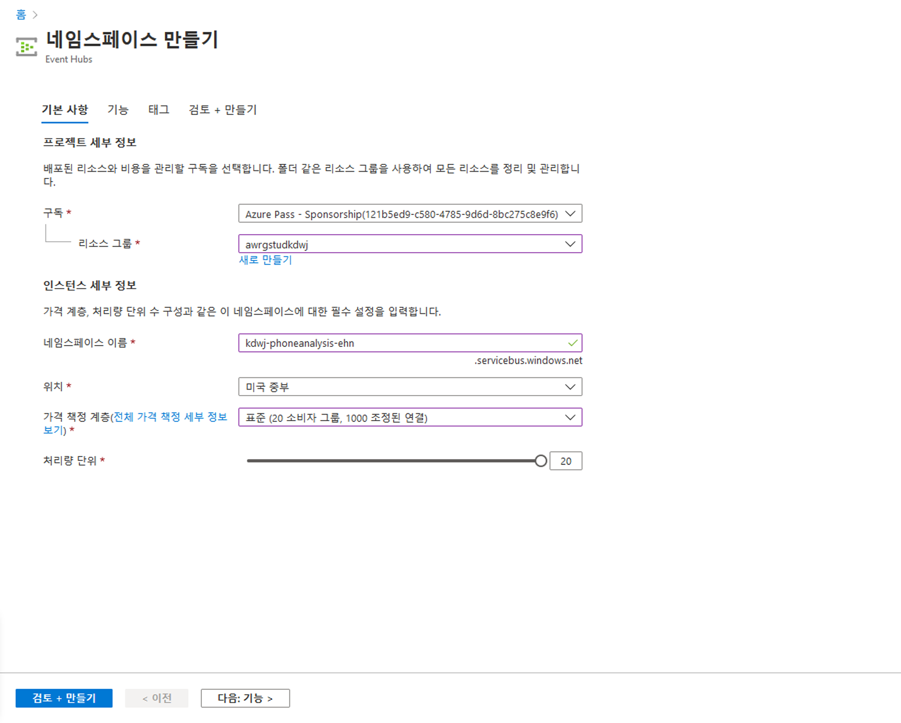

# DP 200 - 데이터 플랫폼 솔루션 구현
# 랩 6 - Stream Analytics를 통해 실시간 분석 수행

**예상 소요 시간**: 60분

**전제 조건**: 이 랩의 사례 연구를 읽었다고 가정합니다. 모듈 1의 콘텐츠 및 랩이 다음과 같다고 가정합니다. 데이터 엔지니어를 위한 Azure도 완료되었습니다.

**랩 파일**: 이 랩용 파일은 _Allfiles\Labfiles\Starter\DP-200.6_ 폴더에 있습니다.

## 랩 개요

수강생들은 데이터 스트림이 무엇인지, 이벤트 처리가 어떻게 이루어지는지를 설명하고, AdventureWorks 사례 연구에 적합한 데이터 스트림 수집 기술을 선택할 수 있습니다. 선택한 수집 기술을 프로비전하고 이를 Stream Analytics와 통합하여 스트리밍 데이터와 함께 작동하는 솔루션을 만듭니다.

## 랩 목표
  
이 랩을 완료하면 다음을 할 수 있습니다.

1. 데이터 스트림 및 이벤트 처리 설명
2. Event Hubs로 데이터 수집
3. 데이터 생성 애플리케이션 시작
4. Stream Analytics 작업으로 데이터 처리

## 시나리오
  
디지털 변환 프로젝트의 일환으로, CIO가 고객 서비스 부서에서 사기성 통화를 식별하도록 지원하라는 작업을 배정했습니다. 지난 몇 년 동안 고객 서비스 부서는 더 이상 보증 대상이 아닌 자전거, 또는 AdventureWorks에서 구매하지 않은 자전거에 대한 지원을 요구하는 사기성 고객 전화가 증가하는 것을 관찰했습니다. 

해당 부서는 현재 고객 서비스 상담원의 경험에 의존하여 이를 식별하고 있습니다. 따라서 상담원이 사기성 클레임을 거는 사람을 실시간으로 추적하도록 돕는 시스템을 구현하려고 합니다.

이 랩을 마치게 되면 다음을 수행했습니다.

1. 데이터 스트림 및 이벤트 처리 설명
2. Event Hubs를 사용하여 데이터 수집
3. 데이터 생성 애플리케이션 시작
4. Stream Analytics 작업으로 데이터 처리

> **중요**: 이 랩을 진행하면서 프로비전 또는 구성 작업에서 발생한 문제를 기록하고 _\Labfiles\DP-200-Issues-Doc.docx_에 있는 문서의 테이블에 로그인합니다. 랩 번호를 문서화하고, 기술을 기록하며, 문제를 설명하고, 해결 방법이 무엇인지 설명합니다. 이 문서를 나중에 모듈에서 다시 참조할 수 있도록 저장합니다.

## 연습 1: 데이터 스트림 및 이벤트 처리 설명

예상 소요 시간: 15분

그룹 연습
  
이 연습의 주요 작업은 다음과 같습니다.

1. 사례 연구 및 시나리오에서 AdventureWorks의 데이터 스트림 수집 기술과 소셜 미디어 분석 요구 사항을 완료하기 위해 데이터 엔지니어로서 수행할 높은 수준의 작업을 식별합니다.

2. 강사는 그룹과 결과에 대해 논의합니다.

### 작업 1: AdventureWorks의 데이터 요구 사항 및 구조를 식별합니다.

1. 랩 가상 머신에서 **Microsoft Word**를 시작하고 **Allfiles\Labfiles\Starter\DP-200.6** 폴더의 **DP-200-Lab06-Ex01.docx** 파일을 엽니다.

2. 한 그룹으로 **10분**을 할애하여 데이터 요구 사항과 사례 연구 문서 내에서 그룹이 식별한 데이터 구조에 대해 논의하고 이를 나열합니다.

### 작업 2: 강사와 조사 결과에 대해 토론합니다.

1. 강사는 결과를 논의하기 위해 그룹 토론을 중지합니다.

> **결과**: 이 연습을 통해 데이터 스트리밍 수집 테이블과 소셜 미디어 분석 요구 사항을 완료하기 위해 데이터 엔지니어로서 수행할 상위 수준의 작업을 보여 주는 Microsoft Word 문서를 만들었습니다.

## 연습 2: Event Hubs를 사용하여 데이터 수집
  
예상 소요 시간: 15분

개인 연습
  
이 연습의 주요 작업은 다음과 같습니다.

1. 이벤트 허브 네임스페이스를 만들고 구성합니다.

2. 이벤트 허브를 만들고 구성합니다.

3. 이벤트 허브 보안을 구성합니다.

### 작업 1: 이벤트 허브 네임스페이스를 만들고 구성합니다.

1. Azure Portal에서 화면 왼쪽 상단에 있는 **홈** 하이퍼링크를 클릭합니다.

2. Azure Portal에서 **리소스 만들기** 아이콘을 클릭하고 **Event Hubs**를 입력한 다음, 검색 결과에서 **Event Hubs**를 선택합니다. Event Hubs 화면에서 **만들기**를 클릭합니다.

3. 네임스페이스 만들기 블레이드에서 다음 옵션을 입력합니다.
    - **구독**: **구독**
    - **리소스 그룹**: **awrgstudxx**
    - **네임스페이스 이름**: **xx-phoneanalysis-ehn**, 여기서 xx는 귀하의 이니셜입니다.
    - **장소**: 가장 가까운 위치를 선택합니다.
    - **가격 계층**: **표준**    
    - **처리량 단위**: **20**
    - 다른 옵션을 기본 설정으로 남겨 둡니다.

        

4. 그런 다음 **검토 + 만들기**를 클릭하고 **만들기**를 클릭합니다.

    > **참고**: 이벤트 허브 네임스페이스를 만드는 데 약 1분이 걸립니다.
   
### 작업 2: 이벤트 허브를 만들고 구성합니다.

1. Azure Portal에서 화면 왼쪽 상단에 있는 **홈** 하이퍼링크를 클릭합니다.

2. Azure Portal의 블레이드에서 **리소스 그룹**을 클릭하고 **awrgstudxx**를 클릭합니다. 여기서 **xx**는 귀하의 이니셜입니다.

3. **xx-phoneanalysis-ehn**를 클릭합니다. 여기서 **xx**는 귀하의 이니셜입니다.

4. **xx-phoneanalysis-ehn** 화면에서 **Event Hubs**를 클릭합니다.

5. 이름 **xx-phoneanalysis-eh**를 제공합니다. 다른 설정을 기본값으로 둔 다음 **만들기**를 선택합니다.

    

    > **참고**: 약 10초 후에 이벤트 허브가 만들어졌다는 메시지가 표시됩니다.

### 작업 3: 이벤트 허브 보안을 구성합니다.

1. Azure Portal의 **xx-phoneanalysis-ehn** 화면에서 **xx**는 귀하의 이니셜입니다. 창 아래쪽으로 스크롤하고 **xx-phoneanalysis-eh** 이벤트 허브를 클릭합니다.

2. 이벤트 허브 액세스 권한을 부여하려면 블레이드 왼쪽의 **설정** 섹션에서 **공유 액세스 정책**을 클릭합니다.

3. **xx-phoneanalysis-eh - 공유 액세스 정책** 화면에서 **추가**를 선택하여 **관리** 권한이 있는 정책을 만듭니다. 정책 이름을 **xx-phoneanalysis-eh-sap**으로 지정하고, **관리**를 선택한 다음 **만들기**를 클릭합니다.

    

4. 정책이 만들어지면 새 정책 **xx-phoneanalysis-eh-sap**을 클릭합니다. 그런 다음 **연결 문자열 - 기본 키**에 대해 복사 단추를 선택하고, 연결 문자열 - 기본 키를 메모장에 붙여 넣습니다. 이 값은 나중에 연습할 때 필요합니다.

    >**참고**: 연결 문자열은 다음과 비슷합니다.
    > ```CMD
    >Endpoint=sb://<이벤트 허브 네임스페이스>.servicebus.windows.net/;SharedAccessKeyName=<공유 액세스 정책명>;SharedAccessKey=<생성 키>;EntityPath=<이벤트 허브명>
    >```
    > 연결 문자열에는 세미콜론으로 구분된 여러 개의 키-값 쌍 (Endpoint, SharedAccessKeyName, SharedAccessKey 및 EntityPath)이 있습니다.

5. 포털에서 이벤트 허브 화면을 닫습니다.

> **결과**: 이 연습을 통해 이벤트 허브 네임스페이스에서 Azure Event Hub를 만들고, 서비스에 대한 액세스를 제공하는 데 사용할 수 있는 이벤트 허브의 보안을 설정했습니다.

## 연습 3: 통신 이벤트 생성기 애플리케이션 시작하기

예상 소요 시간: 15분

개인 연습

이 연습의 주요 작업은 다음과 같습니다.

1. 애플리케이션 연결 문자열을 업데이트

2. 애플리케이션 실행

### 작업 1: 애플리케이션 연결 문자열을 업데이트합니다.

1. **Labfiles\Starter\DP-200.6\DataGenerator** 위치를 찾습니다.

2. 선택한 텍스트 편집기에서 **telcodatagen.exe.config** 파일을 엽니다.

3. 구성 파일의 <appSettings> 요소를 다음과 같은 세부 정보로 업데이트합니다.

    - **EventHubName** 키의 값을 연결 문자열의 **EntityPath** 값으로 설정합니다.
    - **EntityPath 값 없이** 연결 문자열에 **Microsoft.ServiceBus.ConnectionString** 키의 값을 설정합니다(앞에 오는 세미콜론을 제거하는 것을 잊지 마세요).

4. 파일을 저장합니다.

### 작업 2: 애플리케이션을 실행합니다.

1. **시작**을 클릭하고 **CMD**를 입력합니다. 

2. 마우스 오른쪽 단추로 **명령 프롬프트**를 클릭하고, **관리자로 실행**을 클릭합니다. 사용자 액세스 제어 화면에서 **예**를 클릭합니다.

3. 명령 프롬프트에서 **Labfiles\Starter\DP-200.6\DataGenerator** 위치를 찾습니다.

4. 다음 명령을 입력합니다. 

    ```CMD
    telcodatagen.exe 1000 0.2 2
    ```

    > 참고: 이 명령은 다음 매개 변수를 사용합니다.
시간당 호출 데이터 레코드 수.
사기 확률 - 즉, 앱에서 사기성 호출을 시뮬레이션해야 하는 빈도. 값 0.2는 호출 레코드의 약 20%가 사기성이라는 것을 의미합니다.
기간(시간) - 앱을 실행해야 하는 시간. 또한 명령줄에서 프로세스(Ctrl+C)를 종료하여 언제든지 앱을 중지할 수 있습니다.

    

몇 초 후 앱에서 이벤트 허브로 데이터를 전송함에 따라 화면에 전화 통화 레코드가 표시되기 시작합니다. 이 전화 통화 데이터에는 다음 필드가 포함되어 있습니다.

|레코드 | 정의 |
|-|-|
|CallrecTime |호출 시작 시간에 대한 타임스탬프.|
|SwitchNum |호출 연결에 사용되는 전화 스위치. 이 예에서 스위치는 발신 국가/지역(미국, 중국, 영국, 독일 또는 오스트레일리아)을 나타내는 문자열입니다.|
|CallingNum |호출자의 전화번호.|
|CallingIMSI |국제 모바일 구독자 ID(IMSI) 호출자의 고유 식별자.|
|CalledNum | 호출 수신자의 전화번호.|
|CalledIMSI| 국제 모바일 구독자 ID(IMSI) 호출 수신자의 고유 식별자.|

5. 명령 프롬프트 창을 최소화합니다. 

> **결과**: 이 연습을 통해 콜 센터에서 수신하는 전화 통화를 최소화할 수 있는 데이터를 생성하는 애플리케이션을 구성하게 됩니다.

## 연습 4: Stream Analytics 작업으로 데이터 처리

예상 소요 시간: 15분

개인 연습

이 연습의 주요 작업은 다음과 같습니다.

1. Stream Analytics 작업을 프로비전

2. Stream Analytics 작업 입력을 지정

3. Stream Analytics 작업 출력을 지정

4. Stream Analytics 쿼리 정의

5. Stream Analytics 작업 시작

6. 스트리밍 데이터 수집 검증

### 작업 1: Stream Analytics 작업을 프로비전

1. Azure Portal로 돌아가서 **리소스 만들기** 아이콘을 찾아 클릭하고 **STREAM**을 입력합니다. 그런 다음 **Stream Analytics 작업**을 클릭하고 **만들기**를 클릭합니다.

2. **새 Stream Analytics 작업** 화면에서 다음 세부 정보를 입력한 다음 **만들기**를 클릭합니다.
    - **작업 이름**: phoneanalysis-asa-job.
    - **구독**: 기존 구독을 선택합니다.
    - **자원 그룹**: awrgstudxx
    - **위치**: 가장 가까운 위치를 선택합니다.
    - 다른 옵션을 기본 설정으로 남겨 둡니다.

        

    > **참고**: 약 10초 후에 Stream Analytics 작업이 만들어졌다는 메시지가 표시됩니다. Azure Portal에서 업데이트하는 데 몇 분 정도 걸릴 수 있습니다.

### 작업 2: Stream Analytics 작업 입력을 지정

1. Azure Portal의 블레이드에서 **리소스 그룹**을 클릭하고 **awrgstudxx**를 클릭합니다. 여기서 **xx**는 귀하의 이니셜입니다.

2. **phoneanalysis-asa-job**을 클릭합니다.

3. **phoneanalysis-asa-job** Stream Analytics 작업 창의 왼쪽 블레이드에 있는 **작업 토폴로지**에서 **입력**을 클릭합니다.

4. **입력** 화면에서 **스트림 입력 추가**를 클릭한 다음 **Event Hubs**를 클릭합니다.

5. 이벤트 허브 화면에서 다음 값을 입력하고 **저장** 단추를 클릭합니다.
    - **입력 별칭**: 이 작업 입력의 이름을 **PhoneStream**으로 입력합니다.
    - **구독에서 이벤트 허브 선택**: 선택됨
    - **구독**: 구독 이름
    - **이벤트 허브 네임스페이스**: xx-phoneanalysis-ehn
    - **이벤트 허브 이름**: 기존 명명된 xx-phoneanalysis-eh를 사용합니다.
    - **이벤트 허브 소비자 그룹**: 기존 것 사용
    - **인증 방법**: 연결 문자열
    - **이벤트 허브 정책 이름**: 기존 이름(xx-phoneanalysis-eh-sap) 사용
    - 나머지 항목은 기본값으로 둡니다. 마지막으로 **저장***을 클릭합니다.

        

6. 완료되면 **PhoneStream** 입력 작업이 입력 창 아래에 표시됩니다. 입력 창을 닫고 리소스 그룹 페이지로 돌아갑니다.

### 작업 3: Stream Analytics 작업 출력을 지정

1. **phoneanalysis-asa-job**을 클릭합니다.

2. **phoneanalysis-asa-job** Stream Analytics 작업 창의 왼쪽 블레이드에서 **작업 토폴로지**에서 **출력**을 클릭합니다.

3. **출력** 화면에서 **추가**를 클릭한 다음 **Blob Storage/ADLS Gen2**를 클릭합니다.

4. **Blob Storage/ADLS Gen2** 창에서 다음 값을 입력하거나 선택합니다.
    - **출력 별칭**: **PhoneCallRefData**
    - **구독에서 이벤트 허브 선택**: 선택됨
    - **구독**: 구독 이름
    - **스토리지 계정**: **awsastudxx**: 여기서 xx는 귀하의 이니셜입니다.
    - **컨테이너**: **기존 항목 사용**에서 **phonecalls**를 선택합니다.
    - 나머지 항목은 기본값으로 둡니다. 마지막으로 **저장**을 클릭합니다.

        

5. 출력 화면을 닫고 리소스 그룹 페이지로 돌아갑니다.

### 작업 4: Stream Analytics 쿼리 정의

1. **phoneanalysis-asa-job**을 클릭합니다.

2. **phoneanalysis-asa-job** 창 가운데에 있는 **쿼리** 화면에서 **쿼리 편집**을 클릭합니다.

3. 코드 편집기에서 다음 쿼리를 대체합니다.

    ```SQL
    SELECT:
        *
    INTO
        [YourOutputAlias]
    FROM
        [YourInputAlias]
    ```

4. Replace with

    ```SQL
    SELECT System.Timestamp AS WindowEnd, COUNT(*) AS FraudulentCalls
    INTO "PhoneCallRefData"
    FROM "PhoneStream" CS1 TIMESTAMP BY CallRecTime
    JOIN "PhoneStream" CS2 TIMESTAMP BY CallRecTime
    ON CS1.CallingIMSI = CS2.CallingIMSI
    AND DATEDIFF(ss, CS1, CS2) BETWEEN 1 AND 5
    WHERE CS1.SwitchNum != CS2.SwitchNum
    GROUP BY TumblingWindow(Duration(second, 1))
    ```

    > 참고: 이 쿼리는 통화 데이터에서 5초 간격으로 자체 조인을 수행합니다. 사기 전화를 확인하려면 CallRecTime 값을 기반으로 스트리밍 데이터에 자체 조인할 수 있습니다. 그런 다음 CallingIMSI 값(발신 번호)이 동일하지만 SwitchNum 값(발신 국가/지역)이 다른 호출 레코드를 찾을 수 있습니다. 스트리밍 데이터에 JOIN 작업을 사용할 경우 조인은 일치하는 행이 시간상으로 얼마나 분리할 수 있는지를 어느 정도 제한해야 합니다. 스트리밍 데이터가 무한하기 때문에 DATEDIFF 함수를 사용하여 조인의 ON 절 내에 관계 시간 제한을 지정합니다.
    이 쿼리는 DATEDIFF 함수를 제외한 일반 SQL 조인과 같습니다. 이 쿼리에 사용되는 DATEDIFF 함수는 Stream Analytics에만 해당되며, ON...BETWEEN 절 내에 표시되어야 합니다.

    

5. **쿼리 저장**을 선택합니다.

6. 쿼리 창을 닫고 Stream Analytics 작업 페이지로 돌아갑니다.


### 작업 5: Stream Analytics 작업 시작

1. **phoneanalysis-asa-job** 창 가운데에 있는 **쿼리** 화면에서 **시작**을 클릭합니다.
 
2. **작업 시작** 대화 상자에서 **지금**을 클릭하고 **시작**을 클릭합니다. 

>**참고**: 1분이 지나면 **phoneanalysis-asa-job** 창에서 작업이 시작되었다는 메시지가 표시되고, 시작됨 필드가 시작된 시간으로 바뀝니다.

>**참고**: 데이터를 캡처할 수 있도록 2분 동안 실행합니다.

### 작업 6: 스트리밍 데이터 수집 검증

1. Azure Portal의 블레이드에서 **리소스 그룹**을 클릭하고 **awrgstudxx**, **awsastudxx**를 차례로 클릭합니다. 여기서 **xx**는 귀하의 이니셜입니다.

2. Azure Portal에서 **컨테이너** 상자를 클릭한 다음, **phonecalls**라는 컨테이너를 클릭합니다.

3. JSON 파일이 표시되는지 확인하고 크기 열을 기록합니다.

    

4. Microsoft Edge를 새로 고치고 화면이 새로 고쳐지면 파일 크기를 확인합니다.

    >**참고**: 파일을 다운로드하여 JSON 데이터를 쿼리할 수 있으며 데이터를 Power BI로 출력할 수도 있습니다.

> **결과**: 이 연습을 통해 Azure Blob의 JSON 파일 저장소로 스트리밍 데이터를 수집하도록 Azure Stream Analytics를 구성했습니다. 이 작업에 스트리밍 전화 통화 데이터를 사용했습니다.

## 닫기

1. Azure Portal의 블레이드에서 **리소스 그룹**을 클릭하고 **awrgstudxx**, **phoneanalysis-asa-job**을 차례로 클릭합니다.

2. **phoneanalysis-asa-jo** 화면에서 **중지**를 클릭합니다. **스트리밍 작업 중지** 대화 상자에서 **예**를 클릭합니다.

3. 명령 프롬프트 애플리케이션을 닫습니다.