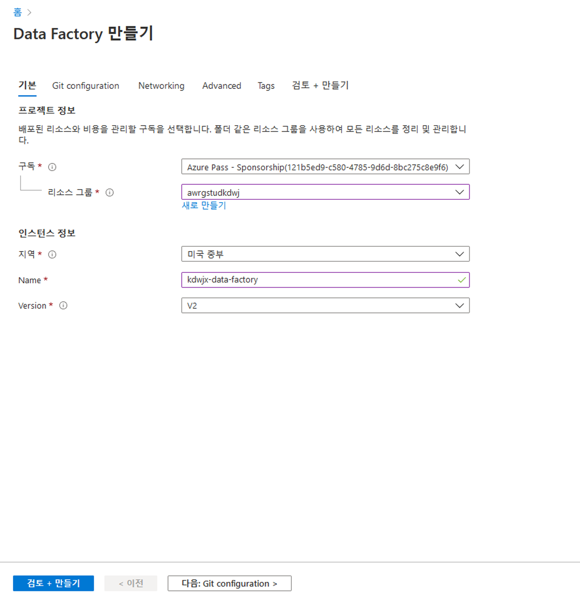
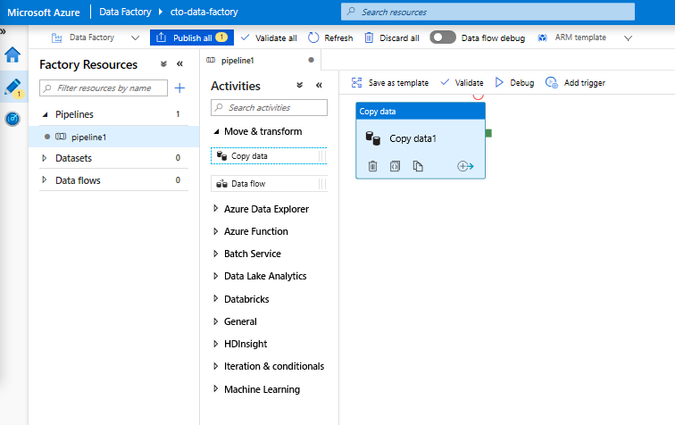
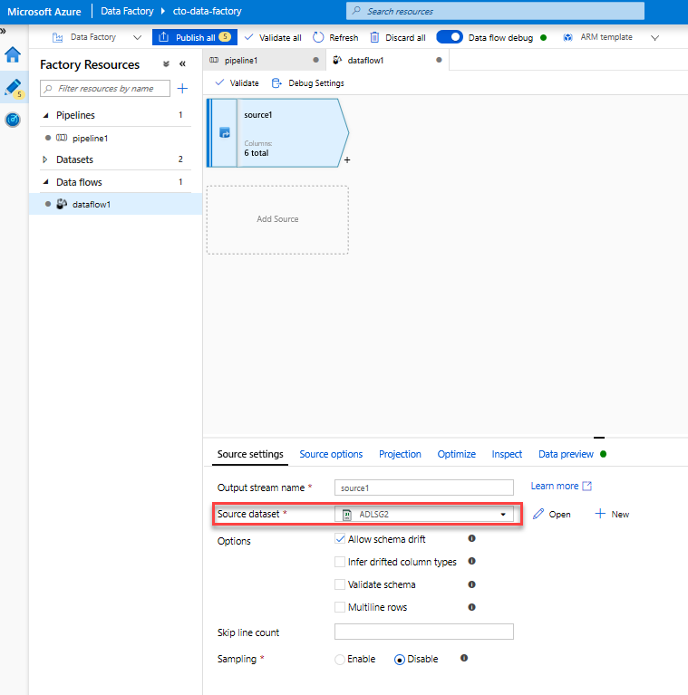
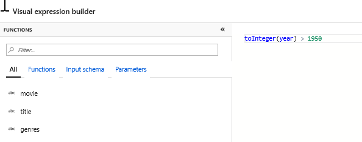
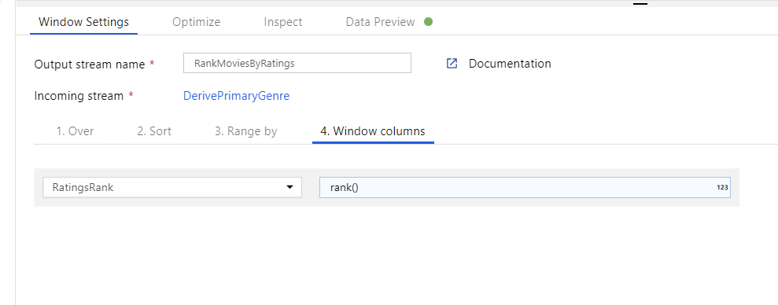
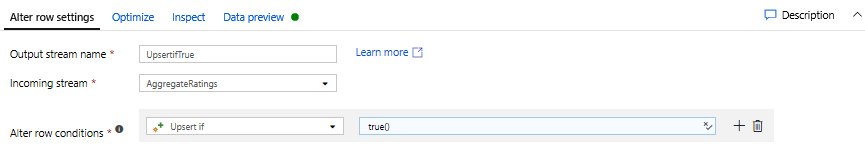
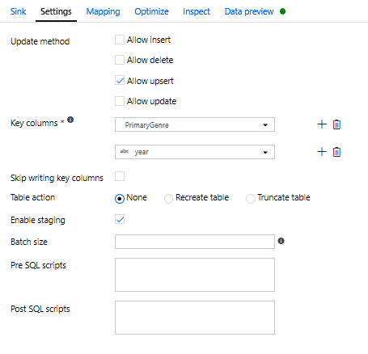
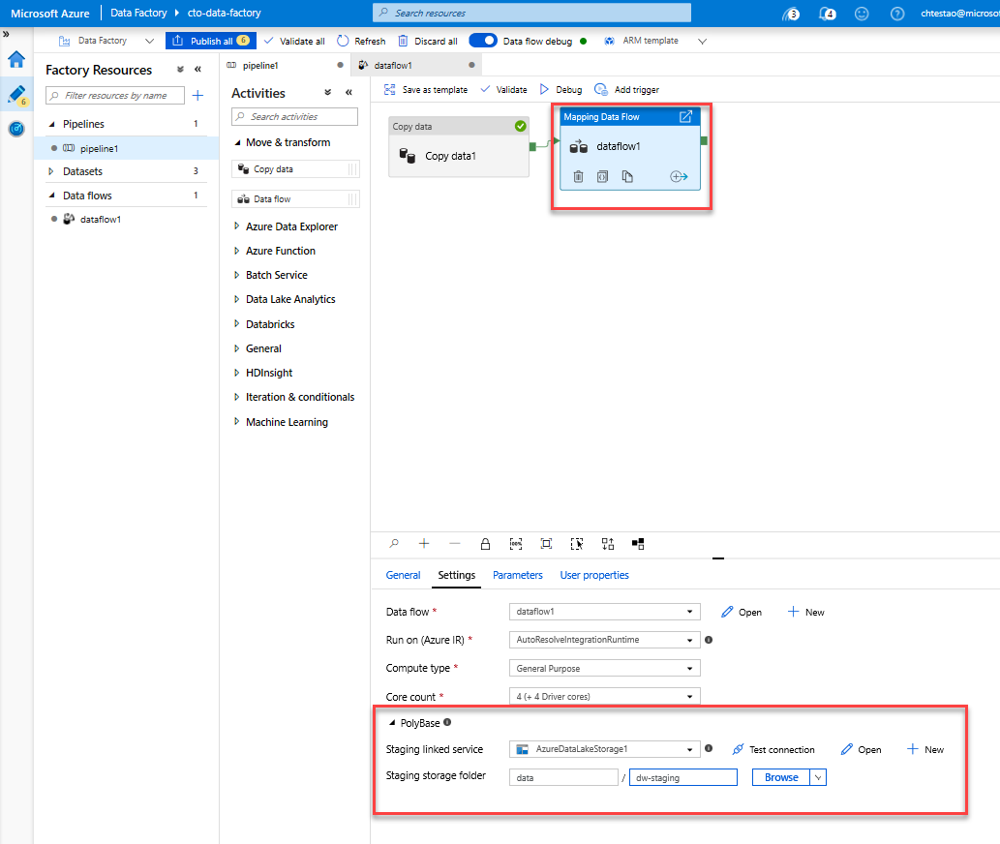

# DP 200 - 데이터 플랫폼 솔루션 구현
# 랩 7 - Azure Data Factory로 데이터 이동을 오케스트레이션

**예상 소요 시간**: 70분

**전제 조건**: 이 랩 관련 사례 연구의 내용을 확인했다고 가정합니다. 모듈 1의 콘텐츠 및 랩은 다음과 같은 것으로 가정합니다. 데이터 엔지니어를 위한 Azure도 완료되었습니다.

* **Azure 구독**: Azure 구독이 없다면 시작하시기 전에 다음을 만드세요.
    시작하기 전 [무료 계정](https://azure.microsoft.com/free/)을 만드세요.

* **Azure Data Lake Storage Gen2 스토리지 계정**: ADLS가 없다면,
    Gen2 스토리지 계정, 다음에서 지침을 확인하세요. [ADLS Gen2 스토리지 계정 만들기
    참조하십시오](https://docs.microsoft.com/ko-kr/azure/storage/blobs/data-lake-storage-quickstart-create-account).

* **Azure Synapse Analytics**: Azure Synapse Analytics 계정이 없다면 다음에서 지침을 확인하세요. [SQL DW 만들기
    참조하십시오](https://docs.microsoft.com/ko-kr/azure/sql-data-warehouse/create-data-warehouse-portal).

**랩 파일**: 이 랩용 파일은 _Allfiles\Labfiles\Starter\DP-200.7_ 폴더에 있습니다.

## 랩 개요

이 모듈에서 학생들은 다양한 데이터 플랫폼 기술의 데이터 이동을 오케스트레이션하는 데 Azure Data Factory를 사용하는 방법을 알아봅니다. 기술의 기능을 설명하고 SQL Database에서 데이터를 수집하여 Azure Synapse Analytics에 데이터를 로드하는 E2E 데이터 파이프라인을 설정할 수 있습니다. 학생은 컴퓨팅 리소스를 호출하는 방법도 시연합니다.

## 랩 목표
  
이 랩을 완료하면 다음과 같은 작업을 수행할 수 있습니다.

1. Azure Data Factory 설정
2. 복사 작업을 사용하여 데이터 수집하기
3. 매핑 데이터 흐름 작업을 사용하여 변환
4. 컴퓨팅 리소스를 사용하여 변환 수행하기

## 시나리오
  
귀하께서는 데이터 웨어하우스로 데이터 추출, 로드 및 변환을 지원하는 도구를 평가하고 있으며, 팀의 데이터 엔지니어가 제품의 변환 기능을 살펴볼 수 있는 Azure Data Factory의 개념 증명을 보여달라고 요청하였습니다. 개념 증명에서 AdventureWorks 데이터의 연관성은 필요가 없으며, 기능 소개를 위한 데이터 세트를 마음껏 선택하도록 하였습니다.

또한 데이터 과학자는 Azure Data Factory에서 Azure Databricks를 호출할 수 있는지 확인하도록 요청했습니다. 이를 위해 Azure Databricks를 컴퓨팅 리소스로 호출하는 간단한 개념 증명 Data Factory 파이프라인을 만듭니다.

이 랩을 마치면 다음과 같은 역량을 갖추게 됩니다.

1. Azure Data Factory 설정
2. 복사 활동을 사용하여 수집된 데이터
3. 데이터 흐름 매핑 작업을 사용하여 변환 수행
4. 계산 리소스를 사용하여 변환 수행

> **중요**: 이 랩을 진행하면서 프로비전 또는 구성 작업에서 발생한 문제를 기록하고 _\Labfiles\DP-200-Issues-Doc.docx_ 에 있는 문서의 테이블에 로그인합니다. 랩 번호를 문서화하고, 기술을 기록하며, 문제를 설명하고, 해결 방법이 무엇인지 설명합니다. 이 문서를 나중에 모듈에서 다시 참조할 때 저장합니다.

## 연습 1: Azure Data Factory 설정

예상 소요 시간: 15분

개인 연습

이 연습의 주요 작업은 다음과 같습니다.

1. Azure Data Factory 설정

### 작업 1: Azure Data Factory 설정.

Azure Data Factory 만들기: [Azure Portal](https://portal.azure.com)을 사용하여 Data Factory를 만듭니다. 

1. Microsoft Edge에서, Azure Portal 탭으로 이동하여 **+ 리소스 만들기**아이콘을 클릭하고, **팩터리**를 입력한 다음, 결과 검색에서 **Data Factory**를 클릭한 후 **만들기**를 클릭합니다.

2. 새 Data Factory 화면에서 다음 옵션을 사용하여 새 Data Factory를 생성합니다.
    - **구독**: 구독
    - **자원 그룹**: awrgstudxx
    - **지역**: 가장 가까운 위치를 선택합니다.    
    - **이름**: xx-data-factory, 여기에서 xx는 이니셜을 나타냄
    - **버전**: V2
    - 다른 옵션을 기본 설정으로 남겨 둡니다.

        

    > **참고**: Data Factory를 만드는 데 약 1분이 걸립니다.

3. **git 구성** 블레이드에서 **나중에 git 구성**을 선택합니다. 

4. **검토 + 만들기**를 클릭하고 **만들기**를 선택합니다.

> **결과**: 이 연습을 완료한 후 Azure Data Factory의 인스턴스를 만들었습니다.

## 연습 2: 복사 작업을 사용하여 데이터 수집하기
  
예상 소요 시간: 15분

개인 연습
  
이 연습의 주요 작업은 다음과 같습니다.

1. 디자이너에 복사 활동 추가

2. 원본으로 사용할 새 HTTP 데이터 세트 만들기

3. 새 ADLS Gen2 싱크 만들기

4. 복사 활동 테스트

### 작업 1: 디자이너에 복사 활동 추가

1. 배포 성공 메시지에서 **리소스로 이동** 단추를 클릭합니다.

2. xx-data-factory 화면 중앙에 있는 단추, **작성자 및 모니터**를 클릭합니다.

3. **제작 캔버스 열기** ADF 홈 페이지에서 오는 경우 왼쪽 사이드바의 **연필 아이콘**을 클릭하고 **+ 파이프라인 단추**를 선택하여 제작 캔버스를 열고 파이프라인을 만듭니다.

4. 활동 창에서 **복사 작업 추가** 후 이동 및 변환 아코디언을 열고 데이터 복사 작업을 파이프라인 캔버스로 끌고 갑니다.

    


### 작업 2: 원본으로 사용할 새 HTTP 데이터 세트 만들기

1. 복사 작업 설정의 원본 탭에서 **+ 신규**를 클릭합니다

2. 데이터 저장소 목록에서 **HTTP**타일을 선택하고 계속을 클릭합니다.

3. 파일 형식 목록에서 **DelimitedText** 형식 타일을 선택하고 계속을 클릭합니다.

4. 속성 설정 블레이드에서 데이터 세트에 **HTTPSource**와 같은 이해할 수 있는 이름을 지정하고 **연결된 서비스** 드롭다운을 클릭합니다. HTTP 연결 서비스를 만들지 않은 경우 **새로운 것**을 선택합니다.

5. 새 링크된 서비스(HTTP) 화면에서 moviesDB CSV 파일의 URL을 지정합니다. 다음 엔드포인트를 사용하여 인증없이 데이터에 액세스할 수 있습니다.

    https://raw.githubusercontent.com/djpmsft/adf-ready-demo/master/moviesDB.csv

6. **기본 URL** 텍스트 상자에 배치합니다. 

7. **인증 유형** 드롭다운에서 **익명**을 선택하고 **만들기**를 클릭합니다.


    -  연결된 서비스를 만들고 선택하면 나머지 데이터 세트 설정을 지정합니다. 이러한 설정은 연결에서 데이터를 가져오는 방법과 위치를 지정합니다. URL이 이미 파일을 가리키고 있 상대 엔드포인트가 필요하지 않습니다. 데이터의 첫 번째 행에 헤더가 있기 때문에 **첫 번째 행을 헤더로**를 참으로 설정하고 **연결/저장소**에서 스키마 가져오기를 선택하여 파일 자체에서 스키마를 가져옵니다. 요청 방법으로 **가져오기**를 선택합니다. 다음 화면이 표시됩니다.

        
           
    - 완료한 후 **확인**을 클릭합니다.
   
    a. 데이터 세트가 올바르게 구성되었는지 확인하려면 복사 활동의 원본 탭에서 **데이터 미리보기**를 클릭하여 데이터의 작은 스냅샷을 가져옵니다.
   
   

### 작업 3: 새 ADLS Gen2 데이터 세트 싱크 만들기

1. **싱크 탭**을 클릭하고 **+새로 만들기**을 클릭합니다

2. **Azure Data Lake Storage Gen2** 타일을 선택하고 **계속**을 클릭합니다.

3. **DelimitedText** 형식 타일을 선택하고 **계속**을 클릭합니다.

4. 속성 설정 블레이드에서 데이터 세트에 **ADLSG2**와 같은 이해할 수 있는 이름을 지정하고 **연결된 서비스** 드롭다운을 클릭합니다. ADLS 연결 서비스를 만들지 않은 경우 **새로운 것**을 선택합니다.

5. 새 연결 서비스(Azure Data Lake Storage Gen2) 블레이드에서 인증 방법을 **계정 키**로 선택하고 **Azure 구독**을 선택한 뒤 **Awdlsstudxx**의 스토리지 계정 이름을 선택합니다. 다음과 같은 화면이 나타납니다.

   

6. **만들기**를 클릭합니다

7. 연결된 서비스를 구성한 후 설정 속성 블레이드를 입력합니다. 이 데이터 세트에 쓰는 동안 moviesDB.csv를 복사할 폴더를 가리키려고 합니다. 아래 예제에서는 파일 시스템 **데이터**의 **출력** 폴더에 쓰고 있습니다. 폴더를 동적으로 만들 수 있지만, 파일 시스템을 작성하려면 파일 시스템이 있어야 합니다. **첫 번째 행을 헤더로**를 참으로 설정합니다. **샘플 파일**(**Labfiles\Starter\DP-200.7\SampleFiles**에서 moviesDB.csv 파일 사용)에서 스키마를 가져올 수 있습니다  

   

8. 완료한 후 **확인**을 클릭합니다.

### 작업 4: 복사 활동 테스트

이제 복사 활동을 완전히 구성했습니다. 테스트하려면 파이프라인 캔버스 상단의 **디버그** 단추를 클릭합니다. 그러면 파이프라인 디버그 실행이 시작됩니다.

1. 파이프라인 디버그 실행 진행률을 모니터링하려면 파이프라인의 **출력** 탭을 클릭합니다.

2. 활동 출력에 대한 자세한 설명을 보려면 안경 아이콘을 클릭합니다. 이렇게 하면 데이터 읽기/기록, 처리량 및 심층적인 기간 통계와 같은 유용한 메트릭을 제공하는 복사 모니터링 화면이 열립니다.

   

3. 복사본이 예상대로 작동하는지 확인하려면 ADLS gen2 저장소 계정을 열고 파일이 예상대로 작성되었는지 확인하십시오.


## 연습 3: 매핑 데이터 흐름으로 데이터 변환
  
예상 소요 시간: 30분

개인 연습

Azure Data Lake Store Gen2로 데이터를 이동했으니, 이제 Spark 클러스터를 통해 대규모로 데이터를 변환한 다음 데이터 웨어하우스에 로드하는 매핑 데이터 흐름을 빌드할 준비가 되었습니다. 
  
이 연습의 주요 작업은 다음과 같습니다.

1. 환경 준비

2. 데이터 원본 추가

3. 매핑 데이터 흐름 변환 사용

4. 데이터 싱크에 쓰기

5. 파이프라인 실행

### 작업 1: 환경 준비

1. **데이터 흐름 디버그 켜기** 작성 모듈의 상단에 있는 **데이터 흐름 디버그** 슬라이더를 켭니다. 

    > 참고: 데이터 흐름 클러스터는 준비하는 데 5~7분이 소요됩니다.

2. 활동 창에서 **데이터 흐름 활동 추가** 후 이동 및 변환 아코디언을 열고 **데이터 흐름** 활동을 파이프라인 캔버스로 끌고 갑니다. 

    

3. 설정 탭에서 가변 **데이터 흐름**의 **+ 새로 만들기**를 클릭합니다.

### 작업 2: 데이터 원본 추가

1. **ADLS 원본 추가** 캔버스에서 데이터 흐름 매핑 개체를 두 번 클릭합니다. 데이터 흐름 캔버스에서 원본 추가 단추를 클릭합니다. **원본 데이터 세트**드롭다운에서 활동 복사에 사용되는 **ADLSG2** 데이터 세트를 선택합니다.

    


    * 데이터 세트가 다른 파일이 있는 폴더를 가리키는 경우 다른 데이터 세트를 만들거나 매개 변수화를 사용하여 moviesDB.csv 파일만 읽혀야 할 수 있습니다.
    * ADLS에서 스키마를 가져오지 않았지만 이미 데이터를 수집한 경우 데이터 세트의 '스키마' 탭으로 이동하여 '스키마 가져오기'를 클릭하면 데이터 흐름에서 스키마 프로젝션을 알 수 있습니다.

    디버그 클러스터가 준비되면 데이터 미리 보기 탭을 통해 데이터가 올바르게 로드되었는지 확인합니다. 새로 고침 단추를 클릭하면 매핑 데이터 흐름이 각 변환 시 데이터가 어떻게 보이는지를 나타내는 스냅샷을 표시합니다.
  
### 작업 3: 매핑 데이터 흐름 변환 사용

1. **선택 변환을 추가하여 이름을 바꾸고 열을 삭제** 데이터 미리 보기에서 "Rotton Tomatoes" 열의 철자가 틀렸을 수 있습니다. 제대로 이름을 지정하고 사용하지 않는 등급 열을 삭제하려면 ADLS 원본 노드 옆에 있는 + 아이콘을 클릭하고 스키마 수정자를 선택하여 [변환 선택](https://docs.microsoft.com/azure/data-factory/data-flow-select)을 추가할 수 있습니다.
    
    

    **이름** 필드에서 'Rotton'을 'Rotten'으로 변경합니다. 등급 열을 삭제하려면, 그 위로 마우스를 가져가서 휴지통 아이콘을 클릭합니다.

    

2. **원치 않는 연도를 필터링하기 위해 필터 변환 추가** 1951년 이후에 만든 영화에만 관심이 있다고 가정해 봅니다. [필터 변환](https://docs.microsoft.com/azure/data-factory/data-flow-filter)을 추가하여 선택 변환 옆에 있는 **+ 아이콘**을 클릭하고 행 한정자 아래에서 **필터**를 선택하여 필터 조건을 지정할 수 있습니다. **식 상자**를 클릭하여 [식 작성기](https://docs.microsoft.com/azure/data-factory/concepts-data-flow-expression-builder)를 열고 필터 조건을 입력합니다. [매핑 데이터 흐름 표현 언어](https://docs.microsoft.com/azure/data-factory/data-flow-expression-functions), **toInteger(year) > 1950**의 구문을 사용하여 문자열 연도 값을 정수로 변환하고 해당 값이 1950을 초과하는 경우 행을 필터링합니다.

    

    표현식 작성기의 포함된 데이터 미리보기 창을 사용하여 조건이 제대로 작동하는지 확인할 수 있습니다.

    


4. **파생 변환을 추가하여 기본 장르를 계산** 보다시피, 장르 열이 '로 구분된 문자열입니다.|' 문자입니다. 각 열의 *첫 번째* 장르만 필요한 경우, 필터 변환 옆에 있는 **+ 아이콘**을 클릭하고 스키마 수정자 에서 파생된 열을 선택하여 [파생 열](https://docs.microsoft.com/azure/data-factory/data-flow-derived-column) 변환을 통해 **PrimaryGenre**라는 새 열을 파생시킬 수 있습니다. 파생된 열은 필터 변환과 마찬가지로 매핑 데이터 흐름 식 작성기를 사용하여 새 열의 값을 지정합니다.

    

    이 시나리오에서는 'genre1'로 서식이 지정된 장르 열에서 첫 번째 장르를 추출하려고 합니다.|genre2|...|genreN'. **위치** 기능을 사용하여 '의 첫 번째 1기반 인덱스를 가져옵니다.|'장르 스트링에서. **iif** 함수를 사용하여 이 색인이 1보다 큰 경우 기본 장르는 색인의 왼쪽에 스트링의 모든 문자를 반환하는 **왼쪽** 함수를 통해 계산할 수 있습니다. 그렇지 않으면 PrimaryGenre 값은 장르 필드와 같습니다. 식 작성기의 데이터 미리 보기 창을 통해 출력을 확인할 수 있습니다.

   
4. **창 변환을 통해 영화 순위 지정** 한 영화가 당 해에 특정 장르에서 어떻게 평가되는지에 관심이 있다고 가정해보겠습니다. [창 변환](https://docs.microsoft.com/azure/data-factory/data-flow-window)을 추가하여 파생 열 변환 옆에 있는 **+ 아이콘**을 클릭하고 스키마 수정자 아래의 창을 클릭하여 창 기반 집계를 정의할 수 있습니다. 이렇게 하려면 창 위에 있는 것, 정렬 기준, 범위 및 새 창 열을 계산하는 방법을 지정합니다. 이 예제에서는 Rotten Tomato를 내림차순으로 정렬하여 PrimaryGenre와 무한한 연도를 가진 창을 만들 것이며, 특정 장르 연도 내에서 각 영화가 가지고 있는 순위와 동일한 RatingRank라는 새 열을 계산합니다.

    

    

    

    

5. **집계 변환으로 집계 평가** 이제 모든 필요한 데이터를 수집하고 도출하였으므로 [집계 변환](https://docs.microsoft.com/azure/data-factory/data-flow-aggregate)을 추가하여 창 변환 옆에 있는 **+ 아이콘**을 클릭하고 스키마 수정자에서 집계를 클릭하여 원하는 그룹을 기반으로 메트릭을 계산할 수 있습니다. 창 변환에서와 같이, PrimaryGenre와 연도별로 영화를 그룹화할 수 있습니다

    

    집계 탭에서 지정된 그룹에 대해 열별로 계산된 집계를 수행할 수 있습니다. 모든 장르와 연도에 대해 평균 Rotten Tomatoes 등급, 가장 높은 등급의 영화와 가장 낮은 등급의 영화(창 기능을 활용) 및 각 그룹에 있는 영화 수를 가져오겠습니다. 집계는 변환 스트림의 행 양을 크게 줄이고 변환에 지정된 열 및 집계 열만 그룹을 전파합니다.

    

    * 집계 변환이 데이터를 변경하는 방법을 보려면 데이터 미리 보기 탭을 사용합니다.
   

6. **행 변환 변경을 통해 Upsert 조건을 지정** 테이블 형식 싱크에 쓰는 경우 집계 변환 옆에 있는 + 아이콘을 클릭하고 [행 변환 변경](https://docs.microsoft.com/azure/data-factory/data-flow-alter-row) 아래의 행 변경을 사용하여 행에 삽입, 삭제, 업데이트 및 upsert 정책을 지정할 수 있습니다. 항상 삽입 및 업데이트하므로 모든 행이 항상 upsert되도록 지정할 수 있습니다.

    

    

### 작업 4: 데이터 싱크에 쓰기

1. **Azure Synapse Analytics 싱크에 쓰기** 이제 모든 변환 논리를 완료했으며 싱크에 쓸 준비가 되었습니다.
    1. Upsert 변환 옆에 있는 **+ 아이콘**을 클릭하고 대상 아래의 싱크를 클릭하여 **싱크**를 추가합니다.
    1. 싱크 탭에서 **+ 새로 만들기 단추**를 사용하여 새 데이터 웨어하우스 데이터 세트를 만듭니다.
    1. 타일 목록에서 **Azure Synapse Analytics**을 선택합니다.
    1. 새 연결된 서비스를 선택하고 모듈 5에서 만든 DWDB 데이터베이스에 연결하도록 Azure Synapse Analytics 연결을 구성합니다. 완료되면 **만들기**를 클릭합니다.
    
    1. 데이터 세트 구성에서 **새 테이블 만들기**를 선택하고 **Dbo**의 스키마와 **등급**의 테이블 이름을 입력합니다. 완료한 후 **확인**을 클릭합니다.
    
    1. Upsert 조건이 지정되었기 때문에 설정 탭으로 이동하여 주요 열 PrimaryGenre 및 연도에 따라 'upsert 허용'을 선택해야합니다.
    
이제 8가지 변환 데이터 흐름 매핑 구축을 완료했습니다. 파이프라인을 실행하고 결과를 볼 시간입니다!


## 작업 5: 파이프라인 실행

1. 캔버스의 파이프라인1 탭으로 이동합니다. 데이터 흐름의 Azure Synapse Analytics는 [PolyBase](https://docs.microsoft.com/sql/relational-databases/polybase/polybase-guide?view=sql-server-2017)를 사용하므로 Blob 또는 ADLS 스테이징 폴더를 지정해야 합니다. 데이터 흐름 실행 활동의 설정 탭에서 PolyBase 아코디언을 열고 ADLS가 연결된 서비스를 선택하고 스테이징 폴더 경로를 지정합니다.

    

2. 파이프라인을 게시하기 전에 다른 디버그 실행을 실행하여 파이프라인이 예상대로 작동하는지 확인합니다. 출력 탭을 보면 두 활동이 실행되는 동안 두 활동의 상태를 모니터링할 수 있습니다.

3. 두 활동이 모두 성공하면 데이터 흐름 활동 옆에 있는 안경 아이콘을 클릭하여 데이터 흐름 실행을 자세히 살펴볼 수 있습니다.

4. 이 랩에서 설명한 것과 동일한 논리를 사용하는 경우 데이터 흐름은 SQL DW에 737행을 작성해야 합니다. [SQL Server Management Studio](https://docs.microsoft.com/sql/ssms/download-sql-server-management-studio-ssms?view=sql-server-2017)로 이동하여 파이프라인이 제대로 작동하는지 확인하고 작성된 내용을 확인할 수 있습니다.

    

## 연습 4: Azure Data Factory 및 Databricks
  
예상 소요 시간: 15분

개인 연습
  
이 연습의 주요 작업은 다음과 같습니다.

1. Databricks 액세스 토큰을 생성합니다.

2. Databricks Notebook 생성

3. 연결된 서비스 만들기

4. Databricks Notebook 활동을 사용하는 파이프라인을 만듭니다.

5. 파이프라인 실행을 트리거합니다.

### 작업 1: Databricks 액세스 토큰을 생성합니다.

1. Azure Portal에서 **리소스 그룹**을 선택하고 **awrgstudxx**를 클릭한 다음, **awdbwsstudxx**을 클릭합니다. 여기에서 xx는 이름 이니셜입니다.

2. **작업 영역 시작**을 클릭합니다.

3. Databricks 작업 영역 오른쪽 위의 사용자 **프로필 아이콘**을 클릭합니다.

4. **사용자 설정**을 클릭합니다.

5. 토큰 액세스 탭으로 이동하여 **새 토큰 생성** 단추를 클릭합니다.

6. "ADF 통합용" **주석**에 설명을 입력하고 10일의 **수명**을 설정하고 **생성**을 클릭합니다.

7. 생성된 토큰을 복사하여 메모장에 저장한 다음 **완료를** 클릭합니다.

### 작업 2: Databricks Notebook 생성

1. 화면 왼쪽에서 **작업 영역**아이콘을 클릭하고 작업 영역이라는 단어 옆의 화살표를 클릭한 다음 **만들기**를 클릭한 다음, **폴더**를 클릭합니다. 폴더 이름을 **adftutorial**로 지정하고 **폴더 만들기**를 클릭합니다. adftutorial 폴더가 작업 영역에 나타납니다.

2. adftutorial 옆의 드롭다운 화살표를 클릭하고 **만들기**를 클릭한 다음, **Notebook**을 클릭합니다.

3. Notebook 만들기 대화 상자에서 **mynotebook**의 이름을 입력하고 언어가 Python **Python**을 명시하는지 확인한 다음, **만들기**를 클릭합니다. 제목이 mynotebook인 Notebook이 나타납니다.

4. 새로 만든 Notebook "mynotebook"에서 다음 코드를 추가합니다.

    ```Python
    # 매개 변수를 활용하고 매개 변수를 인쇄하기 위한 위젯 만들기

    dbutils.widgets.text("input", "","")
    dbutils.widgets.get("input")
    y = getArgument("input")
    print ("Param -\'input':")
    print (y)
    ```

    > **참고** Notebook 경로는 **/adftutorial/mynotebook**입니다.

### 작업 3: 연결된 서비스 만들기

1. Microsoft Edge에서 포털 탭을 클릭합니다. Azure Portal에서 Azure Data Factory를 반환합니다.

2. **xx-data-factory** 화면에서 **작성자 및 모니터를**클릭합니다. Azure Data Factory 솔루션을 작성하기 위해 다른 탭이 열립니다.

3. 화면 왼쪽에서 **작성자**아이콘을 클릭합니다. 이렇게 하면 Data Factory 디자이너가 열립니다.

4. 화면 하단에서 **연결**을 클릭한 다음 **+ 신규**를 클릭합니다.

5. **새 연결 서비스**의 화면 상단에서 계산을 클릭한 다음 **컴퓨팅**을 클릭하고 **Azure Databricks**를 클릭한 다음, **계속**을 클릭합니다.

6. **새 연결 서비스(Azure Databricks)** 화면에서 다음 세부 정보를 입력하고 **완료**를 클릭합니다.
    - **이름**: xx_dbls, xx는 이니셜입니다
    - **Databricks 작업 영역**: awdbwsstudxx, 여기에서 xx는 이니셜입니다.
    - **클러스터 선택**: 기존 사용
    - **도메인/지역**: 채워야 합니다.
    - **액세스 토큰**: 메모장에서 액세스 토큰을 복사하여 이 필드에 붙여넣기
    - **기존 클러스터에서 선택**: awdbclstudxx, 여기에서 xx는 이니셜입니다
    - 다른 옵션을 기본 설정으로 남겨 둡니다.

    > **참고**: 완료를 클릭하면 xx_dbls가 생성된 **작성자 및 모니터** 화면으로 돌아가고 이전 사용 설명에서 만든 다른 연결 서비스가 표시됩니다.

### 작업 5: Databricks Notebook 활동을 사용하는 파이프라인을 만듭니다.

1. 화면 왼쪽에 있는 팩터리 리소스 아래에서 **+** 아이콘을 클릭한 다음, **파이프라인**을 클릭합니다. 이렇게 하면 파이프라인 디자이너가 있는 탭이 열립니다.

2. 파이프라인 디자이너의 하단에서 매개 변수 탭을 클릭한 다음 **+ 신규**를 클릭합니다.

3. **name** 이름이 있는 매개 변수 만들기(**스트링 타입 포함)**

4. **활동** 메뉴에서 **Databricks를** 확장합니다.

5.  **Notebook**을 캔버스로 드래그합니다.

6. 하단에 있는 **Notebook1** 창의 속성에서 다음 단계를 완료합니다.
    - **Azure Databricks** 탭으로 이동합니다.
    - 이전 절차에서 만든 **xx_dbls**를 선택합니다.

    - **설정** 탭으로 전환하고 Notebook 경로에 **/adftutorial/mynotebook**을 입력합니다.
    - **기본 매개 변수**를 확장한 다음, **+ 신규**를 클릭합니다.
    - **입력** 이름(**@pipeline().parameters.name** 값 포함)을 갖는 매개 변수를 만듭니다.

7. **Notebook1**에서 템플릿으로 저장 단추 옆의 **유효성 검사**를 클릭합니다. 화면 오른쪽에 "파이프라인의 유효성이 검사되었습니다.
오류가 발견되지 않았습니다."라 명시된 창이 나타납니다. 창을 닫으려면 >>를 클릭합니다.

8. **모두 게시**를 클릭하여 연결된 서비스 및 파이프라인을 게시합니다.

    > **참고**: 배포가 성공했다는 메시지가 나타납니다.

### 작업 6: 파이프라인 실행 트리거

1. **Notebook1**에서 **트리거 추가**를 클릭하고 디버그 단추 옆의 **지금 트리거**를 클릭합니다.

2. **파이프라인 실행** 대화 상자는 이름 매개 변수를 요청합니다. 여기에서 **/path/filename**을 매개 변수로 사용합니다. 종료를 클릭합니다. 캔버스의 Notebook1 활동 위에 빨간색 원이 나타납니다.

### 작업 7: 파이프라인 모니터링

1. 화면 왼쪽에서 **모니터** 탭을 클릭합니다. 파이프라인 실행이 표시되는지 확인합니다. Notebook이 실행되는 Databricks 작업 클러스터를 만드는 데 약 5~8분이 걸립니다.

2. 주기적으로 **새로 고침**을 선택하여 파이프라인 실행 상태를 확인합니다.

3. 파이프라인 실행과 연결된 활동 실행을 보려면 **작업 열**에서 **활동 실행 보기**를 선택합니다.

### 작업 8: 출력 확인

1. Microsoft Edge에서 **mynotebook - Databricks** 탭을 클릭합니다. 

2. **Azure Databricks** 작업 영역에서 **클러스터**를 클릭하면 작업 상태가 실행 중, 작동 중 또는 종료됨으로 볼 수 있습니다.

3. **awdbclstudxx** 클러스터를 클릭한 다음 **이벤트 로그**를 클릭하여 활동을 봅니다.

    > **참고**: 파이프라인 실행을 트리거한 시간으로 **시작**되는 이벤트 유형을 볼 수 있어야 합니다.