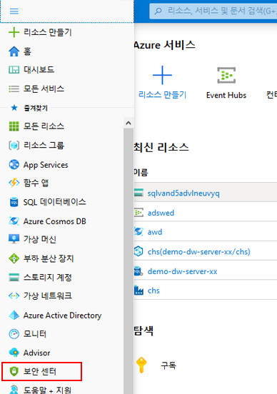
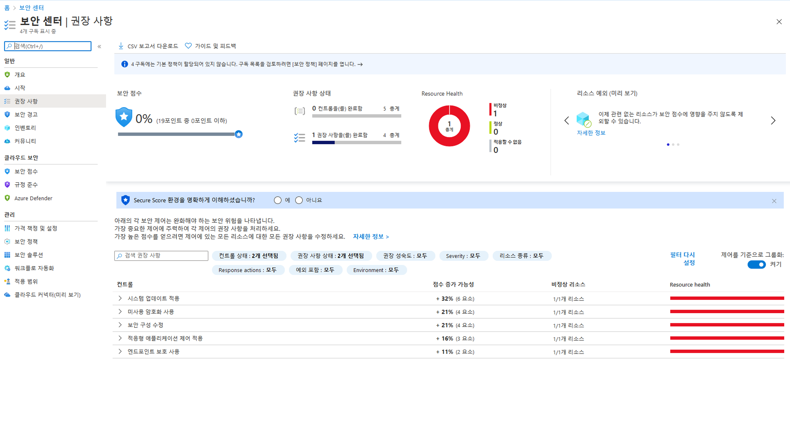
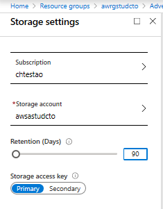
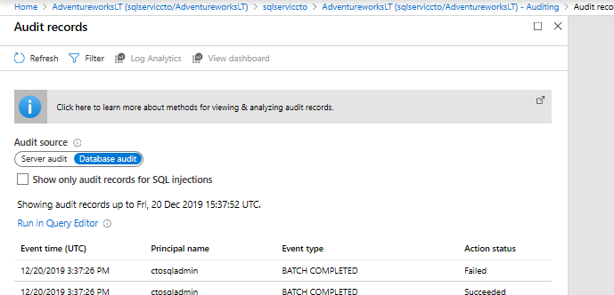

# DP 200 - 데이터 플랫폼 솔루션 구현
# 랩 8 - Azure 데이터 플랫폼 보안

**예상 소요 시간**: 75분

**전제 조건**: 이 랩 관련 사례 연구의 내용을 확인했다고 가정합니다. 모듈 1에서 모듈 7까지의 콘텐츠 및 랩이 완료된 것으로 가정합니다.

**랩 파일**: 이 랩용 파일은 _Allfiles\Labfiles\Starter\DP-200.8_ 폴더에 있습니다.

## 랩 개요

학생들은 심층 방어를 위해 취할 수 있는 다양한 보안 접근 방식을 설명하고 문서화할 수 있습니다. 여기에는 과정에서 지금까지 설정된 보안을 문서화하는 학생이 포함됩니다. 또한 학생들은 AdventureWorks에 존재할 수 있는 보안의 격차를 식별할 수 있습니다.

## 랩 목표
  
이 랩을 완료하면 다음과 같은 작업을 수행할 수 있습니다.

1. 보안 설명
2. 주요 보안 구성 요소 설명
3. 스토리지 계정 및 Data Lake Storage 보안
4. 데이터 저장소 보안
5. 스트리밍 데이터 보안

## 시나리오
  
AdventureWorks의 수석 데이터 엔지니어로서 귀하는 데이터 부동산의 보안을 보장할 책임이 있습니다. 현재 인프라에 대한 보안 검사를 수행하여 필요한 곳에 보안을 부지런히 배치할 수 있도록 합니다. 이 검사는 지금까지 만든 모든 서비스와 데이터를 전체적으로 검사하고 보안 구성에 있을 수 있는 간격을 식별해야 합니다. 

또한 SQL Database DeptDatabasesxx의 보안을 강화하라는 요청을 받았으며 데이터베이스에 대한 액세스를 모니터링할 수 있도록 데이터베이스에 대한 감사를 설정하라는 요청을 받았습니다. 또한 이벤트 허브에 대한 관리 권한이 충분히 제한되지 않으며 이 권한을 제거하려는 것을 알게 되었습니다.

이 랩을 마치면 다음과 같은 역량을 갖추게 됩니다.

1. 설명한 보안
2. 설명된 주요 보안 구성 요소
3. 보안된 스토리지 계정 및 Data Lake Storage
4. 보안된 데이터 저장소
5. 보안된 스트리밍 데이터

> **중요**: 이 랩을 진행하면서 프로비전 또는 구성 작업에서 발생한 문제를 기록하고 _\Labfiles\DP-200-Issues-Doc.docx에_있는 문서의 테이블에 로그인합니다. 랩 번호를 문서화하고, 기술을 기록하며, 문제를 설명하고, 해결 방법이 무엇인지 설명합니다. 이 문서를 나중에 모듈에서 다시 참조할 때 저장합니다.

## 연습 1: 보안 소개

예상 소요 시간: 15분

그룹 연습
  
이 연습의 주요 작업은 다음과 같습니다.

1. 계층화된 접근 방식으로서의 보안.

2. 강사는 그룹과 결과에 대해 논의합니다.

### 작업 1: 계층화된 접근 방식으로서의 보안.

1. 랩 가상 머신에서, **Microsoft Word**를 시작하고up the file **Allfiles\Labfiles\Starter\DP-200.8** 폴더의 **DP-200-Lab08-Ex01.docx** 파일을 엽니다.

2. 이제까지 다룬 과정 내용, 사례 연구 및 시나리오에서 그룹별로 **10분**을 할애하여 지금까지 랩에서 AdventureWorks를 보호하기 위해 영향을 준 보안 계층을 식별합니다. 세 가지 예제를 찾습니다.

### 작업 2: 강사와 조사 결과에 대해 토론합니다.

1. 강사는 결과를 논의하기 위해 그룹 토론을 중지합니다.

> **결과**: 이 연습을 완료한 후 Adventureworks에서 보안을 구현한 방법과 영향을 준 보안 계층에 대한 세 가지 이상의 예가 포함된 Microsoft Word 문서를 만들었습니다.

## 연습 2: 주요 보안 구성 요소
  
예상 소요 시간: 10분

개인 연습
  
이 연습의 주요 작업은 다음과 같습니다.

1. 데이터 및 저장소 보안 예방 조치 평가

### 작업 1: 데이터 및 저장소 보안 예방 조치 평가.

1. Azure Portal 탭에서 **Security Center**를 클릭합니다.

    

2. Security Center - 개요 화면에서 **추천**을 클릭합니다.

    

3. 주의가 필요한 상위 2개의 주요 데이터 및 저장소 구성 요소를 식별합니다.

    1. __답변은 다를 수 있습니다.____
    1. __답변은 다를 수 있습니다.____

> **결과**: 이 연습을 완료한 후 Azure 구독에 있는 데이터 및 저장소 보안 약점을 식별할 수 있는 위치를 배웠습니다.

## 연습 3: 스토리지 계정 및 Data Lake Storage 보안
  
예상 소요 시간: 15분

개인 연습
  
이 연습의 주요 작업은 다음과 같습니다.

1. Azure Blob에 대한 적절한 보안 접근 방식 결정

2. 강사와 조사 결과에 대해 토론합니다.

### 작업 1: Azure Blob에 대한 적절한 보안 접근 방식 결정

1. 여러분은 사내 웹 개발자로부터 외부 웹 디자인 회사가 wsastudxx 스토리지 계정에 있는 웹 이미지에 액세스할 수 있도록 도와달라는 요청을 받았습니다. AdventureWorks의 수석 데이터 엔지니어로서 여러분은 올바른 실사를 적용하면서도 이러한 일이 가능하게 하기 위해 취해야 할 조치를 설명합니다.

2. 랩 가상 머신에서, **Microsoft Word**를 시작하고up the file **Allfiles\Labfiles\Starter\DP-200.8** 폴더의 **DP-200-Lab08-Ex03.docx** 파일을 엽니다.

### 작업 2: 강사와 조사 결과에 대해 토론합니다.

1. 강사는 결과를 논의하기 위해 그룹 토론을 중지합니다.

> **결과**: 이 연습을 완료한 후 외부 웹 개발 회사에 Blob Storage 계정에 대한 보안 액세스를 제공하기 위해 수행할 단계가 포함된 Microsoft Word 문서를 만들었습니다.

## 연습 4: 데이터 저장소 보안
  
예상 소요 시간: 15분

개인 연습
  
이 연습의 주요 작업은 다음과 같습니다.

1. 감사 활성화

2. 데이터베이스 쿼리

3. 감사 로그 보기

### 작업 1: 감사 활성화

1. Azure Portal에서 **리소스 그룹**, awrgstudxx, sqlservicexx를 차례로 클릭하여 **AdventureworksLT (sqlservicekdwj/AdventureworksLT)**로 이동합니다.

2. AdventureworksLT (sqlservicekdwj/AdventureworksLT) 화면에서 **감사** 블레이드를 클릭합니다.

3. **감사** 아래에서 **ON** 단추를 클릭합니다.

4. **스토리지** 상자를 클릭한 다음 **스토리지 세부 정보 - 구성**을 클릭합니다.

5. **저장소 설정** 화면에서 **구독 - 저장소 구독 변경**을 클릭한 다음 구독을 클릭합니다.

6. **저장소 설정** 화면에서 **저장소 설정 - 필수 설정 구성**을 클릭합니다. **스토리지 계정 선택** 화면에서 **awsastudxx**를 클릭합니다.

7. **보존 기간(일)** 텍스트 상자에서 **90**을 입력한 다음 **확인**을 클릭합니다.

    

8. **저장**을 클릭합니다.

### 작업 2: 데이터베이스 쿼리

1. Azure Portal에서 **리소스 그룹**, awrgstudxx, sqlservicexx를 차례로 클릭하여 **AdventureworksLT (sqlservicekdwj/AdventureworksLT)**로 이동합니다.

2. **쿼리 편집기**로 이동합니다.

3. **SQL Server 인증** 창이 표시되면 다음 세부 정보를 사용하여 로그인합니다.
    - 사용자 이름: **xxsqladmin**
    - 암호: **P@ssw0r**

4. **확인**을 클릭합니다. 

> **참고**: 암호가 올바르지 않으면 오류 메시지가 반환됩니다. 올바른 암호 **P@Ssw0rd**를 입력합니다.

5. **Pa55w.rd**의 올바른 암호를 입력합니다.

6. **쿼리 편집기**에서 **AdventureWorksLT**, **테이블**을 차례로 확장합니다.

7. [SalesLT].[Customers]를 마우스 오른쪽 단추로 클릭하고 **상위 1000개 행 선택**을 클릭합니다.

### 작업 2: 감사 로그 보기

1. Azure Portal로 돌아갑니다. AdventureWorksLT (sqlservicexx/AdventureWorksLT) - 감사 화면에서 **감사 로그 보기**를 클릭합니다.

2. **감사 레코드** 로그 파일에 **실패한 인증** 레코드를 기록합니다. **감사 레코드** 화면을 닫습니다.

    

> **결과**: 이 연습을 완료한 후 데이터베이스 감사를 사용하도록 설정하고 감사가 작동하는지 확인했습니다.

## 연습 5: 스트리밍 데이터 보안
  
예상 소요 시간: 15분

개인 연습
  
이 연습의 주요 작업은 다음과 같습니다.

1. 이벤트 허브 권한 변경

### 작업 1: 이벤트 허브 권한 변경

1. Azure Portal의 블레이드에서 **리소스 그룹**을 클릭하고 **awrgstudxx**, **xx-phoneanalysis-ehn**를 차례로 클릭합니다. 여기서 **xx**는 이니셜입니다.

2. Azure Portal의 **xx-phoneanalysis-ehn**에서 **xx**는 귀하의 이니셜입니다. 창 아래쪽으로 스크롤하고 **xx-phoneanalysis-eh** 이벤트 허브를 클릭합니다.

3. 이벤트 허브에 대한 액세스 권한을 부여하려면 **공유 액세스 정책**을 클릭합니다.

4. **xx-phoneanalysis-eh - 공유 액세스 정책** 화면 아래에서 **phoneanalysis-eh-sap**을 클릭합니다.

5. **관리** 권한 옆의 체크박스를 클릭하여 해제하고 **저장**을 클릭합니다.

6. Azure Portal의 블레이드에서 **홈**을 클릭합니다.

> **결과**: 이 연습을 완료한 후 이벤트 허브 공유 액세스 정책의 보안을 수정했습니다.